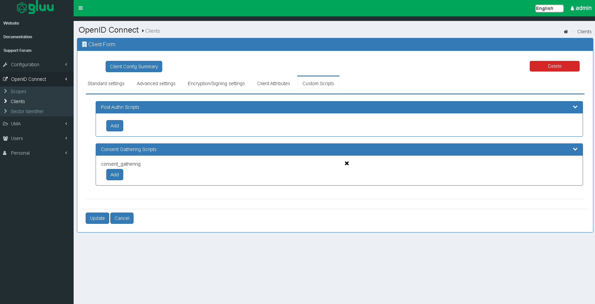
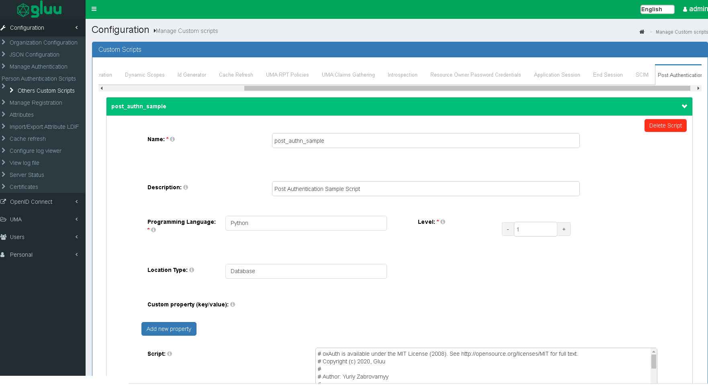
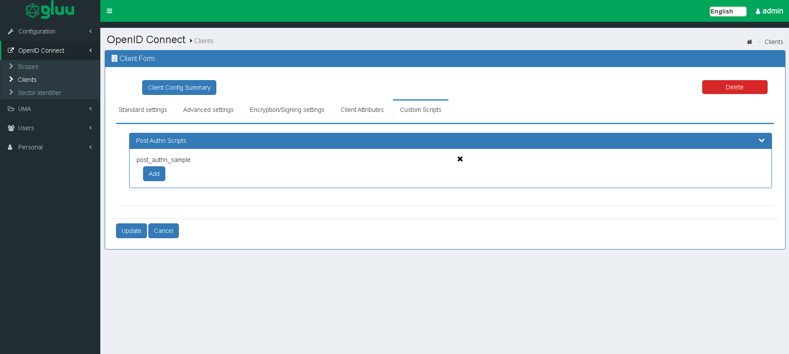
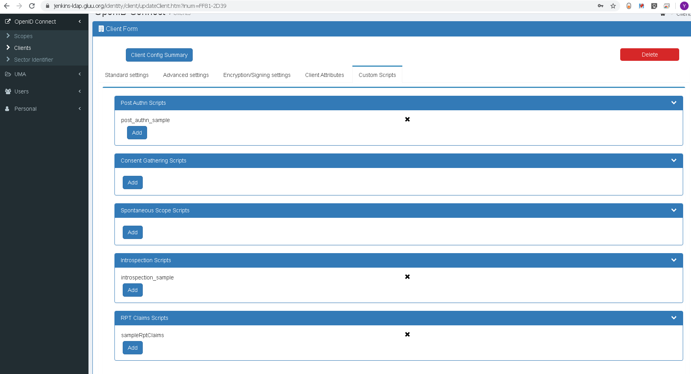
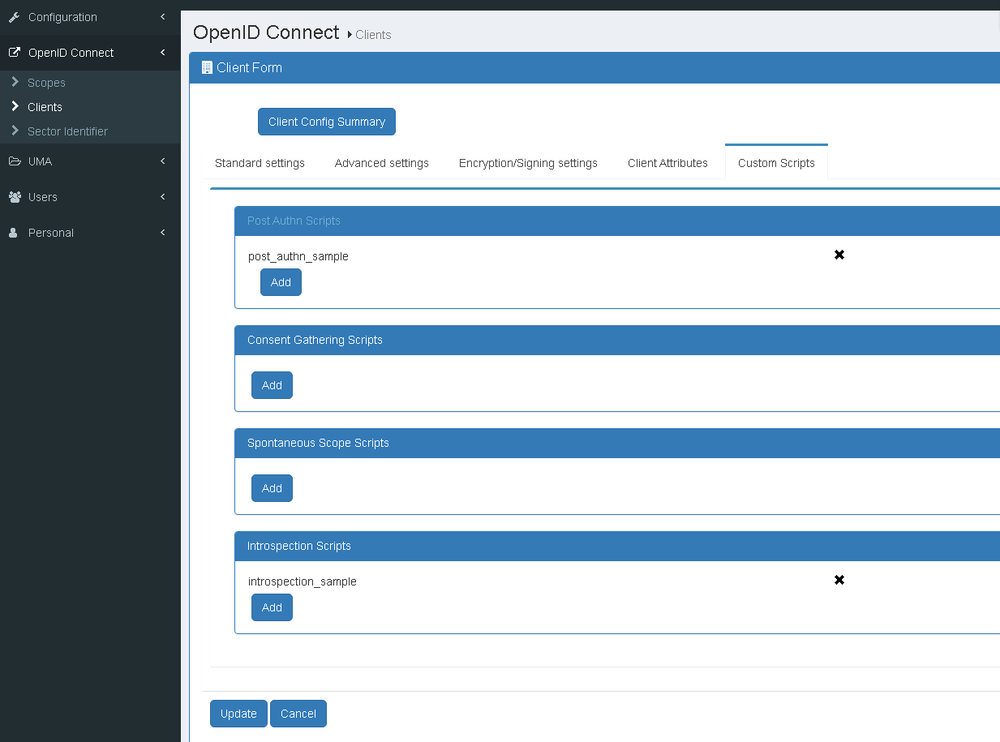

# Interception Scripts

## Overview
Interception scripts can be used to implement custom business logic for authentication, authorization and more in a way that is upgrade-proof and doesn't require forking the Gluu Server code. Each type of script is described by a Java interface -- i.e. which methods are required.

The web interface for Custom Scripts can be accessed by navigating to `Configuration` > `Person Authentication Scripts` or `Other Custom Scripts`.

### Jython
Interception scripts are written in [Jython](http://www.jython.org), enabling Java or Python classes to be imported.

While the syntax of the script requires Python, most of the functionality can be written in Java. If Python classes are imported, they must be "pure python." For example, a class that wraps C libraries can not be imported.

### Methods
There are three methods that inherit a base interface:

|Inherited Methods|Method description|
|-----------------|------------------|
|`def init(self, customScript, configurationAttributes)` |This method is only called once during the script initialization. It can be used for global script initialization, initiate objects etc|
|`def destroy(self, configurationAttributes)` |This method is called once to destroy events. It can be used to free resource and objects created in the `init()` method|
|`def getApiVersion(self, configurationAttributes, customScript)` |The `getApiVersion` method allows API changes in order to do transparent migration from an old script to a new API. **Only include the customScript variable if the value for getApiVersion is greater than 10**|

The `configurationAttributes` parameter is `java.util.Map<String, SimpleCustomProperty>` with properties specified in `oxConfigurationProperty` attributes.

The script manager only loads enabled scripts. Hence, after enabling or disabling a script, the script manager should trigger an event to either load or destroy a script, respectively. All scripts are stored in LDAP in the `ou=scripts,o=<org_inum>,o=gluu` branch.

Here is a sample entry:

```
    dn: inum=@!1111!031C.4A65,ou=scripts,o=@!1111,o=gluu
    objectClass: oxCustomScript
    objectClass: top
    description: <custom_script_description>
    displayName: <display_name>
    gluuStatus: true
    inum: @!1111!031C.4A65
    oxLevel: <priority>
    oxModuleProperty: {"value1":"module_property_name","value2":"module_property_value","description":""}
    oxConfigurationProperty: {"value1":"configuration_property_name","value2":"configuration_property_value","description":""}
    oxRevision: <revision>
    oxScript: <custom_script>
    oxScriptType: <script_type>
    programmingLanguage: python
```

The script manager reloads scripts automatically without needing to restart the application once `oxRevision` is increased.

### Script Naming
New custom scripts should be given a descriptive `displayName`, as that is how they are listed in oxTrust. The `displayName` is limited to 60 characters.  

!!! Note
    The name given to each [Person Authentication script](#person-authentication) is also used as its OpenID Connect `acr_value`. Learn more in the [OpenID Connect docs](./openid-connect.md#authentication).   

### Logs
The log files regarding interception scripts are stored in the `oxauth.log` file. The logs are separated according to the module they affect. The oxAuth custom script logs are stored in `oxauth_script.log` and the oxTrust custom script logs are stored in the `oxtrust_script.log`. Please refer to these log files to troubleshoot errors in the interception scripts or following the workflow of the script.

!!! Note 
    A `print` statement may not work on some environments if the `PYTHON_HOME` environment variable is not set. Make sure it points to a valid python installation.

More details about Logs can be found in the [Log Management](../operation/logs.md) portion of the docs.

### Debugging
As scripts are developed, they need to be debugged. Check the [debugging tutorial](../developer-guide/script-debugging.md) to learn more. 

## Person Authentication     
Authentication scripts can be used to implement complex multi-step, multi-factor authentication workflows. 

In each script, authentication steps and mechanisms are defined, external APIs can be called, and user experience can be adjusted dynamically based on contextual factors. For example, a fraud detection API can be called in step one. If it indicates unacceptable risk, a second step can be added to prompt the user for a stronger authentication credential. 

The authentication interception script extends the base script type with methods for `init`, `destroy` and `getApiVersion`, and also adds the following:

|Method|`isValidAuthenticationMethod(self, usageType, configurationAttributes)`|
|---|---|
|**Description**|This method is used to check if the authentication method is in a valid state. For example we can check there if a 3rd party mechanism is available to authenticate users. As a result it should either return `True` or `False`|
|Method Parameter|`usageType` is `org.gluu.model.AuthenticationScriptUsageType`<br/>`configurationAttributes` is `java.util.Map<String, SimpleCustomProperty>`|

|Method|`def getAlternativeAuthenticationMethod(self, usageType, configurationAttributes)`|
|---|---|
|**Description**|This method is called only if the current authentication method is in an invalid state. Hence authenticator calls it only if `isValidAuthenticationMethod` returns False. As a result it should return the reserved authentication method name|
|Method Parameter|`uageType` is `org.gluu.model.AuthenticationScriptUsageType`<br/>`configurationAttributes` is `java.util.Map<String, SimpleCustomProperty>`|

|Method|`def authenticate(self, configurationAttributes, requestParameters, step)`|
|---|---|
|**Description**|This method is the key method within the person authentication script. It checks if the user has passed the specified step or not. As a result it should either return `True` or `False`|
|Method Parameter|`requestParameters` is `java.util.Map<String, String[]>`<br/>`step` is java integer<br/>`configurationAttributes` is `java.util.Map<String, SimpleCustomProperty>`|

|Method|`def prepareForStep(self, configurationAttributes, requestParameters, step)`|
|---|---|
|**Description**|This method can be used to prepare variables needed to render the login page and store them in an according event context. As a result it should either return `True` or `False`|
|Method Parameter|`requestParameters` is `java.util.Map<String, String[]>`<br/>`step` is a java integer<br/>`configurationAttributes` is `java.util.Map<String, SimpleCustomProperty>`|

|Method|`def getCountAuthenticationSteps(self, configurationAttributes)`|
|---|---|
|**Description**|This method should return an integer value with the number of steps in the authentication workflow|
|Method Parameter|`configurationAttributes` is `java.util.Map<String, SimpleCustomProperty>`|

|Method|`def getExtraParametersForStep(self, configurationAttributes, step)`|
|---|---|
|**Description**|This method provides a way to notify the authenticator that it should store specified event context parameters event in the oxAuth session. It is needed in a few cases, for example when an authentication script redirects the user to a 3rd party authentication system and expects the workflow to resume after that. As a result it should return a java array of strings|
|Method Parameter|`configurationAttributes` is `java.util.Map<String, SimpleCustomProperty>`<br/>`step` is a java integer|

|Method|`def getPageForStep(self, configurationAttributes, step)`|
|---|---|
|**Description**|This method allows the admin to render a required page for a specified authentication step. It should return a string value with a path to an XHTML page. If the return value is empty or null, the authenticator should render the default log in page `/login.xhtml`|
|Method Parameter|`configurationAttributes` is `java.util.Map<String, SimpleCustomProperty>`<br/>`step` is a java integer|

|Method|`def logout(self, configurationAttributes, requestParameters)`|
|---|---|
|**Description**|This method is not mandatory. It can be used in cases when you need to execute specific logout logic in the authentication script when oxAuth receives an end session request to the `/oxauth/logout.htm` endpoint (which receives the same set of parameters than the usual `end_session` endpoint). This method should return `True` or `False`; when `False` oxAuth stops processing the end session request workflow.</br> </br> If `getApiVersion()` returns "3" for this script, `logout()` will call an external end session API at a 3rd party service before terminating sessions at Gluu Server. To do so it calls `getLogoutExternalUrl()` method and redirects the user agent to the URL returned by such method (note at this point Gluu's sessions are not yet killed). After the 3rd-party service has completed its end session routines, it must re-direct user back to `/oxauth/logout.htm` again with empty URL query string - that's enough for oxAuth to recognize it as a continuation of the extended logout flow, restore the original URL query string, and send user to `/oxauth/end_session` to complete it |
|Method Parameters|`configurationAttributes` is `java.util.Map<String, SimpleCustomProperty>`<br/>`requestParameters` is `java.util.Map<String, String[]>`|

Every deployment of the Gluu Server includes a number of pre-written authentication scripts out-of-the-box. Learn more in the [authentication guide](../authn-guide/intro.md). 

For a complete list of pre-written, open source authentication scripts, view our [server integrations](https://github.com/GluuFederation/oxAuth/tree/master/Server/integrations). 

- View a [sample Authentication Script](./sample-authentication-script.py).    

## Consent Gathering
OAuth 2.0 allows providers to prompt users for consent before releasing their personal information to a client (application). The standard consent process is binary: approve or deny. Using the consent gathering interception script, the consent flow can be customized to meet unique business requirements, for instance to support payment authorization, where you need to present transactional information, or where you need to step-up authentication to add security. 

Consent Gathering can be enabled via oxTrust UI as shown below 


Consent Gathering Script should be associated with client in order to be run. Otherwise it's possible to set `consentGatheringScriptBackwardCompatibility` global AS configuration property to `true`, in this case AS will look up for script with higher level globally (ignoring client configuration).



Users will be prompted for consent as below.


- view a [sample Consent Gathering Script](https://github.com/GluuFederation/oxAuth/blob/master/Server/integrations/authz/ConsentGatheringSample.py)

## Post Authn 

After the browser has a session, if a person visits a website, the RP can obtain a code without the user having to authenticate or authorize. In some cases, it is desirable to insert custom business logic before granting the code or tokens from the authorization endpoint.
Post Authn script allows to force re-authentication or re-authorization (even if client is "Pre-authorized" or client authorization persistence is on).

Consent Gathering can be added via oxTrust UI and added to RP's client as shown below


Associate Post Authn script with client (Update button must be clicked to persist changes)


View a [Post Authn Script Sample](https://github.com/GluuFederation/oxAuth/blob/master/Server/integrations/postauthn/postauthn.py)


## Update User     

oxTrust allows an admin to add and modify users which belong to groups. In order to simplify this process and apply repeating actions, oxTrust supports an Update User script. In this script it is possible to modify a person entry before it is stored in the database.

This script type adds only one method to the base script type:

|Method|`def updateUser(self, user, persisted, configurationAttributes)`|
|---|---|
|**Description**|This method updates the user|
|Method Parameter|`user` is `org.gluu.oxtrust.model.GluuCustomPerson`<br/>persisted is a boolean value to specify the operation type: add/modify<br/>`configurationAttributes` is `java.util.Map<String, SimpleCustomProperty>`|

This script can be used in an oxTrust application only.

- [Sample Update User Script](./sample-update-user-script.py)

## User Registration      

oxTrust allows users to perform self-registration. In order to control/validate user registrations there is the user registration script type.

This script type adds three methods to the base script type:

|Methods|`def initRegistration(self, user, requestParameters, configurationAttributes)`<br/>`def preRegistration(self, user, requestParameters, configurationAttributes)`<br/>`def postRegistration(self, user, requestParameters, configurationAttributes)`|
|---|---|
|**Description**|This method enables/disables user account based on the custom property's value|
|Method Parameters|`user` is `org.gluu.oxtrust.model.GluuCustomPerson`<br/>`requestParameters` is `java.util.Map<String, String[]>`<br/>`configurationAttributes` is `java.util.Map<String, SimpleCustomProperty>`|
|Custom Property|`enable_user`--> defaults to `false`|
|Description|It controls whether or not this user account will be ready for loggin into the Gluu Server CE instance|

The methods are executed in the following order:

|Order|Method|Expected Return|
|-----|------|-----------|
|First|`initRegistration()`|True/False|
|Second|`preRegistration()`|True/False|
|Third|`postRegistration()`|True/False|

First oxTrust executes the `initRegistration` method to do an initial user entry update. The `preRegistration` method is called before storing the user entry in the database. Hence in this script it is possible to validate the user entry. The `postRegistration` method is called after successfully storing the user entry in the database. In this method, for example, the script can send an e-mail or send notifications to other organization systems about the new user entry.

- [Sample User Registration Script](./sample-user-registration-script.py)

## Client Registration      

oxAuth implements the [OpenID Connect dynamic client registration](https://openid.net/specs/openid-connect-registration-1_0.html) specification. All new clients have the same default access scopes and attributes except password and client ID. The Client Registration script allows an admin to modify this limitation. In this script it is possible to get a registration request, analyze it, and apply customizations to registered clients. For example, a script can give access to specified scopes if `redirect_uri` belongs to a specified service or domain.

This script type adds few methods to the base script type:

|Method|`def createClient(self, registerRequest, client, configurationAttributes)`|
|---|---|
|**Method Parameter**|`registerRequest` is `org.gluu.oxauth.client.RegisterRequest`<br/>`client` is `org.gluu.oxauth.model.registration.Client`<br/>`configurationAttributes` is `java.util.Map<String, SimpleCustomProperty>`|

|Method|`def updateClient(self, registerRequest, client, configurationAttributes)`|
|---|---|
|**Method Parameter**|`registerRequest` is `org.gluu.oxauth.client.RegisterRequest`<br/>`client` is `org.gluu.oxauth.model.registration.Client`<br/>`configurationAttributes` is `java.util.Map<String, SimpleCustomProperty>`|

|Method|`def getSoftwareStatementHmacSecret(self, context)`|
|---|---|
|**Method Parameter**|`context` is `org.gluu.oxauth.service.external.context.DynamicClientRegistrationContext` <br> (in https://github.com/GluuFederation/oxauth project )|

|Method|`def getSoftwareStatementJwks(self, context)`|
|---|---|
|**Method Parameter**|`context` is `org.gluu.oxauth.service.external.context.DynamicClientRegistrationContext` <br> (in https://github.com/GluuFederation/oxauth project )|

This script can be used in an oxAuth application only.

- [Sample Client Registration Script](./sample-client-registration-script.py)


## Dynamic Scopes      
The dynamic scope custom script allows to generate list of claims (and their values) on the fly, depending on cirtumstances like id of client requesting it, logged user's session parameters, values of other user's attributes, results of some calculations implementing specific buisness logic and/or requests to remote APIs or databases. Claims are then returned the usual way in a response to a call to the `userinfo endpoint`. 

Two parameters are passed to the script:

- `dynamicScopeContext` is [org.gluu.oxauth.service.external.context.DynamicScopeExternalContext class](https://github.com/GluuFederation/oxAuth/blob/master/Server/src/main/java/org/gluu/oxauth/service/external/context/DynamicScopeExternalContext.java) 
- `configurationAttributes` is java.util.Map<String, SimpleCustomProperty> dictionary carring script's custom properties
                                      
In order to configure a dynamic scope the following steps are required:

- Dynamic scope custom script must be configured and enabled at "Other custom scripts" page, "Dynamic scopes" tab
- A scope has to be defined at the "OpenID Connect -> Scopes" page
  - Scope's type must be set to "Dynamic"
  - Corresponding dynamic script must be linked to that scope (Add dynamic script button)
- The scope must be added to the client which will be using it at the "OpenID Connect -> Clients" page (using the "Add Scope" button), and the scope must be included by the client in "scope=" URL query parameter

More detailed explanation about adding scopes can be found under Openid [scopes](openid-connect.md#scopes)

- [Sample Dynamic Scope Script](./sample-dynamic-script.py)

## ID Generator       

By default oxAuth/oxTrust uses an internal method to generate unique identifiers for new person/client, etc. entries. In most cases the format of the ID is:

`'!' + idType.getInum() + '!' + four_random_HEX_characters + '.' + four_random_HEX_characters.`

The ID generation script enables an admin to implement custom ID generation rules.

This script type adds only one method to the base script type:

|Method|`def generateId(self, appId, idType, idPrefix, configurationAttributes)`|
|---|---|
|**Method Parameter**|`appId` is application ID<br/>`idType` is ID Type<br/>`idPrefix` is ID Prefix<br/>`user` is `org.gluu.oxtrust.model.GluuCustomPerson`<br/>`configurationAttributes` is `java.util.Map<String, SimpleCustomProperty>`|

This script can be used in an oxTrust application only.

- [Sample ID Generation Script](./sample-id-generation-script.py)      

## Cache Refresh       

In order to integrate your Gluu instance with backend LDAP servers handling authentication in your existing network environment, oxTrust provides a mechanism called [Cache Refresh](../user-management/ldap-sync.md#ldap-synchronization) to copy user data to the Gluu Server's local LDAP server. During this process it is possible to specify key attribute(s) and specify attribute name transformations. There are also cases when it can be used to overwrite attribute values or to add new attributes based on other attribute values.

This script type adds only one method to the base script type:

|Method|`def updateUser(self, user, configurationAttributes)`|
|---|---|
|**Method Parameter**|`user` is `org.gluu.oxtrust.model.GluuCustomPerson`<br/>`configurationAttributes` is `java.util.Map<String, SimpleCustomProperty>`|

This script can be used in an oxTrust application only.

- [Sample Cache Refresh Script](./sample-cache-refresh-script.py)
 
## UMA 2 RPT Authorization Policies     

This is a special script for UMA. It allows an admin to protect UMA scopes with policies. It is possible to add more than one UMA policy to an UMA scope. On requesting access to a specified resource, the application should call specified UMA policies in order to grant or deny access.

This script type adds only one method to the base script type:

|Method|`def authorize(self, authorizationContext, configurationAttributes)`|
|---|---|
|**Method Parameter**|`authorizationContext` is `org.gluu.oxauth.service.uma.authorization.AuthorizationContext`<br/>`configurationAttributes` is `java.util.Map<String, SimpleCustomProperty>`|

This script can be used in an oxAuth application only.

- [Sample RPT Authorization Policy Script](./sample-uma-authorization-script.py)

## UMA 2 RPT Claims 

Script which allows to modify claims of RPT. It effects both RPT Introspection and RPT as JWT claims. 

Associate RPT Claims script with client (Update button must be clicked to persist changes).



View a [RPT Claims Script Sample](https://github.com/GluuFederation/oxAuth/blob/version_4.4.0/Server/src/main/java/org/gluu/oxauth/uma/service/UmaRptService.java)


## UMA 2 Claims-Gathering     

This is a special script for UMA 2. It allows an admin to code logic for gathering additional claims (required by UMA RPT Authorization Policy).

This script can be used in an oxAuth application only.

- [Sample UMA2 Claims-Gathering Script](./sample-uma-claims-gathering.py)

## Application Session Management      

This script allows an admin to get notification about various session lifetime events. It's possible to add multiple scripts with this type. The application should call all of them according to the level.

This script has following methods:

- `startSession` - Application calls it at start session request (creation) to allow notify 3rd part systems
- `endSession` - This method is triggered by an oxAuth call to the `end_session` endpoint.
- `onEvent` - Invoked on different session events. Event types: AUTHENTICATED, UNAUTHENTICATED, UPDATED (update pushed to persistence), GONE (it can be time out, or expired or ended by /end_session endpoint)

This script can be used in an oxAuth application only. Please check sample below.

- [Sample Application Session Management Script](./sample-application-session-script.py)

[pem]: https://en.wikipedia.org/wiki/Privacy-enhanced_Electronic_Mail "Privacy-enhanced Electronic Mail"

## SCIM

SCIM script allows you to execute custom logic when certain SCIM API operations are invoked. To learn more visit [this page](../user-management/scim-scripting.md).

## Introspection

Introspection scripts allows to modify response of Introspection Endpoint ([spec](https://tools.ietf.org/html/rfc7662)).

Introspection script should be associated with client (used for obtaining the token) in order to be run. Otherwise it's possible to set `introspectionScriptBackwardCompatibility` global AS configuration property to `true`, in this case AS will run all scripts (ignoring client configuration).



The introspection interception script extends the base script type with the `init`, `destroy` and `getApiVersion` methods but also adds the following method(s):

|Method|`def modifyResponse(self, responseAsJsonObject, context)`|
|---|---|
|**Method Parameter**|`responseAsJsonObject` is `org.codehaus.jettison.json.JSONObject`<br/>`context` is ` org.gluu.oxauth.service.external.context.ExternalIntrospectionContext`|

Snippet
```
    # Returns boolean, true - apply introspection method, false - ignore it.
    # This method is called after introspection response is ready. This method can modify introspection response.
    # Note :
    # responseAsJsonObject - is org.codehaus.jettison.json.JSONObject, you can use any method to manipulate json
    # context is reference of org.gluu.oxauth.service.external.context.ExternalIntrospectionContext (in https://github.com/GluuFederation/oxauth project, )
    def modifyResponse(self, responseAsJsonObject, context):
        responseAsJsonObject.put("key_from_script", "value_from_script")
        return True
```

Full version of introspection script example can be found [here](https://github.com/GluuFederation/community-edition-setup/blob/version_4.2.0/static/extension/introspection/introspection.py). 

It is also possible to run introspection script during `access_token` creation as JWT. It can be controlled by `run_introspection_script_before_access_token_as_jwt_creation_and_include_claims` client property which is set to false by default.

If `run_introspection_script_before_access_token_as_jwt_creation_and_include_claims` set to true and `access_token_as_jwt` set to true then introspection script will be run before JWT (`access_token`) is created and all JSON values will be transfered to JWT. Also `context` inside script has additional method which allows to cancel transfering of claims if needed `context.setTranferIntrospectionPropertiesIntoJwtClaims(false)` 

## Revoke Token

Revoke Token scripts allow inject custom logic during token revoking.

```
    # This method is called during Revoke Token call.
    # If True is returned, token is revoked. If False is returned, revoking is skipped.
    # Note :
    # context is reference of org.gluu.oxauth.service.external.context.RevokeTokenContext(in https://github.com/GluuFederation/oxauth project, )
    def revoke(self, context):
        return True
```

Full version of the script example can be found [here](https://github.com/GluuFederation/community-edition-setup/blob/version_4.4.0/static/extension/revoke_token/revoke_token.py).

Note `RevokeTokenContext` allows to access response builder (`context.getResponseBuilder()`) which allows to customer response if needed.

## Update Token Script

### 1. Mandatory methods:

```
class UpdateToken(UpdateTokenType):

    def __init__(self, currentTimeMillis):
        self.currentTimeMillis = currentTimeMillis

    def init(self, customScript, configurationAttributes):
        return True

    def destroy(self, configurationAttributes):
        return True

    def getApiVersion(self):
        return 11
```

### 2. modifyIdToken () : Used to modify claims in an ID token

Pseudocode and example :

```
    # Returns boolean, true - indicates that script applied changes
    # jsonWebResponse - is JwtHeader, you can use any method to manipulate JWT
    # context is reference of org.gluu.oxauth.service.external.context.ExternalUpdateTokenContext
    def modifyIdToken(self, jsonWebResponse, context):

    # header claims
	jsonWebResponse.getHeader().setClaim("header_name", "header_value")

	#custom claims
	jsonWebResponse.getClaims().setClaim("openbanking_intent_id", openbanking_intent_id_value)

	#regular claims        
	jsonWebResponse.getClaims().setClaim("sub", claimValue)

	return True

```

### 3.  modifyAccessToken(): 

#### a. Granularity of access control:
An UpdateTokenType script is great for adding scopes or removing scopes to/from the Access token. By doing so you can tailor build the granularity of access control according to business need.

[`context.overwriteAccessTokenScopes`](https://github.com/GluuFederation/oxAuth/blob/ef5762e41b13bffc09702f821a1ad6d81900428d/Server/src/main/java/org/gluu/oxauth/service/external/context/ExternalUpdateTokenContext.java) is ready to use method of the `context` variable

```
    from com.google.common.collect import Sets
    ....
    def modifyAccessToken(self, accessToken, context):
              context.overwriteAccessTokenScopes(accessToken, Sets.newHashSet("openid", "mynewscope"))
```

#### b.  Perform business check before returning AT

Pseudo code and example - Issue Access token only if account balance is greater than 0

```
    # Returns boolean, true - indicates that script applied changes
    # accessToken - is JwtHeader, you can use any method to manipulate JWT
    # context is reference of org.gluu.oxauth.service.external.context.ExternalUpdateTokenContext
    def modifyAccessToken(self, accessToken, context):

         #read from session
	     sessionIdService = CdiUtil.bean(SessionIdService)
	     sessionId = sessionIdService.getSessionByDn(context.getGrant().getSessionDn()) # fetch from persistence

        org_id = sessionId.getSessionAttributes().get("org_id")
	    balance = thirdPartyApi.checkBalance(org_id)

        if balance > 0 :
           return True
        else:
           return False # forbid the creation of AT
```

#### c. Modify claims in an access token:

```
    

    # Returns boolean, true - indicates that script applied changes. If false is returned token will not be created.
    # accessToken is reference of org.gluu.oxauth.model.common.AccessToken (note authorization grant can be taken as context.getGrant())
    # context is reference of org.gluu.oxauth.service.external.context.ExternalUpdateTokenContext
    def modifyAccessToken(self, accessToken, context):
       
        context.getHeader().setClaim("custom_header_name", "custom_header_value")
        context.getClaims().setClaim("claim_name", "claimValue")
       
        print "Update token script. Modify access token: %s" % accessToken
        return True

```

### 5. Modify a specific token lifetime based on the context:

1. Refresh token lifetime:

```
    def getRefreshTokenLifetimeInSeconds(self, context):
        return 24 * 60 * 60 # one day
```

2. ID token lifetime:

```
    def getIdTokenLifetimeInSeconds(self, context):
        return 10 * 60 * 60 # 10 hours
```

3. Access token lifetime:
```
    def getAccessTokenLifetimeInSeconds(self, context):
        return 10 * 60 * 60 # 10 hours
```

### 6. modifyRefreshToken() :  
Used to modify claims in a Refresh Token

```
    # Returns boolean, true - indicates that script applied changes. If false is returned token will not be created.
    # refreshToken is reference of org.gluu.oxauth.model.common.RefreshToken (note authorization grant can be taken as context.getGrant())
    # context is reference of org.gluu.oxauth.service.external.context.ExternalUpdateTokenContext
    def modifyRefreshToken(self, refreshToken, context):
        return True

```

- [Sample Update Token Script](./sample-update-token-script.py)


## End Session (Logout)

End Session scripts allows to modify HTML response for Frontchannel logout ([spec](http://openid.net/specs/openid-connect-frontchannel-1_0.html)).

The End Session interception script extends the base script type with the `init`, `destroy` and `getApiVersion` methods but also adds the following method(s):

|Method|`def getFrontchannelHtml(self, context)`|
|---|---|
|**Method Parameter**|`context` is `org.gluu.oxauth.service.external.context.EndSessionContext`|

Snippet
```
    # Returns string, it must be valid HTML (with iframes according to spec http://openid.net/specs/openid-connect-frontchannel-1_0.html)
    # This method is called on `/end_session` after actual session is killed and oxauth construct HTML to return to RP.
    # Note :
    # context is reference of org.gluu.oxauth.service.external.context.EndSessionContext (in https://github.com/GluuFederation/oxauth project, )
    def getFrontchannelHtml(self, context):
        return ""
```

Full version of the script example can be found [here](https://github.com/GluuFederation/community-edition-setup/blob/version_4.4.0/static/extension/end_session/end_session.py). 

## Resource Owner Password Credentials

Resource Owner Password Credentials script allows modifying the behavior of Resource Owner Password Credentials Grant.

The script is invoked after normal authentication and can either leave current result or change it - authenticate if not authenticated - it should return `True` and optionally set user (via `context.setUser(user)`) 

The script extends the base script type with the `init`, `destroy` and `getApiVersion` methods but also adds the following method(s):

|Method|`def authenticate(self, context)`|
|---|---|
|**Method Parameter**|`context` is `org.gluu.oxauth.service.external.context.ExternalResourceOwnerPasswordCredentialsContext`|

Snippet
```
    # Returns boolean, true - authenticate user, false - ignore script and do not authenticate user.
    # This method is called after normal ROPC authentication. This method can cancel normal authentication if it returns false and sets `context.setUser(null)`.
    # Note :
    # context is reference of org.gluu.oxauth.service.external.context.ExternalResourceOwnerPasswordCredentialsContext#ExternalResourceOwnerPasswordCredentialsContext (in https://github.com/GluuFederation/oxauth project, )
    def authenticate(self, context):
        if (context.getHttpRequest().getParameterValues("device_id")[0] == "device_id_1"):
            return True
        return False
```

Full version of the script example can be found [here](https://github.com/GluuFederation/community-edition-setup/blob/version_4.4.0/static/extension/resource_owner_password_credentials/resource_owner_password_credentials.py).

Sometimes it can be useful to ROPC custom script at Authorization Endpoint to avoid redirects and pages. 
By default it is not enabled but it can be enabled if set `forceRopcInAuthorizationEndpoint` AS configuration property to `true`.

Also it is required to set `user` in context in custom script (`context.setUser(<user>)`). Without it authorization will go on in normal way (with pages and redirects).

## Persistence Extension

Allows administrators to specify the hashing algorithm employed to encode users' passwords in the local database.  

|Method|`def createHashedPassword(self, credential)`|
|---|---|
|**Description**|Given a password, it must return its hashed representation as `String`|
|Method Parameter|`credential` is `String`|

For implementation, method `createStoragePassword(String, PasswordEncryptionMethod)` of utility class `PasswordEncryptionHelper` can be useful here. The enumeration `PasswordEncryptionMethod` already provides a numerous list of encryption alternatives.

|Method|`def compareHashedPasswords(self, credential, storedCredential)`|
|---|---|
|**Description**|Returns true if the given (plain) password matches a hashed password representation.<br/>When the persistence extension script is enabled this method is called upon user+password authentication to determine if the authentication is deemed successful|
|Method Parameter|`credential` is the password as a `String` (eg. as given in the login form)|
|Method Parameter|`storedCredential` is the hashed password (`String`) as stored in the local database for the user in question|

Relevant links:

- [Utility classes]( https://github.com/GluuFederation/oxCore/tree/version_4.2.0/persistence-core/src/main/java/org/gluu/persist/operation/auth)
- [Sample script](https://github.com/GluuFederation/community-edition-setup/blob/version_4.2.0/static/extension/persistence_extension/SampleScript.py)

!!! Note
    It is recommended to store this script in your database. If you use the filesystem option, you may have to replicate the file across nodes when in a container-based environment. This is because the script caller can be oxTrust, oxAuth or even SCIM service. 

## IDP Extension 

This script type is specific to SAML / Shibboleth IDP and allows developers to perform two operations:

- Attribute Translation. The developer can use this to perform any transformation on the returned OpenId attributes after oxAuth authenication 
  is complete and flow of control is returned to Shibboleth IDP. 
- Attribute Update. The method in the script is invoked just before the the SAML response is crafted and returned to the SP. Here , the developer 
  can add, remove or update the attributes to achieve various results. 

|Method|`def translateAttributes(self, context, configurationAttributes)`|
| ---  | --- |
| **Description**|Translate attributes from user profile|
|Method Parameter| `context` is [`org.gluu.idp.externalauth.TranslateAttributesContext.java`](https://github.com/GluuFederation/shib-oxauth-authn3/blob/version_4.4.0/src/main/java/org/gluu/idp/externalauth/TranslateAttributesContext.java) |
|Method Parameter| `configurationAttributes` is `java.util.Map<String, SimpleCustomProperty>`|
    
## Additional Tips

Visit [Custom Scripts and Pages Guide](../developer-guide/tips-cust-script-pages.md) for code references on building custom scripts and pages.
