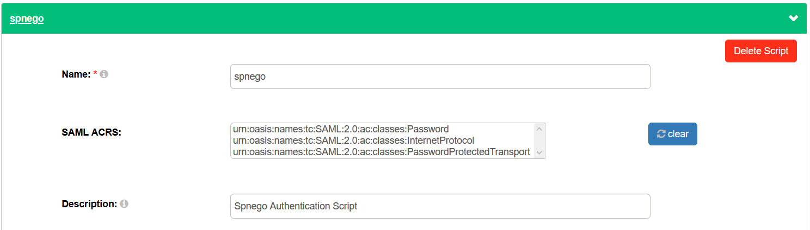
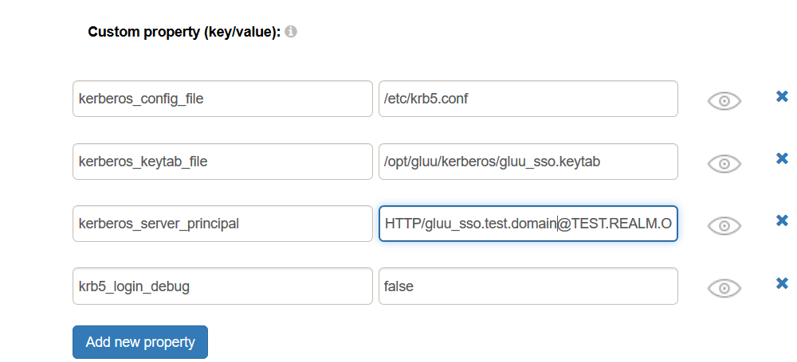

# Integrated Windows Authentication (SPNEGO)

## Overview 
[Integrated Windows Authentication](https://en.wikipedia.org/wiki/Integrated_Windows_Authentication) , also known as 
SPNEGO is a technology by Microsoft that allows users to log in with their Windows Credentials to web applications. 
When properly configured, the user's browser sends the user's credentials in the `Authorization` header. In this document we explain how to configure IWA to work with Gluu Server, using the [SPNEGO](https://github.com/GluuFederation/gluu-spnego-auth/blob/master/scripts/SpnegoExternalAuthenticator.py) custom script. 

## Prerequisites
- An Active Directory Installation with administrative access to the server
- A Gluu Server ([installation instructions](../installation-guide/index.md)) which has been configured 
  fopr authentication against the AD server. See [ldap sync](https://gluu.org/docs/gluu-server/user-management/ldap-sync/)
- [Spnego Authentication Script](https://github.com/GluuFederation/gluu-spnego-auth/blob/master/scripts/SpnegoExternalAuthenticator.py)
- [Gluu Spnego Authentication Java Library] (https://ox.gluu.org/maven/org/gluu/gluu-spnego-auth/1.0.Final/gluu-spnego-auth-1.0.Final.jar)

## Active Directory Configuration 

First , create a Kerberos service principal name and keytab file.

1. From the AD Server, Go to `Start` > `Programs` > `Administrative Tools` > `Active Directory Users and Computers`
  A good idea is to use the name of the Gluu Server. E.g. if the Gluu server is running on a machine called `gluu_sso.test.domain`, create a user in active directory called `gluu_sso`. Make sure that no computer is named `gluu_sso` under `Computers and Domain Controllers`.
  
1. From the AD server , open a terminal and use the `setspn` command to map the Kerberos SPN (Service Principal Name) to the user account created in the previous step. An SPN is of the form `<service name>/<fully qualified host name>`. The `service name` in this case must be `HTTP`. However, the fully qualified host name can be any strings allowed by the KDC. Make sure an SPN is registered for every fully host name which will be used to access the application server. Following the example from above, the command will look something like this:

     ```
       C:> setspn -A HTTP/gluu_sso.test.domain gluu_sso
     ```
     
1. From the AD server, Use the command line `ktpass` to create a kerberos keytab for the Service Principal Name. Please  consult the Microsoft documentation for more information about the tool. An example of use of the command line tool would be as follows. Note that for the sake of this example, we use TEST.REALM.ORG as our Kerberos Realm (i.e. our Active Directory domain).

   ```
     C:> ktpass -out C:\Temp\gluu_sso.keytab -princ HTTP/gluu_sso.test.domain@TEST.REALM.ORG -mapUser gluu_sso
         -mapOp set -pass user_account_password -crypto AES256-SHA1 -pType KRB5_NT_PRINCIPAL
   ```
   
   The table below attempts to describe the options used in the sample command above.
   
   |Option                       | Description                                                       |
   |-----------------------------|-------------------------------------------------------------------|
   | -out <path>                 | Path to the file where the keytab is written to                   |
   | -princ <principal>          | A concatenation of the logon username and the realm               |
   | -mapUser  <user>            | The user to which the the key is mapped                           |
   | -mapOp <op>                 | Describes how the mapping attribute is to be set                  |
   | -pass <password>            | The password of the user specified in `-mapUser`                  |
   | -crypto <algorith>          | The cryptographic algorithm to use for the key                    |
   | -pType <ptype>              | The principal type                                                |
   
   Please note that the realm in `-princ` must be in capital letters. Once done, transfer the keytab file to the Gluu Server instance. A good idea would be to create a directory called `/opt/gluu/kerberos` and place it there.

## Creating a krb5.conf

 The IWA authentication script relies on a java based library which in turns relies on the JDK's implementation of Kerberos. In order to function properly, the java library requires a valid kerberos config file (krb5.conf). The file contains kerberos configuration information, including the location of the KDCs and admin servers for Kerberos realms. We provide a [sample krb5.conf](https://github.com/GluuFederation/gluu-spnego-auth/blob/master/samples/krb5.conf) file which can be used as a starting point. 
 
The main entries to change are the following:
- The `default_realm` in the `[libdefaults]` section
- The`kdc` and `default_domain` in the `[realms]` section. Also, rename the realm entry 
- The `[domain_realm]` provides a translation from a domain name or hostname to a Kerberos realm name.
  Modify it appropriately. 

!!! Note
    The value of the realms and FQDNs for the kdc in the `krb5.conf` must be in capital letters.

Once done , transfer the krb5.conf file to the Gluu Server instance. A good idea would be to place it in the `/etc`
directory, i.e. `/etc/krb5.conf` 

## Manually installing the script and it's dependencies
 In principle, the script and it's dependencies should come pre-installed with Gluu Server. But it may happen 
 that it's not , which is the case for previous versions of Gluu Server which weren't bundled with the script.
 If your Gluu Server installation comes with the script installed, skip this step. 
 To find out if the script is already installed is to go to `Configuration` > `Manage Custom Scripts` > `Person Authentication`
and look for the script called `spnego`. 

1. [Download](https://ox.gluu.org/maven/org/gluu/gluu-spnego-auth/1.0.Final/gluu-spnego-auth-1.0.Final.jar) the Gluu Java library for Spnego Authentication.
1. Login into your Gluu installation (chroot)
1. Copy the file into the Gluu server container , in the directory `/opt/gluu/jetty/oxauth/custom/libs/`
1. Open the file `/opt/gluu/jetty/oxauth/webapps/oxauth.xml` and modify it as follows
   ```
   <?xml version="1.0"  encoding="ISO-8859-1"?>
   <!DOCTYPE Configure PUBLIC "-//Jetty//Configure//EN" "http://www.eclipse.org/jetty/configure_9_0.dtd">

   <Configure class="org.eclipse.jetty.webapp.WebAppContext">
      <Set name="contextPath">/oxauth</Set>
        <Set name="war">
            <Property name="jetty.webapps" default="." />/oxauth.war
        </Set>
        <Set name="extractWAR">true</Set>
        <Set name="extraClasspath">/opt/gluu/jetty/oxauth/custom/libs/gluu-spnego-auth-1.0.Final.jar</Set>
   </Configure>
   ```
1. Download the [Spnego Authentication Script](https://github.com/GluuFederation/gluu-spnego-auth/blob/master/scripts/SpnegoExternalAuthenticator.py) and install it as described [here](./customauthn.md). Name the script `spnego` make 
sure it is not enabled until the mandatory custom script properties which will be described further below are set. 
1. Download the HTML pages [here](https://github.com/GluuFederation/gluu-spnego-auth/tree/master/pages/spnego)
1. Login into your Gluu installation (chroot)
1. Create a directory called `spnego` under `/opt/gluu/jetty/oxauth/custom/pages/` and copy the HTML pages downloaded above
1. Restart oxauth

## Properties 

There are a few properties in the SPNEGO Authentication Script:

|Property Name            | Mandatory| Description                                 | Example                             |
|-------------------------|----------|---------------------------------------------|-------------------------------------|
|kerberos_config_file     | Yes      | Path to the krb5.conf file                  | /etc/krb5.conf                      |
|kerberos_keytab_file     | Yes      | Path to the keytab file                     | /etc/gluu/kerberos/gluu_sso.keytab  |
|kerberos_server_principal| Yes      | User Principal to use for pre-authentication| HTTP/gluu_sso.test.domain@TEST.REALM.ORG | 
|krb5_login_debug         | No       | Krb5LoginModule debug value (See footnote)  | true                                |
|krb5_login_use_ticket_cache | No    | Krb5LoginModule ticket cache use flag       | false                               |
|krb5_login_ticket_cache  | No       | Krb5LoginModule ticket cache location       | /tmp/krb5_cache                     |
|krb5_login_renew_tgt     | No       | Krb5LoginModule TGT renew flag              | false                               |

!!! Note
    The options with a  `krb5_login` prefix are passed to the `Krb5LoginModule` whose documentation you can find [here](https://docs.oracle.com/javase/7/docs/jre/api/security/jaas/spec/com/sun/security/auth/module/Krb5LoginModule.html). Turning on debugging with `krb5_login_debug` turns on debugging not just for the `Krb5LoginModule` but also turns on debugging for many other modules.

## Configure oxTrust 

Follow the steps below to configure the `spnego` script in the oxTrust Admin GUI.

1. Navigate to `Configuration` > `Person Authentication Scripts`
1. Scroll down to the SPNEGO authentication script   

    

1. Change the value of `kerberos_config_file` to the location of the krb5.conf file , e.g. `/etc/krb5.conf`
1. Change the value of `kerberos_keytab_file` to the location of the keytab file , e.g. `/opt/kerberos/gluu_sso.keytab`
1. Change the value of `kerberos_server_principal` to the user principal used for pre-authentication
1. Change the value of any optional parameters related to `Krb5LoginModule` if necessary.

         

1. Enable the script by ticking the check box    

    

Now SPNEGO is an available authentication mechanism for your Gluu Server. This means that, using OpenID Connect `acr_values`, applications can now request SPNEGO authentication for users. 

!!! Note 
    To make sure SPNEGO has been enabled successfully, you can check your Gluu Server's OpenID Connect configuration by navigating to the following URL: `https://<hostname>/.well-known/openid-configuration`. Find `"acr_values_supported":` and you should see `"spnego"`. 

## Make SPNEGO the Default Authentication Mechanism

Now applications can request SPNEGO authentication, but what if you want to make it your default authentication mechanism? You can follow these instructions: 

1. Navigate to `Configuration` > `Manage Authentication`. 
1. Select the `Default Authentication Method` tab. 
1. In the Default Authentication Method window you will see two options: `Default acr` and `oxTrust acr`. 

    - The `oxTrust acr` field controls the authentication mechanism that is presented to access the oxTrust dashboard GUI (the application you are in).    
    - The `Default acr` field controls the default authentication mechanism that is presented to users from all applications that leverage your Gluu Server for authentication.    

You can change one or both fields to SPNEGO authentication as you see fit. If you want SPNEGO to be the default authentication mechanism for access to oxTrust and all other applications that leverage your Gluu Server, change both fields to SPNEGO.

## IE/Edge Browser Configuration

Internet Explorer/Edge works the best with SPNEGO authentication and is the simplest to configure. 
We'll cover its configuration here.

1. Login to the Windows Active Directory Domain from the Desktop 
1. Go To `Control Panel` > `Internet Options`
1. In `Internet Options` , go to the `Security Tab`
1. Select the `Local Intranet` icon and click `Sites`
1. In the Local intranet window, make sure the checkbox to include all local(intranet) not listed in other zones is selected, then click `Advanced`
1. In the `Local Intranet` window, fill in the `Add this website` to the zone field with the web address of the host name so that SSO can be enabled for the list of websites show in the websites field. Click `OK` and close the local intranet window.
1. In `Internet Options`, click the `Advanced` tab and scroll to `Security Settings`. Make sure that `Enable Integrated Windows Authentication (requires restart)` box is checked. 
1. Click `OK`. Restart your IE/Edge Browser if any instance is running.

## Firefox Browser Configuration

Firefox works well too for SPNEGO Authentication. We'll cover the steps for it's configuration.

1. Open Firefox and enter `about:config` in the address bar. Dismiss any warning that appears. 
1. In the filter field,  enter `negotiate`. That will limit the number of fields to just the ones of interest. 
1. Double-click the `network.negotiate-auth.trusted-uris` field/option. This field contains the trusted sites Firefox can perform a negotiate authentication with.
1. In the dialog box , enter the url of the protected resource. 
1. Click the `OK` button
1. The settings take effect immediately. No need to restart the Firefox browser
