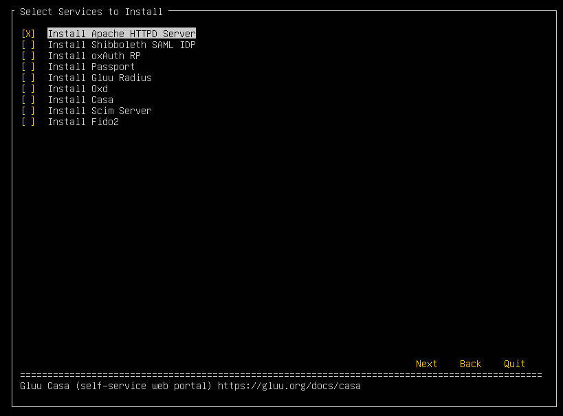

# Setup Script

## Setup TUI

After installation, executing `setup.py` will launch the Setup TUI by default. The TUI will walk through the setup process step-by-step.

1. A warning will pop up if the free disk space is less than the recommended 40 GB.

1. The TUI will detect which operating system, init type, and Apache version are currently on the server.

1. The third screen will gather some basic information to generate certificates.

1. Next, pick which services should be installed for this deployment. 
    

1. Next, pick a persistence mechanism. Choose from WrenDS, an LDAP that can be installed locally or remotely, or [Couchbase](https://www.couchbase.com/), an enterprise NoSQL cloud database.

1. Finally, review the summary screen that gives an overview of the selections made during the setup process.

## Setup Command Line

If TUI is not available on your environment, it switches to command line. If you want to use command line, execute with `-c` argument:

```
/install/community-edition-setup/setup.py -c
```

The setup script will bring up a prompt to provide information for certificate as well as the IP Address and the hostname for the Gluu Server.  Hit `Enter` to accept the default values. 

Refer to the following table for details about available setup options:    

| Setup Option                | Explanation                                                                                                                                                                                                                                   |
|-------------------------|-----------------------------------------------------------------------------------------------------------------------------------------------------------------------------------------------------------------------------------------------|
| Enter IP Address | Used primarily by Apache httpd for the [Listen](https://httpd.apache.org/docs/2.4/bind.html) directive. **Use an IP address assigned to one of this server's network interfaces (usage of addresses assigned to loopback interfaces is not supported)** |
| Enter hostname | Internet-facing FQDN that is used to generate certificates and metadata. **Do not use an IP address or localhost.**                                                                                                                           |
| Enter your city or locality | Used to generate X.509 certificates.                                                                                                                                                                                                          |
| Enter your state or province two letter code | Used to generate X.509 certificates.                                                                                                                                                                                                          |
| Enter two letter Country Code | Used to generate X.509 certificates.                                                                                                                                                                                                          |
| Enter Organization Name | Used to generate X.509 certificates.                                                                                                                                                                                                          |
| Enter email address for support at your organization | Used to generate X.509 certificates.                                                                                                                                                                                                          | 
| Optional: enter password for oxTrust and LDAP superuser | Used as the LDAP directory manager password, and for the default admin user for oxTrust.                                                                                                                                                      |
| Install oxAuth OAuth2 Authorization Server | Required. Includes Gluu's OpenID Connect provider (OP) and UMA authorization server (AS) implementations.                                                                                                                                     |
| Install oxTrust Admin UI | Required. This is the Gluu server admin dashboard.                                                                                                                                                                                            |
| Backend Type | Required. You can choose one of Local OpenDj, Remote OpenDj, Local Couchbase (availabel if you have package at /opt/dist/couchbase), Remote Couchbase, Local MySQL, Remote MySQL, Local PgSQL, Remote PgSQL, Cloud Spanner, Spanner Emulator. *Note: Some options are not available depending on your profile.* |
| Install Apache 2 web server | Required                                                                                                                                                                                                                                      |
| Install Shibboleth SAML IDP | Optional. Only install if a SAML identity provider (IDP) is needed.                                                                                                                                                                           |
| Install oxAuth RP | Optional. OpenID Connect test client: useful for test environments, for more details see [here](../admin-guide/openid-connect.md/#oxauth-rp)                                                                                                     |
| Install Passport | Optional. Install if you want to support external IDP, for instance to offer users social login.                                                                                                                                              |
| Install Gluu Radius | Optional. Installs Radius server. More information is available [here](../admin-guide/radius-server/gluu-radius.md)                                                                                                                           

When complete, the setup script will show the selections and prompt for confirmation. If everything looks OK, select Y to finish installation. 

After 5-10 minutes the following success message will appear: 

`Gluu Server installation successful! Point your browser to [hostname].`

!!! Login
    Log in using the username `admin` and the password from the setup script prompt e.g `hlE3vzf0hMdD` or the password entered

### Avoiding common issues

Avoid setup issues by acknowledging the following:         

- IP Address: Do **not** use `localhost` for either the IP address or hostname.     

- Hostname:     
     - Make sure to choose the hostname carefully. Changing the hostname after installation is not a simple task.   
     - Use a real hostname--this can always be managed via host file entries if adding a DNS entry is too much work for testing.   
     - For clustered deployments, use the hostname of the cluster that will be used by applications connecting to Gluu.   
     
!!! Warning
    Use a FQDN (fully qualified domain name) as hostname and refrain from using 127.0.0.1 as IP address or usage of private IP is not supported and not recommended.
    
- Only run the setup script **one time**. Running the command twice will break the instance.

If a resolvable DNS host is not used, then it must be added to the hostname of the Operating System hosts file on the server running the browser.

!!! Warning
    Remove or encrypt the setup.properties.last file as it contains the clear text passwords for *LDAP, admin user, keystores, and 3DES salt*.

Errors can be found the the `setup_errors.log` file and a detailed step by step installation is found in the `setup.log` file under the `/install/community-edition-setup` folder.

## Script Command Line Options
The setup script can be used to configure your Gluu Server and to add initial data for oxAuth and oxTrust to start. If `setup.properties` is found in this folder, these properties will automatically be used instead of the interactive setup.

The administrator can use the following command line options to include additional components:

* __-c__ Switches to command line
* __-p__ Install Passport
* __-d__ specify the directory where community-edition-setup is located. Defaults to '.'
* __-f__ specify `setup.properties` file
* __-h__ invoke this help
* __-n__ no interactive prompt before install starts. Run with `-f`
* __-N__ no Apache httpd server
* __-s__ install the Shibboleth IDP
* __-u__ update hosts file with IP address/hostname
* __-w__ get the development head war files
* __-t__ Load test data
* __-x__ Load test data and exit
* __-stm__ Enable Scim Test Mode
* __-sum__ Enable-scim-uma-mode
* __-properties-password__ Provide password to decode `setup.properties.last.enc`
* __--import-ldif=custom-ldif-dir__ Render ldif templates from custom-ldif-dir and import them in LDAP
* __--listen_all_interfaces__ Allow the LDAP server to listen on all server interfaces. This is required for clustered installations to replicate between LDAP servers. If not enabled, the LDAP server listens only to localhost
* __---allow-pre-released-features__ Enable options to install experimental features, not yet officially supported.
* __--remote-ldap__ Allows use of a remote LDAP server.
* __--install-local-ldap__ Installs a local OpenDJ LDAP server
* __--disable-local-ldap__  Disables installing local OpenDJ LDAP server
* __--remote-couchbase__ Allows use of a remote Couchbase server
* __--local-couchbase__ Enables installing couchbase server
* __--no-data__ Do not import any data to database backend, used for clustering
* __--no-oxauth__ Do not install oxAuth OAuth2 Authorization Server
* __--no-oxtrust__ "Do not install oxTrust Admin UI
* __--install-gluu-radius__ Install oxTrust Admin UI
* __-ip-address__ Used primarily by Apache httpd for the Listen directive
* __-host-name__ Internet-facing FQDN that is used to generate certificates and metadata
* __-org-name__ Organization name field used for generating X.509 certificates
* __-email__ Email address for support at your organization used for generating X.509 certificates
* __-city__ City field used for generating X.509 certificates
* __-state__ State field used for generating X.509 certificates
* __-country__ Two letters country coude used for generating X.509 certificates
* __-oxtrust-admin-password__ Used as the default admin user for oxTrust
* __-ldap-admin-password__ Used as the LDAP directory manager password
* __-application-max-ram__ Sets the maximum RAM value to be used
* __-local-rdbm=mysql__ Sets RDBMS type to MySQL
* __-rdbm-user=<username>__ Credential for RDBM setup
* __-rdbm-port RDBM_PORT__  RDBM port
* __-rdbm-db RDBM_DB__      RDBM database
* __-rdbm-host RDBM_HOST__  RDBM host
* __--reset-rdbm-db__       Deletes all table on target database. Warning! You will lose all data on target database.
* __-rdbm-password=<password>__ Credential for RDBM setup
* __-spanner-project__ Spanner project name
* __-spanner-instance__ Spanner instance name
* __-spanner-database__ Spanner database name
* __-spanner-emulator-host__ Use Spanner emulator host
* __-google-application-credentials__ Path to Google application credentials json file
* __--install-casa__ Install CASA
* __--install-oxd__ Install oxd Server
* __--install-scim__ Install Scim Server
* __--install-fido2__ Install FIDO2
* __--oxd-use-gluu-storage__ Use Gluu Storage for Oxd Server
* __-couchbase-bucket-prefix__ Set prefix for couchbase buckets
* __-couchbase-hostname__ Remote couchbase server hostname
* __-couchbase-admin-user__ Couchbase admin user
* __-couchbase-admin-password__ Couchbase admin user password
* __--generate-oxd-certificate__ Generate certificate for oxd based on hostname
* __--dummy__ Dummy installation. Used for re-storing backups
* __-csx__ Collect setup properties, save and exit
* __-j__ Use Java existing on system
* __-testadmin-password__ Used as password for testadmin for oxTrust
* __-profile__ Setup profile, can take one of CE, DISA-STIG
* __-opendj-keystore-type__ OpenDj keystore type, ony for DISA-STIG profile and can take one of pkcs11, bcfks
* __--no-progress__ Use simple progress
* __-enable-script__ inum of scripts to enable, use comma as seperation character
* __-ox-authentication-mode__ Sets oxAuthenticationMode 
* __-ox-trust-authentication-mode__ Sets oxTrustAuthenticationMode
* __--gluu-passwurd-cert__  Creates Gluu Passwurd API keystore
* __-properties__ Other properties. Example: encode_salt:Y83EBo94vj9b4iyKDX2drmZk,default_store_type:JKS

Example Command: `# ./setup.py -p -s` This command will install Gluu Server with Passport and Shibboleth IDP.


!!! Note
    `setup.py` will save an encrypted properties file named `setup.properties.last.enc`. The password is the same as the oxTrust admin password. Retain this password to use this file for future installations. To reuse the file, it needs to be decrypted with the following command:
    ```
    openssl enc -d -aes-256-cbc -in setup.properties.last.enc -out setup.properties.last
    ```
    When prompted, enter the oxTrust admin password.


<!-- 
#### Couchbase Server Setup (Experimental)
Starting in CE 4.1, Gluu Server supports Couchbase Server as a database backend. To install with Couchbase, you need to download the OS-specific Couchbase package from https://www.couchbase.com/downloads (Enterprise version only), and save to `/opt/dist/couchbase`. For example, for Ubuntu 18,

```
# ls /opt/dist/couchbase
couchbase-server-enterprise_6.0.1-ubuntu18.04_amd64.deb
```

If both Couchbase and LDAP (either locally or remote) are available, you will be asked if you want to use hybrid backends:

```
Install (1) Gluu OpenDj (2) Couchbase (3) Hybrid [1|2|3] [1] : 3
  Please note that you have to update your firewall configuration to
  allow connections to the following ports:
  4369, 28091 to 28094, 9100 to 9105, 9998, 9999, 11207, 11209 to 11211,
  11214, 11215, 18091 to 18093, and from 21100 to 21299.
By using this software you agree to the End User License Agreement.
See /opt/couchbase/LICENSE.txt.
Use Gluu OpenDj to store (1) default (2) user (3) cache (4) statistic (5) site : 14
```

In this example, both OpenDJ and Couchbase will be used for storing data. Default storage (system configurations, attributes, clients, etc.) will be OpenDJ and also metric data (statistic) will be stored in OpenDJ. Other data will be stored in Couchbase server.

-->
