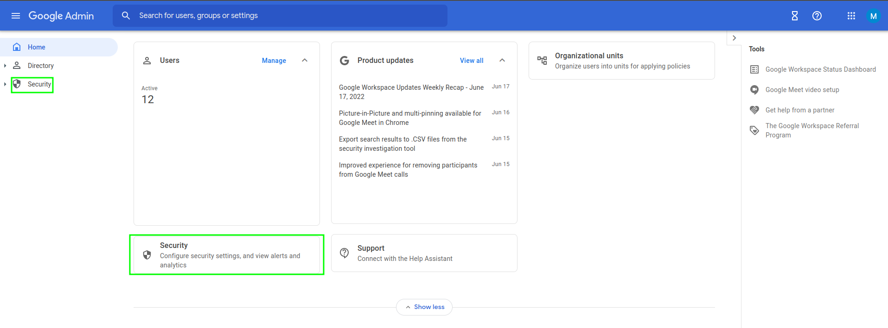
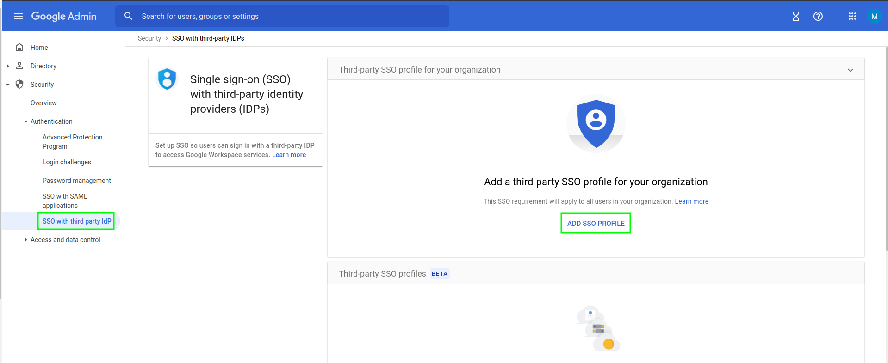
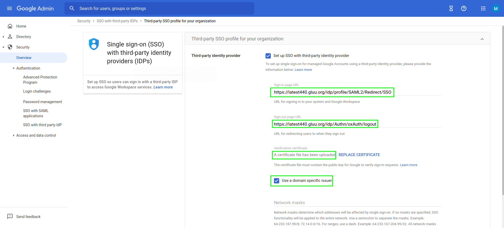
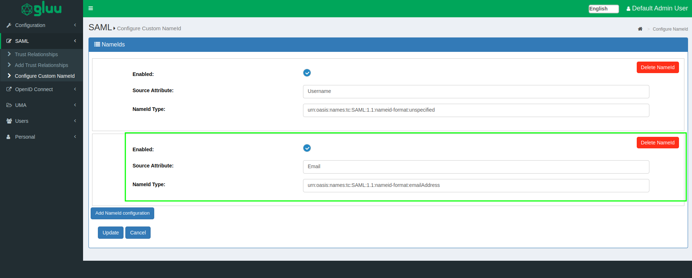
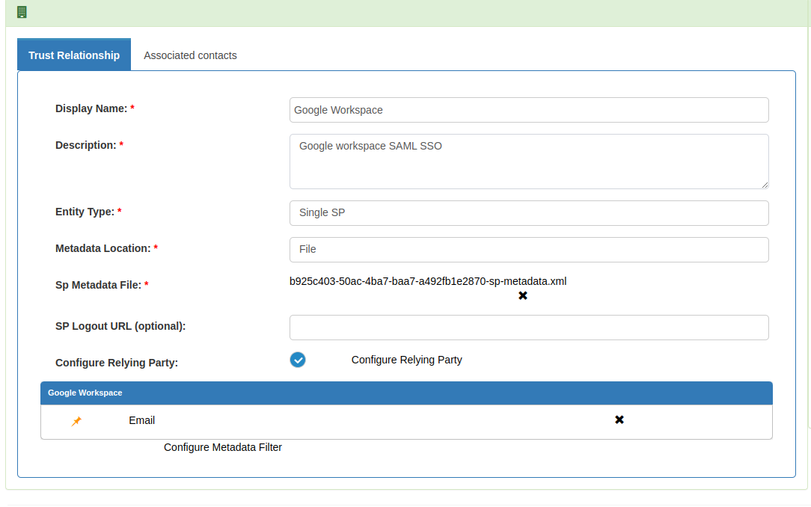
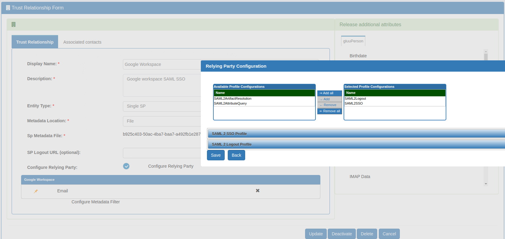

# Google Workspace Single Sign On

  - Using protocol: SAML 

## Google workspace configuration

- Log into `admin.google.com` with administrative privilege user.
 


- `Security` > `SSO with third party IdP` 
 


- `Add SSO Profile`

     - Check `Set up SSO with third-party identity provider`
     
     - Sign-in page URL: `https://[hostname_of_Gluu_Server]/idp/profile/SAML2/Redirect/SSO`

     - Sign-out page URL: `https://[hostname_of_Gluu_Server/idp/Authn/oxAuth/logout`

     - Verificiation certificate: Log into your Gluu Server and grab `idp-signing.crt` from `~inside_container/etc/certs/`. Upload it.
    
 
 
- Save configuration. 
  
## Gluu Server configuration

- Configure NameID:  

     - Configure a NameID based on `Email` attribute. 

     - NameId type would be: `urn:oasis:names:tc:SAML:1.1:nameid-format:emailAddress`
    


 - Create Trust Relationship: 


    - We need to write a quick metadata for Google workplace which we are going to use in trust relationship. 
 
    - Metadata is attached below. Deployer need to modify that according to their own DNS entry. 

    ```
      <EntityDescriptor entityID="google.com/a/company.org" xmlns="urn:oasis:names:tc:SAML:2.0:metadata">
          <SPSSODescriptor protocolSupportEnumeration="urn:oasis:names:tc:SAML:2.0:protocol">
             <NameIDFormat>urn:oasis:names:tc:SAML:1.1:nameid-format:emailAddress</NameIDFormat>
                  <AssertionConsumerService index="1" Binding="urn:oasis:names:tc:SAML:2.0:bindings:HTTP-POST"
                  Location="https://www.google.com/a/company.org/acs" >
                  </AssertionConsumerService>
          </SPSSODescriptor>
      </EntityDescriptor>
    ```
     
    - Create a trust relationship with above metadata and release "Email" attribute. 
 




- Create test user who is aligned with your Google Workspace user (for testing purposes). Our test user is 'zico@gluu.org' which is available in both Google and Gluu Server. 

## Test

Initiate SSO with `docs.google.com/a/gluu.org` and it would look as demonstrated [in this video](https://youtu.be/Iub6e246YGw).
