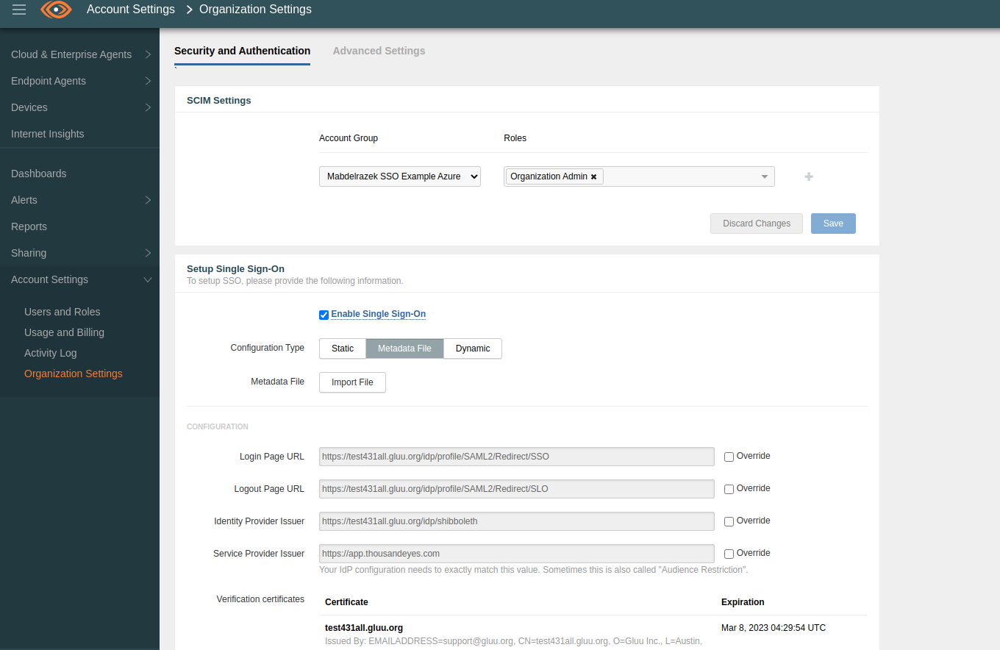
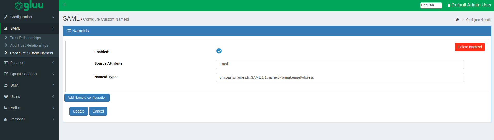
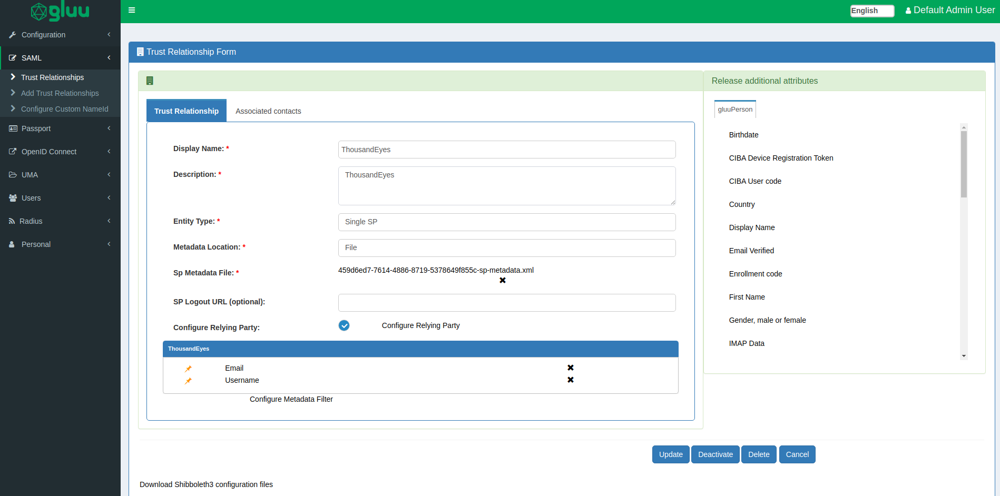

# Build ThousandEyes Single Sign On with Gluu Server through SAML protocol

## ThousandEyes configuration

As administrative user, log into ThousandEyes control panel. 

 - Account Settings > Organization Settings > `Setup Single Sign-On`
 - Grab Gluu Server's metadata from `https://GluuServer.gluu.org/idp/shibboleth` location and import that in "Metadata File" 
 - Configuration: 
   - Login Page URL: `https://GluuServer.gluu.org/idp/profile/SAML2/Redirect/SSO`
   - Logout Page URL: `https://GluuServer.gluu.org/idp/profile/SAML2/Redirect/SLO`
   - Identity Provider Issuer: `https://test431all.gluu.org/idp/shibboleth`
   - Service Provider Issuer: `https://app.thousandeyes.com`
   - Vetification certificates: automatically collected from IDP metadata...



## Gluu Server configuration

 - Grab ThousandEyes metadata from `https://app.thousandeyes.com/saml-metadata` and modify like below. 
   - Remove `unspecified` type nameID section ( `<md:NameIDFormat>urn:oasis:names:tc:SAML:1.1:nameid-format:unspecified</md:NameIDFormat>` ) 
   - Save it
 - Configure NameID based on EmailAddress. 
  
 
 
 - Configure Trust Relationship by using modified SP metadata. 
   - Relying Party configuration: 
      - "SAML2SSO" profile: 
         - assertionLifetime: default
         - signResponses: conditional
         - signAssertions: never
         - signRequests: conditional
         - encryptAssertions: never
         - encryptNameIds: never
         - Default Auth Methods: none
         - includeAttributestatement: default
         - Support Unspecified NameidFormat: default 
  
 - 

- Create an user who has same email address as ThousandEyes portal has. As for example, test user 'mohib@gluu.org' is available in both ThousandEyes and Gluu Server in this case. 

## Test

Use `app.thousandeyes.com/login/sso` to initiate SSO. A successful SSO would look like below: 

 - Screencast: https://youtu.be/YrAjVN0hxAs
 - SAML assertion: 

  ```
       <?xml version="1.0" encoding="UTF-8"?><saml2p:Response xmlns:saml2p="urn:oasis:names:tc:SAML:2.0:protocol" Destination="https://app.thousandeyes.com/login/sso/acs" ID="_57e46037dce5569adeed053c32a56cc5" InResponseTo="_df3efdd0-cac3-4c46-9e7d-f95462ed9df0" IssueInstant="2022-03-08T16:49:25.367Z" Version="2.0" xmlns:xsd="http://www.w3.org/2001/XMLSchema">
           <saml2:Issuer xmlns:saml2="urn:oasis:names:tc:SAML:2.0:assertion">https://test431all.gluu.org/idp/shibboleth</saml2:Issuer>
           <ds:Signature xmlns:ds="http://www.w3.org/2000/09/xmldsig#">
               <ds:SignedInfo>
                   <ds:CanonicalizationMethod Algorithm="http://www.w3.org/2001/10/xml-exc-c14n#"/>
                   <ds:SignatureMethod Algorithm="http://www.w3.org/2001/04/xmldsig-more#rsa-sha256"/>
                   <ds:Reference URI="#_57e46037dce5569adeed053c32a56cc5">
                       <ds:Transforms>
                           <ds:Transform Algorithm="http://www.w3.org/2000/09/xmldsig#enveloped-signature"/>
                           <ds:Transform Algorithm="http://www.w3.org/2001/10/xml-exc-c14n#">
                               <ec:InclusiveNamespaces xmlns:ec="http://www.w3.org/2001/10/xml-exc-c14n#" PrefixList="xsd"/>
                           </ds:Transform>
                       </ds:Transforms>
                       <ds:DigestMethod Algorithm="http://www.w3.org/2001/04/xmlenc#sha256"/>
                       <ds:DigestValue>cjk9qQI8TXE2AU76TF7R1xk7dgIiLzjUY82hox/osTA=</ds:DigestValue>
                   </ds:Reference>
               </ds:SignedInfo>
               <ds:SignatureValue>qbXbimhid6uaOvoq5lPOSIjKVKO7/wwYPbumeqwlHPWorEgeACMoPjqL9REp4fP+c9hTA1B3/UAk2Rna8/eU8NOe9soCO/5zIrilLcduXlgXnDMNJXHr7Jo/2S+X3GmuPe4WFQ2QrDH5L2gXN2qrUt3+5qsdeyRgvWEYKOmrmZ9egrMWV+pJMPenDRdv7MVR6dVIC/yo7/xKvzlA7kyfJHdVNmuHYGzrCClUMXmippywnHaOBNpBHg1I5QEqo9eymhmaTl2Lk6DUV1J5PRyzkQydx8Vniju2Sj9FFkQ7MxYvS0Qri753hyXmz67OryQfchMPS+TbFyVpiyUcT+Hf3A==</ds:SignatureValue>
               <ds:KeyInfo>
                   <ds:X509Data>
                       <ds:X509Certificate>MIIDgzCCAmsCFHb8W9yVnE1wcfEYnxIHNBXqvZXfMA0GCSqGSIb3DQEBCwUAMH4xCzAJBgNVBAYT
       AlVTMQswCQYDVQQIDAJUWDEPMA0GA1UEBwwGQXVzdGluMRIwEAYDVQQKDAlHbHV1IEluYy4xHDAa
       BgNVBAMME3Rlc3Q0MzFhbGwuZ2x1dS5vcmcxHzAdBgkqhkiG9w0BCQEWEHN1cHBvcnRAZ2x1dS5v
       cmcwHhcNMjIwMzA4MDQyOTU0WhcNMjMwMzA4MDQyOTU0WjB+MQswCQYDVQQGEwJVUzELMAkGA1UE
       CAwCVFgxDzANBgNVBAcMBkF1c3RpbjESMBAGA1UECgwJR2x1dSBJbmMuMRwwGgYDVQQDDBN0ZXN0
       NDMxYWxsLmdsdXUub3JnMR8wHQYJKoZIhvcNAQkBFhBzdXBwb3J0QGdsdXUub3JnMIIBIjANBgkq
       hkiG9w0BAQEFAAOCAQ8AMIIBCgKCAQEAq4qA/QLDcR4EUgp/ssOF5B20loJAYLJ7LK8uu5FaGZY8
       9rYE88sCg060rIXQ1U91ZBveVXhaKEI+wwMaEYM2NOcRBbWpLzX1HvgfEiQAJryEtoBSz1iYpVOt
       bqZYeVxSiKAegKir3MpxIVVzpCpXc0FjUtPkawhlr/HgZ9ft8GkIrdJoKEapwQYMkH0d3chUd/Jk
       YqpIr8cK0zyUUD5lnUMJty/CP6gREalIoWZFvolRIXa5WHHxqWDN46xCKuirZgdBmsLT0fHrv6Vm
       2sNS20X84QoZa2JRyDET4ohJLT3VxU5iFd7lDQI4GBWxpAJwk5qTM106Z7x6dlf/SpNUvQIDAQAB
       MA0GCSqGSIb3DQEBCwUAA4IBAQBfcxB75sVn14DObaHeNBJuTePVpLX0uWoH6S6a1wzZTylYYZXX
       MewBoHTIfaNE/8xXg467+wfICbBl7TaBnZxfhLt5dP6R8SuYIvstLY02PY5Xc6Rq0XIpl8nu6Str
       5k96VxUlrEnNrvGJoHzJ+io5uEpJTb5qyjAW5/fe2suiVh7rzxNR5MVRYDwlq1RA7AQNyou1FDdG
       Vi6tx92OWXhotWY8Q14j3LdJcLiUZDX3nMZGaRzB+Bd+9Y+p8Z5zxz7cQn1HyD1wxC0yLWkl+gW0
       CzyOc234DU6oFDn8Qr6O6f8/Wo02v8rqc8RdCzRgyTno4MDdKhgjk3svk/Foei8m</ds:X509Certificate>
                   </ds:X509Data>
               </ds:KeyInfo>
           </ds:Signature>
           <saml2p:Status>
               <saml2p:StatusCode Value="urn:oasis:names:tc:SAML:2.0:status:Success"/>
           </saml2p:Status>
           <saml2:Assertion xmlns:saml2="urn:oasis:names:tc:SAML:2.0:assertion" ID="_7d8f36c36377b1a5b003ef841ca2387b" IssueInstant="2022-03-08T16:49:25.367Z" Version="2.0" xmlns:xsd="http://www.w3.org/2001/XMLSchema">
               <saml2:Issuer>https://test431all.gluu.org/idp/shibboleth</saml2:Issuer>
               <ds:Signature xmlns:ds="http://www.w3.org/2000/09/xmldsig#">
                   <ds:SignedInfo>
                       <ds:CanonicalizationMethod Algorithm="http://www.w3.org/2001/10/xml-exc-c14n#"/>
                       <ds:SignatureMethod Algorithm="http://www.w3.org/2001/04/xmldsig-more#rsa-sha256"/>
                       <ds:Reference URI="#_7d8f36c36377b1a5b003ef841ca2387b">
                           <ds:Transforms>
                               <ds:Transform Algorithm="http://www.w3.org/2000/09/xmldsig#enveloped-signature"/>
                               <ds:Transform Algorithm="http://www.w3.org/2001/10/xml-exc-c14n#">
                                   <ec:InclusiveNamespaces xmlns:ec="http://www.w3.org/2001/10/xml-exc-c14n#" PrefixList="xsd"/>
                               </ds:Transform>
                           </ds:Transforms>
                           <ds:DigestMethod Algorithm="http://www.w3.org/2001/04/xmlenc#sha256"/>
                           <ds:DigestValue>9x9rsyeERjVLu2SFkAAyXtS0WQVjPr0BsWKMFw53Wow=</ds:DigestValue>
                       </ds:Reference>
                   </ds:SignedInfo>
                   <ds:SignatureValue>dHXFFJ8vO1hjsnHnqEhwPNpu3Z5QmuSEoIkyLCjeBBMRoKJqSFKaWDdAGvbL0uQXYfaL4OeHg8GWbvRfclIT2dOYZFpEI6u7IiR09gqo4eSuzPwOYNwff+R5vgWWtrMwN1CX+1Ke83xfcU+Sor2U5biBuRu1XQxE+maN4SFlPWpFSC3pXjFkemiYHz/qGV4AcIcM1OnVG1PqKvFBYLlbc2gvNMLVdXylL2oGMKk90KQ90YtAI2Ko3EcU5gpQPSDeFns0n+8YS5SwTtDjwrvRnkuHMYaBfFwY+ISKyTutZE+sobTH/r1kyFnkMsPL6sRatxEw2Ggqg2qs+byxDpw1VA==</ds:SignatureValue>
                   <ds:KeyInfo>
                       <ds:X509Data>
                           <ds:X509Certificate>MIIDgzCCAmsCFHb8W9yVnE1wcfEYnxIHNBXqvZXfMA0GCSqGSIb3DQEBCwUAMH4xCzAJBgNVBAYT
       AlVTMQswCQYDVQQIDAJUWDEPMA0GA1UEBwwGQXVzdGluMRIwEAYDVQQKDAlHbHV1IEluYy4xHDAa
       BgNVBAMME3Rlc3Q0MzFhbGwuZ2x1dS5vcmcxHzAdBgkqhkiG9w0BCQEWEHN1cHBvcnRAZ2x1dS5v
       cmcwHhcNMjIwMzA4MDQyOTU0WhcNMjMwMzA4MDQyOTU0WjB+MQswCQYDVQQGEwJVUzELMAkGA1UE
       CAwCVFgxDzANBgNVBAcMBkF1c3RpbjESMBAGA1UECgwJR2x1dSBJbmMuMRwwGgYDVQQDDBN0ZXN0
       NDMxYWxsLmdsdXUub3JnMR8wHQYJKoZIhvcNAQkBFhBzdXBwb3J0QGdsdXUub3JnMIIBIjANBgkq
       hkiG9w0BAQEFAAOCAQ8AMIIBCgKCAQEAq4qA/QLDcR4EUgp/ssOF5B20loJAYLJ7LK8uu5FaGZY8
       9rYE88sCg060rIXQ1U91ZBveVXhaKEI+wwMaEYM2NOcRBbWpLzX1HvgfEiQAJryEtoBSz1iYpVOt
       bqZYeVxSiKAegKir3MpxIVVzpCpXc0FjUtPkawhlr/HgZ9ft8GkIrdJoKEapwQYMkH0d3chUd/Jk
       YqpIr8cK0zyUUD5lnUMJty/CP6gREalIoWZFvolRIXa5WHHxqWDN46xCKuirZgdBmsLT0fHrv6Vm
       2sNS20X84QoZa2JRyDET4ohJLT3VxU5iFd7lDQI4GBWxpAJwk5qTM106Z7x6dlf/SpNUvQIDAQAB
       MA0GCSqGSIb3DQEBCwUAA4IBAQBfcxB75sVn14DObaHeNBJuTePVpLX0uWoH6S6a1wzZTylYYZXX
       MewBoHTIfaNE/8xXg467+wfICbBl7TaBnZxfhLt5dP6R8SuYIvstLY02PY5Xc6Rq0XIpl8nu6Str
       5k96VxUlrEnNrvGJoHzJ+io5uEpJTb5qyjAW5/fe2suiVh7rzxNR5MVRYDwlq1RA7AQNyou1FDdG
       Vi6tx92OWXhotWY8Q14j3LdJcLiUZDX3nMZGaRzB+Bd+9Y+p8Z5zxz7cQn1HyD1wxC0yLWkl+gW0
       CzyOc234DU6oFDn8Qr6O6f8/Wo02v8rqc8RdCzRgyTno4MDdKhgjk3svk/Foei8m</ds:X509Certificate>
                       </ds:X509Data>
                   </ds:KeyInfo>
               </ds:Signature>
               <saml2:Subject>
                   <saml2:NameID Format="urn:oasis:names:tc:SAML:1.1:nameid-format:emailAddress" xmlns:saml2="urn:oasis:names:tc:SAML:2.0:assertion">mohib@gluu.org</saml2:NameID>
                   <saml2:SubjectConfirmation Method="urn:oasis:names:tc:SAML:2.0:cm:bearer">
                       <saml2:SubjectConfirmationData Address="118.179.84.52" InResponseTo="_df3efdd0-cac3-4c46-9e7d-f95462ed9df0" NotOnOrAfter="2022-03-08T16:54:25.435Z" Recipient="https://app.thousandeyes.com/login/sso/acs"/>
                   </saml2:SubjectConfirmation>
               </saml2:Subject>
               <saml2:Conditions NotBefore="2022-03-08T16:49:25.367Z" NotOnOrAfter="2022-03-08T16:54:25.367Z">
                   <saml2:AudienceRestriction>
                       <saml2:Audience>https://app.thousandeyes.com</saml2:Audience>
                   </saml2:AudienceRestriction>
               </saml2:Conditions>
               <saml2:AuthnStatement AuthnInstant="2022-03-08T16:49:25.298Z" SessionIndex="_e4e94633d2a9159c4e085d666b2b0506">
                   <saml2:SubjectLocality Address="118.179.84.52"/>
                   <saml2:AuthnContext>
                       <saml2:AuthnContextClassRef>urn:oasis:names:tc:SAML:2.0:ac:classes:PasswordProtectedTransport</saml2:AuthnContextClassRef>
                   </saml2:AuthnContext>
               </saml2:AuthnStatement>
               <saml2:AttributeStatement>
                   <saml2:Attribute FriendlyName="mail" Name="urn:oid:0.9.2342.19200300.100.1.3" NameFormat="urn:oasis:names:tc:SAML:2.0:attrname-format:uri">
                       <saml2:AttributeValue xmlns:xsi="http://www.w3.org/2001/XMLSchema-instance" xsi:type="xsd:string">mohib@gluu.org</saml2:AttributeValue>
                   </saml2:Attribute>
                   <saml2:Attribute FriendlyName="uid" Name="urn:oid:0.9.2342.19200300.100.1.1" NameFormat="urn:oasis:names:tc:SAML:2.0:attrname-format:uri">
                       <saml2:AttributeValue xmlns:xsi="http://www.w3.org/2001/XMLSchema-instance" xsi:type="xsd:string">mohib</saml2:AttributeValue>
                   </saml2:Attribute>
               </saml2:AttributeStatement>
           </saml2:Assertion>
       </saml2p:Response>

       2022-03-08 16:49:25,512 - 118.179.84.52 - DEBUG [net.shibboleth.idp.profile.impl.RecordResponseComplete:89] - Profile Action RecordResponseComplete: Record response complete
       2022-03-08 16:49:25,513 - 118.179.84.52 - INFO [Shibboleth-Audit.SSO:283] - 118.179.84.52|2022-03-08T16:49:13.638592Z|2022-03-08T16:49:25.513084Z|mohib|https://app.thousandeyes.com|_7d8f36c36377b1a5b003ef841ca2387b|password|2022-03-08T16:49:25.298206Z|mail,uid|mohib@gluu.org|emailAddress|false|false||Redirect|POST||Success||a3d650ed9bb68585b6a0eef595cfa46f9cf298df1379440409fa27c7ea4e7827|Mozilla/5.0 (X11; Linux x86_64) AppleWebKit/537.36 (KHTML, like Gecko) Chrome/98.0.4758.80 Safari/537.36

  ```
