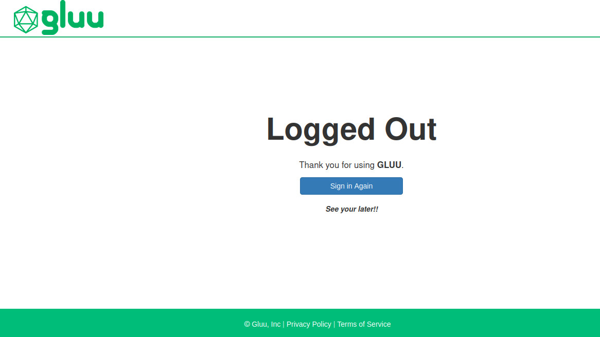

# Customizing Public Pages

Most organizations will want to edit and customize the look and feel of public-facing Gluu Server pages to match their own corporate branding. 
The following documentation provides the file locations of public-facing pages, as well as instructions for adding custom HTML, CSS, and Javascript files to your Gluu Server. 

Public pages include:  

- All included sign-in pages     
- Registration    
- Password Recovery   
- Error Pages    

!!! Warning 
    Customizations should only be made by people with a solid understanding of web development. Before changing any files, we recommend creating backups to easily revert your instance to its original state.

## Overview

The Gluu Server's public-facing pages are `xhtml` files. Each Gluu Server component is deployed as a separate archive in WAR format. When any component's service is started, its archive is unpacked ("exploded") to Jetty's temporary file directory located under `/opt/jetty-<VERSION>/temp/` before it'll be able to start serving requests for associated functionality. 

To customize any files used by a component, they need to be changed either at that temporary location, or inside the corresponding archive itself. Note that changes made directly to unpacked files under `/opt/jetty-<VERSION>/temp/` won't be persisted--each time a component's service is restarted its WAR archive will be re-exploded, overwriting the existing content on the disk.

A typical example would be customizing oxAuth's login page. There are two ways to achieve this:

1. Unpack the needed files from `/opt/gluu/jetty/oxauth/webapps/oxauth.war` with a tool like `jar`, update them and add them back to the archive with all required dependencies (**not recommended**);

1. Put changed files under `/opt/gluu/jetty/oxauth/custom/` directory, so they could be used instead of the standard files in `oxauth.war`. (Note: the same approach will work for oxTrust if files are placed under `/opt/gluu/jetty/identity/custom/`). The benefit of using this method is that your customizations won't be disturbed by any changes to `oxauth.war` or `identity.war` later on (for example, in case this Gluu instance will be patched or updated, and a component's WAR archive will get overwritten). More on this method below. 

## Directory structure and mappings

!!! Note
    Log in to the Gluu Server chroot before working on design customizations for any pages.

New directories trees have been added inside the Gluu Server `chroot` to make page customizations easier. 
Each such tree is placed in the configuration directory of the corresponding Gluu component (only 
customization of oxAuth and oxTrust pages is supported at the moment by this feature). 
The new directory structure can be illustrated as follows (only directories related to this feature are shown for clarity):

### oxAuth

```
/opt/gluu/jetty/oxauth/
|-- custom
|   |-- i18n
|   |-- libs
|   |-- pages
|   `-- static
```

### oxTrust

```
/opt/gluu/jetty/identity/
|-- custom
|   |-- i18n
|   |-- libs
|   |-- pages
|   `-- static
```

### Subdirectories 

Customized `i18n` should be placed in the following directories:
```
/opt/gluu/jetty/identity/custom/i18n
/opt/gluu/jetty/oxauth/custom/i18n
```

Resources from this folder will be loaded at the next service restart.

!!! Note
    This can only customize oxAuth/Identity resources. New messages bundles applications are not read automatically.

Sub-directory `custom/pages` have a special purpose. They enable overriding exploded `xhtml` pages from the unpacked WAR archive. The path to the exploded WAR conforms to the following scheme:

```
/opt/jetty-<VERSION>/temp/jetty-localhost-<PORT_NUMBER>-<COMPONENT_NAME>.war-_<COMPONENT_NAME>-any-<RANDOM_TAG>.dir/webapp/
```

So, for example, the path to an exploded oxAuth's WAR archive directory may look like this (and may be changed the next time the corresponding service is restarted):

```
/opt/jetty-9.4/temp/jetty-localhost-8081-oxauth.war-_oxauth-any-9071517269463235631.dir/webapp/
```

Thus, a modified `login.xhtml` page put under `custom/pages/` will be used instead of the `webapp/login.xhtml` file from the exploded archive. You can use files unpacked there as a base for your own customized files.

!!! Warning 
    Jetty included in earlier Gluu 3.x packages are known to create duplicated directories under `/opt/jetty-<VERSION>/temp/` for each of its components. In case of encountering this issue, it's recommended to stop the corresponding service and remove all subdirectories related to it from the `temp/` directory. After starting service again its WAR archive will be unpacked there again.

!!! Note
    This approach is for XHTML pages only. Other resources like `faces-config.xml` cannot be overridden with this method.

Customized `libs` used by oxAuth should be placed in the following directories:

```
/opt/gluu/jetty/identity/custom/libs
/opt/gluu/jetty/oxauth/custom/libs
```

Additional libs/plugins should be registered in `/opt/gluu/jetty/oxauth/webapps/oxauth.xml` or `/opt/gluu/jetty/identity/webapps/identity.xml` in attribute `<Set name="extraClasspath"></Set>`

Custom CSS or images should be placed under `custom/static` directory. To avoid collisions with static resources from WAR files, Gluu maps this folder to the URL's path like this: `/{oxauth|identity}/ext/resources`

So, for example, a CSS file placed at this path:

```
/opt/gluu/jetty/oxauth/custom/static/stylesheet/theme.css
```

...will be externally available at a URL similar to this:

```
https://your.gluu.host/oxauth/ext/resources/stylesheet/theme.css
```

...and should be referenced from inside of source codes of customized files by a path like this:

```
/oxauth/ext/resources/stylesheet/theme.css
```

All images should be placed under: 

`/opt/gluu/jetty/oxauth/custom/static/img`

!!! Note
    You can change the logo on every public-facing page here. Place your image in `/static/img` and name it `logo.png`.

And all CSS is inside:

`/opt/gluu/jetty/oxauth/custom/static/stylesheet`

### Full customization

If the above customization approach does not help to resolve customization issues, it's possible to explode WAR files and instruct Jetty to use the exploded folder instead of a WAR file. The following is a sample for oxAuth:

1. Unpack oxauth.war into `/opt/gluu/jetty/oxauth/webapps/oxauth` folder
1. Put updated `/opt/gluu/jetty/oxauth/webapps/oxauth.xml` with the following content:

    ```
    <Configure class="org.eclipse.jetty.webapp.WebAppContext">
            <Set name="contextPath">/oxauth</Set>
            <Set name="war">
                    <Property name="jetty.webapps" default="." />/oxauth/
            </Set>
    </Configure>
    ```

!!! Warning 
    Upgrade will not apply any changes to the exploded `/opt/gluu/jetty/oxauth/webapps/oxauth` folder. After installing an upgrade package, the administrator should reapply changes manually.

## Location of key webpage source files

The default public-facing pages can be a good base for your organization's customized ones. Aside from extracting them directly from a corresponding WAR file, they can be found at Jetty's temp directory to which they are unpacked each time a corresponding service starts.

### oxAuth

oxAuth is the core Gluu CE component, handling all authentication in the framework and implementing OpenID Connect and UMA flows. Most of the web UI pages displayed to end users belong to oxAuth (login/logout/authorization flows).

Base directory:
`/opt/jetty-<VERSION>/temp/jetty-localhost-8081-oxauth.war-_oxauth-any-<RANDOM_TAG>.dir/webapp/`

- Default login page:
    `./login.xhtml`
- Authorization page:
    `./authorize.xhtml`
- Logout page:
    `./logout.xhtml`
- Error page:
    `./error.xhtml`
- Custom authentication scripts; XHTML files under:
    `./webapp/auth/`

### oxTrust:

oxTrust is responsible for displaying the Gluu Server's default registration page, as well as the administrator web UI's pages. 

Base directory:
`/opt/jetty-<VERSION>/temp/jetty-localhost-8082-identity.war-_identity-any-<RANDOM_TAG>.dir/webapp/`

- Registration page:
    `./register.xhtml`

## Applying changes

To apply the customizations just set, and [restart](./services.md#restart) the `oxauth` and `oxtrust` services. 

!!! Note
    It'll take about ten seconds for page modifications to reload.

## Customizing SAML IDP pages

Many organizations will want to edit and customize the look and feel of IDP pages to match their own corporate branding. The Gluu Server includes a custom folder that will override existing IDP pages. The IDP pages use the `vm` file type. To customize the pages, follow these steps:

1. Find the desired file inside the chroot at `/opt/shibboleth-idp/views`
1. Copy and edit the file, then move it to `/opt/gluu/jetty/idp/custom/pages`

Now, the customized page will override the default one.    

## An Example: Removing the Gluu copyright 

For a good practical example, let's consider a task of removing the Gluu copyright 
at the bottom of oxAuth's login page. You can follow these steps to achieve this:

1. Log in to the Gluu container   

1. Create a new directory structure under `custom/pages/` to accommodate the new customized page:

    ```
    # mkdir -p /opt/gluu/jetty/oxauth/custom/pages/WEB-INF/incl/layout/`    
    ```

1. Get a default template page from the exploded WAR archive and put it in the path under `custom/pages` directory, which will allow it to override the original page (your path to the exploded WAR will differ from the one used here): `# cp /opt/jetty-9.3/temp/jetty-localhost-8081-oxauth.war-_oxauth-any-9071517269463235631.dir/webapp/WEB-INF/incl/layout/template.xhtml /opt/gluu/jetty/oxauth/custom/pages/WEB-INF/incl/layout/template.xhtml`   

1. Modify the new file by removing or editing the following snippet in it:

    ```
    <s:fragment rendered="#{not isLogin}">
        <div class="footer">
            <p>Copyright <a href="http://www.gluu.org">Gluu</a> All rights reserved.</p>
        </div>
    </s:fragment>
    ```

1. Assign appropriate permissions to new directories and files: `# chown -R jetty:jetty /opt/gluu/jetty/oxauth/custom/pages/ && chmod -R a-x+rX /opt/gluu/jetty/oxauth/custom/pages/`    

  You may opt to copy the default oxAuth login page (`login.xhtml`) to the custom files 
directory as well, and add some customizations to it:    

```
cp /opt/jetty-9.3/temp/jetty-localhost-8081-oxauth.war-_oxauth-any-9071517269463235631.dir/webapp/login.xhtml  /opt/gluu/jetty/oxauth/custom/pages/
```

  Don't forget to apply appropriate file system permissions if needed. [Restart](./services.md#restart) the `oxauth` service inside the chroot.`   

## Custom oxAuth Login Page Example in Cloud Native edition


This guide will show how to customize HTML pages and CSS in oxAuth for Gluu Server cloud native edition.

As an example, we're going to:

1. add text to the top of the login form (and apply styling)
1. add text in the footer

### Preparing custom files for oxAuth

!!! Note

    The pod namespace and name are set to `gluu` and `oxauth` respectively.

1.  Locate the directory containing exploded oxAuth WAR

    ```sh
    kubectl -n gluu exec oxauth -- ls /opt/jetty/temp
    ```

    Output example:

    ```
    jetty-0_0_0_0-8080-oxauth_war-_oxauth-any-6467019887303284828
    ```

1.  Get the `login.xhtml` from oxAuth pod:

    ```sh
    kubectl -n gluu cp oxauth:opt/jetty/temp/jetty-0_0_0_0-8080-oxauth_war-_oxauth-any-6467019887303284828/webapp/login.xhtml ./login.xhtml
    ```

    Modify the file locally:

    ```html
    <h:form id="loginForm" style="padding:30px;">
        <!-- customization -->
        <div class="row"><p id="creds-title">Enter Credentials</p></div>
        <!-- end of customization -->
        <div class="row">
            <div class="col-sm-3 col-md-3">
                <h:outputText value="#{msgs['login.username']}" />
            </div>
    ```

1.  Get the `login-template.xhtml` from oxAuth pod:

    ```sh
    kubectl -n gluu cp oxauth:opt/jetty/temp/jetty-0_0_0_0-8080-oxauth_war-_oxauth-any-6467019887303284828/webapp/WEB-INF/incl/layout/login-template.xhtml ./login-template.xhtml
    ```

    Modify the file locally:

    ```html
    <h:head>
        <link type="text/css" rel="stylesheet" href="https://fonts.googleapis.com/css?family=Open+Sans:300,400,600" />
        <!-- customization -->
        <link rel="stylesheet" href="/oxauth/ext/resources/stylesheet/custom.css" />
        <!-- end of customization -->
    </h:head>

    <footer class="footer" id="appFooter">
        <div class="row" style="margin-top: 20px;">
            <div class="col-sm-6 centered" style="text-align: center;">
                <p class="centered">
                    &copy; <a target="_blank" href="https://github.com/GluuFederation/oxAuth/blob/master/LICENSE">
                        <h:outputText value="#{msgs['common.gluuInc']}" escape="false" />
                    </a> | <a target="_blank" escape="false">Custom Footer goes here</a>
                </p>
            </div>
        </div>
    </footer>
    ```

1.  Copy the following text and save it as `custom.css`:

    ```css
    #creds-title {
        font-style: italic;
        font-weight: bolder;
    }
    ```

1.  Use `configmaps` or `jackrabbit` (deprecated since Gluu v4.5.2) to upload customization.

=== "ConfigMaps"

    1.  Create configmaps to store the content of the modified `login.xhtml`, `login-template.xhtml`, and `custom.css` files.

        ```sh
        kubectl -n gluu create cm oxauth-custom-html --from-file=login.xhtml
        kubectl -n gluu create cm oxauth-custom-layout-html --from-file=login-template.xhtml
        kubectl -n gluu create cm oxauth-custom-css --from-file=custom.css
        ```

    1.  Mount these files in your `values.yaml` under `oxauth.volumes` and `oxauth.volumeMounts`:

        ```yaml
        oxauth:
           volumeMounts:
             - name: oxauth-pages-volume
               mountPath: /opt/gluu/jetty/oxauth/custom/pages # login.xthml will be mounted under this directory
             - name: oxauth-layout-volume
               mountPath: /opt/gluu/jetty/oxauth/custom/pages/WEB-INF/incl/layout # login-template.xthml will be mounted under this directory
             - name: oxauth-static-volume
               mountPath:  /tmp/static #custom.css will be mounted in the temporary location
            lifecycle:
                postStart:
                    exec:
                        command: [ "sh", "-c", "mkdir /opt/gluu/jetty/oxauth/custom/static/stylesheet/ && cp /tmp/static/custom.css /opt/gluu/jetty/oxauth/custom/static/stylesheet"] # custom.css will be copied from the temporary to the desired location   
           volumes:
             - name: oxauth-pages-volume
               configMap:
                 name: oxauth-custom-html
             - name: oxauth-layout-volume
               configMap:
                 name: oxauth-custom-layout-html
             - name: oxauth-static-volume
               configMap:
                 name: oxauth-custom-css
        ```

    1.  Run helm install or helm upgrade if Gluu has been already installed.

        ```bash
        helm upgrade gluu gluu/gluu -n gluu --version=1.8.x -f values.yaml
        ```

=== "Jackrabbit"

    !!! warning
        Jackrabbit is deprecated since Gluu v4.5.2 and users are recommended to use ConfigMaps instead.

    1. Connect to your [Jackrabbit](../installation-guide/install-kubernetes.md#working-with-jackrabbit)

    1. After connecting to  Jackrabbit create the following directories: `opt/gluu/jetty/oxauth/custom/pages/WEB-INF/incl/layout` and `opt/gluu/jetty/oxauth/custom/static/stylesheet`.

    1. Put `login.xhtml` under `opt/gluu/jetty/oxauth/custom/pages` directory.

    1. Put `login-template.xhtml` under `opt/gluu/jetty/oxauth/custom/pages/WEB-INF/incl/layout` directory

    1. Put `custom.css` under `opt/gluu/jetty/oxauth/custom/static/stylesheet` directory.

    1. Custom files will be pulled by oxAuth pod after few minutes.

Here's the screenshot of customized oxAuth login page.


## Custom oxTrust Logout Page Example in Cloud Native edition

This guide will show examples of how to customize HTML pages and CSS in oxTrust for Gluu Server cloud native edition.

As an example, we're going to add text to the logout form.

### Preparing custom files for oxTrust

!!! Note

    The pod namespace and name are set to `gluu` and `oxtrust` respectively.

1.  Locate the directory containing exploded oxTrust WAR

    ```sh
    kubectl -n gluu exec oxtrust -- ls /opt/jetty/temp
    ```

    Output example:

    ```
    jetty-0_0_0_0-8080-identity_war-_identity-any-6467019887303284828
    ```

1.  Get the `finishlogout.xhtml` from oxTrust pod:

    ```sh
    kubectl -n gluu cp oxtrust:opt/jetty/temp/jetty-0_0_0_0-8080-identity_war-_identity-any-6467019887303284828/webapp/finishlogout.xhtml ./finishlogout.xhtml
    ```

    Modify the file locally:

    ```html
    <ui:define name="body">
        <div class="lockscreen-wrapper" style="text-align: center;">
            <div class="lockscreen-name"
                style="text-align: center; font-size: 1.2em !important; margin-top: 10px; margin-bottom: 10px;">
                Thank you for using <b>GLUU</b>.
            </div>
            <a class="btn btn-block btn-primary" href="login.htm" style="width: 50%;">#{msgs['finishLogout.signIn']}</a>
            <!-- customization -->
            <div style="font-style: italic; font-weight: bolder; margin-top: 20px;">See your later!!</div>
            <!-- end of customization -->
        </div>
    </ui:define>
    ```

1. Use `configmaps` or `jackrabbit` to upload customization.

=== "ConfigMaps"

    1.  Create a configmap to store the contents of the `finishlogout.xhtml` file.

        ```sh
        kubectl -n gluu create cm oxtrust-custom-html --from-file=finishlogout.xhtml
        ```

    1.  Mount this file in your `values.yaml` under `oxtrust.volumes` and `oxtrust.volumeMounts`:

        ```yaml
        oxtrust:
          volumeMounts:
            - name: oxtrust-pages-volume
              mountPath: /opt/gluu/jetty/identity/custom/pages # finishlogout.xthml will be mounted under this directory
          volumes:
            - name: oxtrust-pages-volume
              configMap:
                name: oxtrust-custom-html
        ```

    1.  Run helm install or helm upgrade if Gluu has been already installed.

        ```bash
        helm upgrade gluu gluu/gluu -n gluu --version=1.7.x -f values.yaml
        ```

=== "Jackrabbit"

    !!! warning
        Jackrabbit is deprecated since Gluu v4.5.2 and users are recommended to use ConfigMaps instead.

    1. Connect to your [Jackrabbit](../installation-guide/install-kubernetes.md#working-with-jackrabbit)

    1. After connecting to  Jackrabbit create the following directories: `opt/gluu/jetty/identity/custom/pages`.

    1. Put `finishlogout.xhtml` under `opt/gluu/jetty/identity/custom/pages` directory.

    1. Custom files will be pulled by oxTrust pod after few minutes.

Here's the screenshot of customized oxTrust logout page.



## Custom SAML IDP Pages Example in Cloud Native edition

This guide will show examples of how to customize pages in oxShibboleth (SAML IDP) for Gluu Server cloud native edition.

=== "ConfigMaps"

    !!! Note

        The pod namespace and name are set to `gluu` and `oxshibboleth` respectively.

    1.  Locate the directory containing web pages

        ```bash
        kubectl -n gluu exec oxshibboleth -- ls /opt/shibboleth-idp/views
        ```

        Output example:

        ```
        error.vm    logout.vm
        ```

    1.  Get the `error.vm` from oxShibboleth pod:

        ```bash
        kubectl -n gluu cp oxshibboleth:opt/shibboleth-idp/views/error.vm ./error.vm
        ```

    1.  Modify the copied `error.vm` local file

    1.  Create a configmap to store the contents of modified `error.vm`.

        ```bash
        kubectl -n gluu create cm oxshibboleth-custom-vm --from-file=error.vm
        ```

    1.  Mount this file by adding to the `values.yaml` under `oxshibboleth.volumes` and `oxshibboleth.volumeMounts`:

        ```yaml
        oxshibboleth:
          volumeMounts:
            - name: oxshibboleth-pages-volume
              mountPath: /opt/gluu/jetty/idp/custom/pages # error.vm will be mounted under this directory
          volumes:
            - name: oxshibboleth-pages-volume
              configMap:
                name: oxshibboleth-custom-vm
        ```

    1.  Run helm install or helm upgrade if Gluu has been already installed.

        ```bash
        helm upgrade gluu gluu/gluu -n gluu --version=1.7.x -f values.yaml
        ```
