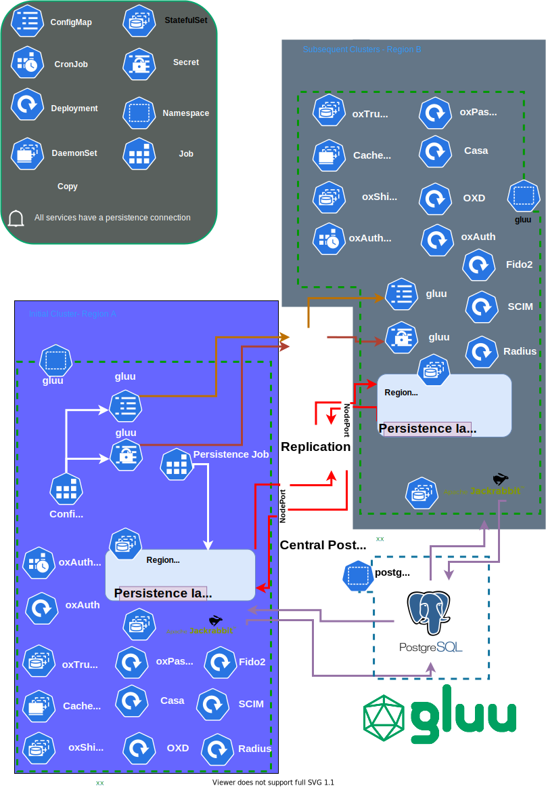

# ALPHA-How to setup multi kubernetes clusters with Gluu Server cloud native edition and LDAP as a persistence

## Overview

This will walk you through a multi cluster setup of Gluu using LDAP as the backend persistence.



## Installation

### Set up the cluster

#### Resources

Setup two kubernetes cluster. We will be using two microk8s clusters sized at t2.xlarge with one node each as an example.
 
#### Requirements

- You must make sure that the nodeports are open for ldap  communications. The node ports depend on the number of clusters and take a format of `309(namespaceintID)(n-1)`, `307(namespaceintID)(n-1)`, `304(namespaceintID)(n-1)`, and `306(namespaceintID)(n-1)`, where `n` is the replica number.
- All serf addresses will be in the format of `RELEASE-NAME-opendj-CLUSTERID-regional-STATEFULSET#-SERFADDRESSSUFFIX` and hence these addresses must be resolvable. The below table depicts the relationship , assuming the release name to be `gluu` , cluster id to be `east`, namespace int id to be `0`, and serf address suffix to be `regional.gluu.org`.

    |NodePort   |Serf advertise port  | Serf admin port | Serf LDAPS port	|Serf LDAP replication port| Serf Advertise address                          |
    |-----------|---------------------|-----------------|-------------------|--------------------------|-------------------------------------------------|
    |Replica 1  |`30700`              |`30400`	        |`30600`        	| `30900`                  | `gluu-opendj-east-regional-0-regional.gluu.org` |
    |Replica 2  |`30701`              |`30401`	        |`30601`	        | `30901`                  | `gluu-opendj-east-regional-1-regional.gluu.org` | 
    |Replica n  |`3070(n-1)`          |`3040(n-1)`	    |`3060(n-1)`	    | `3090(n-1)`              | `gluu-opendj-east-regional-(n-1)-regional.gluu.org` |

- All clusters must use the same helm release name

- All clusters will use the same nodeports

!!!note
    This is an alpha feature only offered with helm installation of Gluu >4.2.
        
!!!note
     It is recommended to start with one replica in cluster one and then scale through a helm upgrade command after the setup has finished. Forexample, you can edit the value of `opendj.multiCluster.replicaCount` inside your `values.yaml`  and run `helm upgrade <release-name> /helm -f /helm/gluu/values.yaml -n <namespace>`

!!!note
     All serf addresses will be in the format of `RELEASE-NAME-opendj-CLUSTERID-regional-STATEFULSET#-SERFADDRESSSUFFIX`

#### On the first cluster run:

1.  Download [`pygluu-kubernetes.pyz`](https://github.com/GluuFederation/cloud-native-edition/releases). This package can be built [manually](https://github.com/GluuFederation/cloud-native-edition/blob/4.2/README.md#build-pygluu-kubernetespyz-manually).

1.  Run :

    ```bash
    ./pygluu-kubernetes.pyz helm-install
    ```

1.  Keep an eye out for the following prompts: 

    ```bash
    ALPHA-FEATURE-Are you setting up a multi kubernetes cluster [N] [y/N]: Y
    Please enter Serf advertise address suffix. You must be able to resolve this address in your DNS [regional.gluu.org]: regional.gluu.org
    ALPHA-FEATURE-Enter the number of opendj statefulsets to create. Each will have an advertise address of RELEASE-NAME-opendj-regional-{{statefulset number}}-{Serf address suffix }}  (1, 2, 3, 4, 5, 6, 7, 8, 9) [1]: 1
    ALPHA-FEATURE-Is this a subsequent kubernetes cluster (2nd and above) [N] [y/N]: N
    ALPHA-FEATURE-Please enter a cluster ID that distinguishes this cluster from any subsequent clusters. i.e west, east, north, south, test.. [test]: east
    ALPHA-FEATURE-Please enter the cluster IDs for all other subsequent clusters i.e west, east, north, south, test..seperated by a comma with no quotes , or brackets Forexample, if there was three other clusters ( not including this one) that Gluu will be installed three cluster IDs will be needed. This is to help generate the serf addresses automatically. [dev,stage,prod]: west
    ```
    
    All the above NodePorts must be reachable by the second cluster. Please note also that the Serf advertise address must be resolvable by both clusters. In the event that this is a test environment you may map the addresses via `hostAliases` key inside ldap StatefulSets in both cluster after deployment as in the example below:
   
    ```yaml
      hostAliases:
      - hostnames:
        - gluu-opendj-east-regional-0-regional.gluu.org
        ip: 11.11.11.11
      - hostnames:
        - gluu-opendj-west-regional-0-regional.gluu.org
        ip: 12.12.12.12
      restartPolicy: Always
      schedulerName: default-scheduler
      securityContext: {}
      terminationGracePeriodSeconds: 30
      volumes:
      - name: serfkey
        secret:
          secretName: gluu-serf-key
      - configMap:
          name: gluu-serf-peers
        name: serfpeers
    ```

1.  Wait for all pods to be ina ready state.

1.  Prepare `gluu` Secret for second cluster
    
    ```bash
    kubectl get  secret gluu -n gluu -o yaml > gluu-secret.yaml
    ```

1.  Prepare `gluu` ConfigMap for second cluster

    ```bash
    kubectl get cm gluu -n gluu -o yaml > gluu-cm.yaml
    ```
    
#### On the second cluster:

1.  Download [`pygluu-kubernetes.pyz`](https://github.com/GluuFederation/cloud-native-edition/releases). This package can be built [manually](https://github.com/GluuFederation/cloud-native-edition/blob/4.2/README.md#build-pygluu-kubernetespyz-manually).

1.  Move the following from the first cluster:
    - `settings.json`
    - `gluu-secret.yaml`
    -  `gluu-cm.yaml`

1.  Place `settings.json` adjacent to `pygluu-kubernetes.pyz`.

1.  Create the namespace for gluu. It must match the one created in the first cluster

    ```bash
    kubectl create ns gluu
    ```
   
1.  Create both `gluu-secret.yaml` and `gluu-cm.yaml`

    ```bash
    kubectl create -f gluu-secret.yaml
    kubectl create -f gluu-cm.yaml
    ```
    
1.  Open `settings.json` at the second cluster and edit the following lines to match your setup:

    ```json
      "GLUU_LDAP_SECONDARY_CLUSTER": "Y",
      "GLUU_LDAP_MULTI_CLUSTER_CLUSTER_ID": "west",
    ```
    

1.  Run :

    ```bash
    ./pygluu-kubernetes.pyz helm-install
    ```
   
1.  Tail the logs and wait for replication to occur. Services should start turning on soon after replication finishes.

#### Test replication

You may run `dsreplication` command to check the replication status using the a command as in the example below:

```bash
kubectl exec -ti gluu-opendj-0 -n gluu -- /opt/opendj/bin/dsreplication status -X


>>>> Specify OpenDJ LDAP connection parameters

Directory server hostname or IP address [gluu-opendj-regional-0-0]: 
Directory server administration port number [30440]: 

Global Administrator User ID [admin]: 

Password for user 'admin': 
Suffix DN : Server                                              : Entries : Replication enabled : DS ID : RS ID : RS Port (1) : M.C. (2) : A.O.M.C. (3) : Security (4)
----------:-----------------------------------------------------:---------:---------------------:-------:-------:-------------:----------:--------------:-------------
o=gluu    : gluu-opendj-east-regional-0-regional.gluu.org:30400 : 210     : true                : 3405  : 24442 : 30980       : 0        :              : true
o=gluu    : gluu-opendj-east-regional-1-regional.gluu.org:30401 : 210     : true                : 10457 : 11635 : 30981       : 0        :              : true
o=gluu    : gluu-opendj-west-regional-1-regional.gluu.org:30401 : 210     : true                : 20953 : 28477 : 30981       : 0        :              : true
o=metric  : gluu-opendj-east-regional-0-regional.gluu.org:30400 : 25      : true                : 6048  : 24442 : 30980       : 24       :              : true
o=metric  : gluu-opendj-east-regional-1-regional.gluu.org:30401 : 28      : true                : 12646 : 11635 : 30981       : 14       :              : true
o=metric  : gluu-opendj-west-regional-1-regional.gluu.org:30401 : 7       : true                : 13210 : 28477 : 30981       : 52       :              : true
o=site    : gluu-opendj-east-regional-0-regional.gluu.org:30400 : 2       : true                : 2115  : 24442 : 30980       : 0        :              : true
o=site    : gluu-opendj-east-regional-1-regional.gluu.org:30401 : 2       : true                : 2672  : 11635 : 30981       : 0        :              : true
o=site    : gluu-opendj-west-regional-1-regional.gluu.org:30401 : 2       : true                : 3031  : 28477 : 30981       : 0        :              : true

[1] The port used to communicate between the servers whose contents are being
replicated.
[2] The number of changes that are still missing on this server (and that have
been applied to at least one of the other servers).
[3] Age of oldest missing change: the date on which the oldest change that has
not arrived on this server was generated.
[4] Whether the replication communication through the replication port is
encrypted or not.

```   

#### Example `settings.json` used in the first cluster.

```json
{
  "ACCEPT_GLUU_LICENSE": "Y",
  "GLUU_VERSION": "4.3.0_dev",
  "TEST_ENVIRONMENT": "",
  "GLUU_UPGRADE_TARGET_VERSION": "",
  "GLUU_HELM_RELEASE_NAME": "gluu",
  "NGINX_INGRESS_RELEASE_NAME": "ningress",
  "NGINX_INGRESS_NAMESPACE": "ingress-nginx",
  "POSTGRES_NAMESPACE": "",
  "POSTGRES_URL": "",
  "USE_ISTIO": "N",
  "USE_ISTIO_INGRESS": "",
  "ISTIO_SYSTEM_NAMESPACE": "",
  "NODES_ZONES": [],
  "NODES_NAMES": [],
  "NODE_SSH_KEY": "",
  "VERIFY_EXT_IP": "",
  "AWS_LB_TYPE": "",
  "USE_ARN": "",
  "VPC_CIDR": "",
  "ARN_AWS_IAM": "",
  "LB_ADD": "",
  "REDIS_URL": "",
  "REDIS_TYPE": "",
  "REDIS_PW": "",
  "REDIS_USE_SSL": "false",
  "REDIS_SSL_TRUSTSTORE": "",
  "REDIS_SENTINEL_GROUP": "",
  "REDIS_NAMESPACE": "",
  "INSTALL_REDIS": "",
  "INSTALL_POSTGRES": "",
  "INSTALL_JACKRABBIT": "Y",
  "JACKRABBIT_STORAGE_SIZE": "4Gi",
  "JACKRABBIT_URL": "http://jackrabbit:8080",
  "JACKRABBIT_ADMIN_ID": "admin",
  "JACKRABBIT_ADMIN_PASSWORD": "Test1234#",
  "JACKRABBIT_CLUSTER": "N",
  "JACKRABBIT_PG_USER": "",
  "JACKRABBIT_PG_PASSWORD": "",
  "JACKRABBIT_DATABASE": "",
  "DEPLOYMENT_ARCH": "microk8s",
  "PERSISTENCE_BACKEND": "ldap",
  "INSTALL_COUCHBASE": "",
  "COUCHBASE_NAMESPACE": "",
  "COUCHBASE_VOLUME_TYPE": "",
  "COUCHBASE_CLUSTER_NAME": "",
  "COUCHBASE_URL": "",
  "COUCHBASE_USER": "",
  "COUCHBASE_BUCKET_PREFIX": "",
  "COUCHBASE_SUPERUSER": "",
  "COUCHBASE_PASSWORD": "",
  "COUCHBASE_SUPERUSER_PASSWORD": "",
  "COUCHBASE_CRT": "",
  "COUCHBASE_CN": "",
  "COUCHBASE_INDEX_NUM_REPLICA": "",
  "COUCHBASE_SUBJECT_ALT_NAME": "",
  "COUCHBASE_CLUSTER_FILE_OVERRIDE": "",
  "COUCHBASE_USE_LOW_RESOURCES": "",
  "COUCHBASE_DATA_NODES": "",
  "COUCHBASE_QUERY_NODES": "",
  "COUCHBASE_INDEX_NODES": "",
  "COUCHBASE_SEARCH_EVENTING_ANALYTICS_NODES": "",
  "COUCHBASE_GENERAL_STORAGE": "",
  "COUCHBASE_DATA_STORAGE": "",
  "COUCHBASE_INDEX_STORAGE": "",
  "COUCHBASE_QUERY_STORAGE": "",
  "COUCHBASE_ANALYTICS_STORAGE": "",
  "COUCHBASE_INCR_BACKUP_SCHEDULE": "",
  "COUCHBASE_FULL_BACKUP_SCHEDULE": "",
  "COUCHBASE_BACKUP_RETENTION_TIME": "",
  "COUCHBASE_BACKUP_STORAGE_SIZE": "",
  "LDAP_BACKUP_SCHEDULE": "",
  "NUMBER_OF_EXPECTED_USERS": "",
  "EXPECTED_TRANSACTIONS_PER_SEC": "",
  "USING_CODE_FLOW": "",
  "USING_SCIM_FLOW": "",
  "USING_RESOURCE_OWNER_PASSWORD_CRED_GRANT_FLOW": "",
  "DEPLOY_MULTI_CLUSTER": "",
  "HYBRID_LDAP_HELD_DATA": "",
  "LDAP_JACKRABBIT_VOLUME": "",
  "APP_VOLUME_TYPE": 1,
  "LDAP_STATIC_VOLUME_ID": "",
  "LDAP_STATIC_DISK_URI": "",
  "GLUU_CACHE_TYPE": "NATIVE_PERSISTENCE",
  "GLUU_NAMESPACE": "gluu",
  "GLUU_FQDN": "demoexample.gluu.org",
  "COUNTRY_CODE": "US",
  "STATE": "TX",
  "EMAIL": "support@gluu.org",
  "CITY": "Austin",
  "ORG_NAME": "Gluu",
  "GMAIL_ACCOUNT": "",
  "GOOGLE_NODE_HOME_DIR": "",
  "IS_GLUU_FQDN_REGISTERED": "N",
  "LDAP_PW": "Test1234#",
  "ADMIN_PW": "Test1234#",
  "OXD_APPLICATION_KEYSTORE_CN": "",
  "OXD_ADMIN_KEYSTORE_CN": "",
  "LDAP_STORAGE_SIZE": "4Gi",
  "OXAUTH_REPLICAS": 1,
  "OXTRUST_REPLICAS": 1,
  "LDAP_REPLICAS": 1,
  "OXSHIBBOLETH_REPLICAS": "",
  "OXPASSPORT_REPLICAS": "",
  "OXD_SERVER_REPLICAS": "",
  "CASA_REPLICAS": "",
  "FIDO2_REPLICAS": "",
  "SCIM_REPLICAS": "",
  "ENABLE_OXTRUST_API": "N",
  "ENABLE_OXTRUST_TEST_MODE": "N",
  "ENABLE_CACHE_REFRESH": "N",
  "ENABLE_OXD": "N",
  "ENABLE_FIDO2": "N",
  "ENABLE_SCIM": "N",
  "ENABLE_OXPASSPORT": "N",
  "ENABLE_OXSHIBBOLETH": "N",
  "ENABLE_CASA": "N",
  "ENABLE_OXAUTH_KEY_ROTATE": "N",
  "ENABLE_OXTRUST_API_BOOLEAN": "true",
  "ENABLE_OXTRUST_TEST_MODE_BOOLEAN": "false",
  "ENABLE_OXPASSPORT_BOOLEAN": "false",
  "ENABLE_CASA_BOOLEAN": "false",
  "ENABLE_SAML_BOOLEAN": "false",
  "ENABLED_SERVICES_LIST": [
    "update-lb-ip",
    "oxtrust",
    "config",
    "oxauth",
    "jackrabbit",
    "persistence",
    "ldap"
  ],
  "OXAUTH_KEYS_LIFE": "",
  "EDIT_IMAGE_NAMES_TAGS": "N",
  "CASA_IMAGE_NAME": "gluufederation/casa",
  "CASA_IMAGE_TAG": "4.3.0_dev",
  "CONFIG_IMAGE_NAME": "gluufederation/config-init",
  "CONFIG_IMAGE_TAG": "4.3.0_dev",
  "CACHE_REFRESH_ROTATE_IMAGE_NAME": "gluufederation/cr-rotate",
  "CACHE_REFRESH_ROTATE_IMAGE_TAG": "4.3.0_dev",
  "CERT_MANAGER_IMAGE_NAME": "gluufederation/certmanager",
  "CERT_MANAGER_IMAGE_TAG": "4.3.0_dev",
  "LDAP_IMAGE_NAME": "gluufederation/opendj",
  "LDAP_IMAGE_TAG": "4.3.0_dev",
  "JACKRABBIT_IMAGE_NAME": "gluufederation/jackrabbit",
  "JACKRABBIT_IMAGE_TAG": "4.3.0_dev",
  "OXAUTH_IMAGE_NAME": "gluufederation/oxauth",
  "OXAUTH_IMAGE_TAG": "4.3.0_dev",
  "FIDO2_IMAGE_NAME": "gluufederation/fido2",
  "FIDO2_IMAGE_TAG": "4.3.0_dev",
  "SCIM_IMAGE_NAME": "gluufederation/scim",
  "SCIM_IMAGE_TAG": "4.3.0_dev",
  "OXD_IMAGE_NAME": "gluufederation/oxd-server",
  "OXD_IMAGE_TAG": "4.3.0_dev",
  "OXPASSPORT_IMAGE_NAME": "gluufederation/oxpassport",
  "OXPASSPORT_IMAGE_TAG": "4.3.0_dev",
  "OXSHIBBOLETH_IMAGE_NAME": "gluufederation/oxshibboleth",
  "OXSHIBBOLETH_IMAGE_TAG": "4.3.0_dev",
  "OXTRUST_IMAGE_NAME": "gluufederation/oxtrust",
  "OXTRUST_IMAGE_TAG": "4.3.0_dev",
  "PERSISTENCE_IMAGE_NAME": "gluufederation/persistence",
  "PERSISTENCE_IMAGE_TAG": "4.3.0_dev",
  "UPGRADE_IMAGE_NAME": "gluufederation/upgrade",
  "UPGRADE_IMAGE_TAG": "4.3.0_dev",
  "CONFIRM_PARAMS": "Y",
  "GLUU_LDAP_MULTI_CLUSTER": "Y",
  "GLUU_LDAP_ADVERTISE_ADDRESS": "regional.gluu.org",
  "GLUU_LDAP_SECONDARY_CLUSTER": "N",
  "GLUU_LDAP_SERF_PEERS": [
    "gluu-opendj-west-regional-0-regional.gluu.org:30940",
    "gluu-opendj-east-regional-0-regional.gluu.org:30940",
    "gluu-opendj-west-regional-1-regional.gluu.org:30941",
    "gluu-opendj-east-regional-1-regional.gluu.org:30941"
  ],
  "GLUU_INSTALL_SQL": "",
  "GLUU_SQL_DB_DIALECT": "",
  "GLUU_SQL_DB_NAMESPACE": "",
  "GLUU_SQL_DB_HOST": "",
  "GLUU_SQL_DB_PORT": "",
  "GLUU_SQL_DB_NAME": "",
  "GLUU_SQL_DB_USER": "",
  "GLUU_SQL_DB_PASSWORD": "",
  "GOOGLE_SERVICE_ACCOUNT_BASE64": "",
  "USE_GOOGLE_SECRET_MANAGER": "",
  "GOOGLE_SPANNER_INSTANCE_ID": "",
  "GOOGLE_SPANNER_DATABASE_ID": "",
  "GOOGLE_PROJECT_ID": "",
  "MIGRATION_ENABLED": "N",
  "MIGRATION_DIR": "",
  "MIGRATION_DATA_FORMAT": "",
  "GLUU_SCIM_PROTECTION_MODE": "",
  "GLUU_LDAP_MULTI_CLUSTER_REPLICAS": 1,
  "GLUU_LDAP_MULTI_CLUSTER_CLUSTER_ID": "east",
  "GLUU_LDAP_MUTLI_CLUSTERS_IDS": [
    "west",
    "east"
  ]
}
``` 
  
#### Example `settings.json` used in the second cluster.

```json
{
  "ACCEPT_GLUU_LICENSE": "Y",
  "GLUU_VERSION": "4.3.0_dev",
  "TEST_ENVIRONMENT": "",
  "GLUU_UPGRADE_TARGET_VERSION": "",
  "GLUU_HELM_RELEASE_NAME": "gluu",
  "NGINX_INGRESS_RELEASE_NAME": "ningress",
  "NGINX_INGRESS_NAMESPACE": "ingress-nginx",
  "POSTGRES_NAMESPACE": "",
  "POSTGRES_URL": "",
  "USE_ISTIO": "N",
  "USE_ISTIO_INGRESS": "",
  "ISTIO_SYSTEM_NAMESPACE": "",
  "NODES_ZONES": [],
  "NODES_NAMES": [],
  "NODE_SSH_KEY": "",
  "VERIFY_EXT_IP": "",
  "AWS_LB_TYPE": "",
  "USE_ARN": "",
  "VPC_CIDR": "",
  "ARN_AWS_IAM": "",
  "LB_ADD": "",
  "REDIS_URL": "",
  "REDIS_TYPE": "",
  "REDIS_PW": "",
  "REDIS_USE_SSL": "false",
  "REDIS_SSL_TRUSTSTORE": "",
  "REDIS_SENTINEL_GROUP": "",
  "REDIS_NAMESPACE": "",
  "INSTALL_REDIS": "",
  "INSTALL_POSTGRES": "",
  "INSTALL_JACKRABBIT": "Y",
  "JACKRABBIT_STORAGE_SIZE": "4Gi",
  "JACKRABBIT_URL": "http://jackrabbit:8080",
  "JACKRABBIT_ADMIN_ID": "admin",
  "JACKRABBIT_ADMIN_PASSWORD": "Test1234#",
  "JACKRABBIT_CLUSTER": "N",
  "JACKRABBIT_PG_USER": "",
  "JACKRABBIT_PG_PASSWORD": "",
  "JACKRABBIT_DATABASE": "",
  "DEPLOYMENT_ARCH": "microk8s",
  "PERSISTENCE_BACKEND": "ldap",
  "INSTALL_COUCHBASE": "",
  "COUCHBASE_NAMESPACE": "",
  "COUCHBASE_VOLUME_TYPE": "",
  "COUCHBASE_CLUSTER_NAME": "",
  "COUCHBASE_URL": "",
  "COUCHBASE_USER": "",
  "COUCHBASE_BUCKET_PREFIX": "",
  "COUCHBASE_SUPERUSER": "",
  "COUCHBASE_PASSWORD": "",
  "COUCHBASE_SUPERUSER_PASSWORD": "",
  "COUCHBASE_CRT": "",
  "COUCHBASE_CN": "",
  "COUCHBASE_INDEX_NUM_REPLICA": "",
  "COUCHBASE_SUBJECT_ALT_NAME": "",
  "COUCHBASE_CLUSTER_FILE_OVERRIDE": "",
  "COUCHBASE_USE_LOW_RESOURCES": "",
  "COUCHBASE_DATA_NODES": "",
  "COUCHBASE_QUERY_NODES": "",
  "COUCHBASE_INDEX_NODES": "",
  "COUCHBASE_SEARCH_EVENTING_ANALYTICS_NODES": "",
  "COUCHBASE_GENERAL_STORAGE": "",
  "COUCHBASE_DATA_STORAGE": "",
  "COUCHBASE_INDEX_STORAGE": "",
  "COUCHBASE_QUERY_STORAGE": "",
  "COUCHBASE_ANALYTICS_STORAGE": "",
  "COUCHBASE_INCR_BACKUP_SCHEDULE": "",
  "COUCHBASE_FULL_BACKUP_SCHEDULE": "",
  "COUCHBASE_BACKUP_RETENTION_TIME": "",
  "COUCHBASE_BACKUP_STORAGE_SIZE": "",
  "LDAP_BACKUP_SCHEDULE": "",
  "NUMBER_OF_EXPECTED_USERS": "",
  "EXPECTED_TRANSACTIONS_PER_SEC": "",
  "USING_CODE_FLOW": "",
  "USING_SCIM_FLOW": "",
  "USING_RESOURCE_OWNER_PASSWORD_CRED_GRANT_FLOW": "",
  "DEPLOY_MULTI_CLUSTER": "",
  "HYBRID_LDAP_HELD_DATA": "",
  "LDAP_JACKRABBIT_VOLUME": "",
  "APP_VOLUME_TYPE": 1,
  "LDAP_STATIC_VOLUME_ID": "",
  "LDAP_STATIC_DISK_URI": "",
  "GLUU_CACHE_TYPE": "NATIVE_PERSISTENCE",
  "GLUU_NAMESPACE": "gluu",
  "GLUU_FQDN": "demoexample.gluu.org",
  "COUNTRY_CODE": "US",
  "STATE": "TX",
  "EMAIL": "support@gluu.org",
  "CITY": "Austin",
  "ORG_NAME": "Gluu",
  "GMAIL_ACCOUNT": "",
  "GOOGLE_NODE_HOME_DIR": "",
  "IS_GLUU_FQDN_REGISTERED": "N",
  "LDAP_PW": "Test1234#",
  "ADMIN_PW": "Test1234#",
  "OXD_APPLICATION_KEYSTORE_CN": "",
  "OXD_ADMIN_KEYSTORE_CN": "",
  "LDAP_STORAGE_SIZE": "4Gi",
  "OXAUTH_REPLICAS": 1,
  "OXTRUST_REPLICAS": 1,
  "LDAP_REPLICAS": 1,
  "OXSHIBBOLETH_REPLICAS": "",
  "OXPASSPORT_REPLICAS": "",
  "OXD_SERVER_REPLICAS": "",
  "CASA_REPLICAS": "",
  "FIDO2_REPLICAS": "",
  "SCIM_REPLICAS": "",
  "ENABLE_OXTRUST_API": "N",
  "ENABLE_OXTRUST_TEST_MODE": "N",
  "ENABLE_CACHE_REFRESH": "N",
  "ENABLE_OXD": "N",
  "ENABLE_FIDO2": "N",
  "ENABLE_SCIM": "N",
  "ENABLE_OXPASSPORT": "N",
  "ENABLE_OXSHIBBOLETH": "N",
  "ENABLE_CASA": "N",
  "ENABLE_OXAUTH_KEY_ROTATE": "N",
  "ENABLE_OXTRUST_API_BOOLEAN": "true",
  "ENABLE_OXTRUST_TEST_MODE_BOOLEAN": "false",
  "ENABLE_OXPASSPORT_BOOLEAN": "false",
  "ENABLE_CASA_BOOLEAN": "false",
  "ENABLE_SAML_BOOLEAN": "false",
  "ENABLED_SERVICES_LIST": [
    "config",
    "jackrabbit",
    "oxtrust",
    "update-lb-ip",
    "ldap",
    "persistence",
    "oxauth"
  ],
  "OXAUTH_KEYS_LIFE": "",
  "EDIT_IMAGE_NAMES_TAGS": "N",
  "CASA_IMAGE_NAME": "gluufederation/casa",
  "CASA_IMAGE_TAG": "4.3.0_dev",
  "CONFIG_IMAGE_NAME": "gluufederation/config-init",
  "CONFIG_IMAGE_TAG": "4.3.0_dev",
  "CACHE_REFRESH_ROTATE_IMAGE_NAME": "gluufederation/cr-rotate",
  "CACHE_REFRESH_ROTATE_IMAGE_TAG": "4.3.0_dev",
  "CERT_MANAGER_IMAGE_NAME": "gluufederation/certmanager",
  "CERT_MANAGER_IMAGE_TAG": "4.3.0_dev",
  "LDAP_IMAGE_NAME": "gluufederation/opendj",
  "LDAP_IMAGE_TAG": "4.3.0_dev",
  "JACKRABBIT_IMAGE_NAME": "gluufederation/jackrabbit",
  "JACKRABBIT_IMAGE_TAG": "4.3.0_dev",
  "OXAUTH_IMAGE_NAME": "gluufederation/oxauth",
  "OXAUTH_IMAGE_TAG": "4.3.0_dev",
  "FIDO2_IMAGE_NAME": "gluufederation/fido2",
  "FIDO2_IMAGE_TAG": "4.3.0_dev",
  "SCIM_IMAGE_NAME": "gluufederation/scim",
  "SCIM_IMAGE_TAG": "4.3.0_dev",
  "OXD_IMAGE_NAME": "gluufederation/oxd-server",
  "OXD_IMAGE_TAG": "4.3.0_dev",
  "OXPASSPORT_IMAGE_NAME": "gluufederation/oxpassport",
  "OXPASSPORT_IMAGE_TAG": "4.3.0_dev",
  "OXSHIBBOLETH_IMAGE_NAME": "gluufederation/oxshibboleth",
  "OXSHIBBOLETH_IMAGE_TAG": "4.3.0_dev",
  "OXTRUST_IMAGE_NAME": "gluufederation/oxtrust",
  "OXTRUST_IMAGE_TAG": "4.3.0_dev",
  "PERSISTENCE_IMAGE_NAME": "gluufederation/persistence",
  "PERSISTENCE_IMAGE_TAG": "4.3.0_dev",
  "UPGRADE_IMAGE_NAME": "gluufederation/upgrade",
  "UPGRADE_IMAGE_TAG": "4.3.0_dev",
  "CONFIRM_PARAMS": "Y",
  "GLUU_LDAP_MULTI_CLUSTER": "Y",
  "GLUU_LDAP_ADVERTISE_ADDRESS": "regional.gluu.org",
  "GLUU_LDAP_SECONDARY_CLUSTER": "Y",
  "GLUU_LDAP_SERF_PEERS": [
    "gluu-opendj-west-regional-0-regional.gluu.org:30940",
    "gluu-opendj-east-regional-0-regional.gluu.org:30940",
    "gluu-opendj-west-regional-1-regional.gluu.org:30941",
    "gluu-opendj-east-regional-1-regional.gluu.org:30941"
  ],
  "GLUU_INSTALL_SQL": "",
  "GLUU_SQL_DB_DIALECT": "",
  "GLUU_SQL_DB_NAMESPACE": "",
  "GLUU_SQL_DB_HOST": "",
  "GLUU_SQL_DB_PORT": "",
  "GLUU_SQL_DB_NAME": "",
  "GLUU_SQL_DB_USER": "",
  "GLUU_SQL_DB_PASSWORD": "",
  "GOOGLE_SERVICE_ACCOUNT_BASE64": "",
  "USE_GOOGLE_SECRET_MANAGER": "",
  "GOOGLE_SPANNER_INSTANCE_ID": "",
  "GOOGLE_SPANNER_DATABASE_ID": "",
  "GOOGLE_PROJECT_ID": "",
  "MIGRATION_ENABLED": "N",
  "MIGRATION_DIR": "",
  "MIGRATION_DATA_FORMAT": "",
  "GLUU_SCIM_PROTECTION_MODE": "",
  "GLUU_LDAP_MULTI_CLUSTER_REPLICAS": 1,
  "GLUU_LDAP_MULTI_CLUSTER_CLUSTER_ID": "west",
  "GLUU_LDAP_MULTI_CLUSTERS_IDS": [
    "west",
    "east"
  ]
}
```

#### Example `values.yaml` that was generated and used in the first cluster.

```yaml
global:
  usrEnvs:
    normal: {}
    secret: {}
  istio:
    ingress: false
    enabled: false
    namespace: istio-system
  alb:
    ingress: false
  cloud:
    testEnviroment: true
  upgrade:
    enabled: false
  storageClass:
    allowVolumeExpansion: true
    allowedTopologies: []
    mountOptions:
    - debug
    # -- parameters:
    #fsType: ""
    #kind: ""
    #pool: ""
    #storageAccountType: ""
    #type: ""
    parameters: {}
    provisioner: microk8s.io/hostpath
    reclaimPolicy: Retain
    volumeBindingMode: WaitForFirstConsumer
  gcePdStorageType: pd-standard
  azureStorageAccountType: Standard_LRS
  azureStorageKind: Managed
  lbIp: "172.31.18.144"
  domain: demoexample.gluu.org
  isDomainRegistered: "false"
  ldapServiceName: opendj
  gluuPersistenceType: ldap
  gluuJackrabbitCluster: "false"
  configAdapterName: kubernetes
  configSecretAdapter: kubernetes
  cnGoogleApplicationCredentials: /etc/gluu/conf/google-credentials.json
  oxauth:
    enabled: true
  fido2:
    enabled: false
  scim:
    enabled: false
  config:
    enabled: true
  jackrabbit:
    enabled: true
  persistence:
    enabled: true
  oxtrust:
    enabled: true
  opendj:
    enabled: true
  oxshibboleth:
    enabled: false
  oxd-server:
    enabled: false
  nginx-ingress:
    enabled: true
  oxauth-key-rotation:
    enabled: false
  cr-rotate:
    enabled: false
config:
  usrEnvs:
    normal: {}
    secret: {}
  orgName: Gluu
  email: support@gluu.org
  adminPass: Test1234#
  ldapPass: Test1234#
  redisPass: P@assw0rd
  countryCode: US
  state: TX
  city: Austin
  configmap:
    cnSqlDbDialect: mysql
    cnSqlDbHost: my-release-mysql.default.svc.cluster.local
    cnSqlDbPort: 3306
    cnSqlDbName: gluu
    cnSqlDbUser: gluu
    cnSqlDbTimezone: UTC
    cnSqlPasswordFile: /etc/gluu/conf/sql_password
    cnSqldbUserPassword: Test1234#
    gluuOxdApplicationCertCn: oxd-server
    gluuOxdAdminCertCn: oxd-server
    gluuCouchbaseCrt: LS0tLS1CRUdJTiBDRVJUSUZJQ0FURS0tLS0tCk1JSURlakNDQW1LZ0F3SUJBZ0lKQUwyem5UWlREUHFNTUEwR0NTcUdTSWIzRFFFQkN3VUFNQzB4S3pBcEJnTlYKQkFNTUlpb3VZMkpuYkhWMUxtUmxabUYxYkhRdWMzWmpMbU5zZFhOMFpYSXViRzlqWVd3d0hoY05NakF3TWpBMQpNRGt4T1RVeFdoY05NekF3TWpBeU1Ea3hPVFV4V2pBdE1Tc3dLUVlEVlFRRERDSXFMbU5pWjJ4MWRTNWtaV1poCmRXeDBMbk4yWXk1amJIVnpkR1Z5TG14dlkyRnNNSUlCSWpBTkJna3Foa2lHOXcwQkFRRUZBQU9DQVE4QU1JSUIKQ2dLQ0FRRUFycmQ5T3lvSnRsVzhnNW5nWlJtL2FKWjJ2eUtubGU3dVFIUEw4Q2RJa1RNdjB0eHZhR1B5UkNQQgo3RE00RTFkLzhMaU5takdZZk41QjZjWjlRUmNCaG1VNmFyUDRKZUZ3c0x0cTFGT3MxaDlmWGo3d3NzcTYrYmlkCjV6Umw3UEE0YmdvOXVkUVRzU1UrWDJUUVRDc0dxVVVPWExrZ3NCMjI0RDNsdkFCbmZOeHcvYnFQa2ZCQTFxVzYKVXpxellMdHN6WE5GY0dQMFhtU3c4WjJuaFhhUGlva2pPT2dyMkMrbVFZK0htQ2xGUWRpd2g2ZjBYR0V0STMrKwoyMStTejdXRkF6RlFBVUp2MHIvZnk4TDRXZzh1YysvalgwTGQrc2NoQTlNQjh3YmJORUp2ZjNMOGZ5QjZ0cTd2CjF4b0FnL0g0S1dJaHdqSEN0dFVnWU1oU0xWV3UrUUlEQVFBQm80R2NNSUdaTUIwR0ExVWREZ1FXQkJTWmQxWU0KVGNIRVZjSENNUmp6ejczZitEVmxxREJkQmdOVkhTTUVWakJVZ0JTWmQxWU1UY0hFVmNIQ01Sanp6NzNmK0RWbApxS0V4cEM4d0xURXJNQ2tHQTFVRUF3d2lLaTVqWW1kc2RYVXVaR1ZtWVhWc2RDNXpkbU11WTJ4MWMzUmxjaTVzCmIyTmhiSUlKQUwyem5UWlREUHFNTUF3R0ExVWRFd1FGTUFNQkFmOHdDd1lEVlIwUEJBUURBZ0VHTUEwR0NTcUcKU0liM0RRRUJDd1VBQTRJQkFRQk9meTVWSHlKZCtWUTBXaUQ1aSs2cmhidGNpSmtFN0YwWVVVZnJ6UFN2YWVFWQp2NElVWStWOC9UNnE4Mk9vVWU1eCtvS2dzbFBsL01nZEg2SW9CRnVtaUFqek14RTdUYUhHcXJ5dk13Qk5IKzB5CnhadG9mSnFXQzhGeUlwTVFHTEs0RVBGd3VHRlJnazZMRGR2ZEN5NVdxWW1MQWdBZVh5VWNaNnlHYkdMTjRPUDUKZTFiaEFiLzRXWXRxRHVydFJrWjNEejlZcis4VWNCVTRLT005OHBZN05aaXFmKzlCZVkvOEhZaVQ2Q0RRWWgyTgoyK0VWRFBHcFE4UkVsRThhN1ZLL29MemlOaXFyRjllNDV1OU1KdjM1ZktmNUJjK2FKdWduTGcwaUZUYmNaT1prCkpuYkUvUENIUDZFWmxLaEFiZUdnendtS1dDbTZTL3g0TklRK2JtMmoKLS0tLS1FTkQgQ0VSVElGSUNBVEUtLS0tLQo=
    gluuCouchbasePass: P@ssw0rd
    gluuCouchbaseSuperUserPass: P@ssw0rd
    gluuCouchbaseSuperUser: admin
    gluuCouchbaseUrl: cbgluu.default.svc.cluster.local
    gluuCouchbaseBucketPrefix: gluu
    gluuCouchbaseUser: gluu
    gluuCouchbaseIndexNumReplica: 0
    gluuCouchbasePassFile: /etc/gluu/conf/couchbase_password
    gluuCouchbaseSuperUserPassFile: /etc/gluu/conf/couchbase_superuser_password
    gluuCouchbaseCertFile: /etc/certs/couchbase.crt
    gluuPersistenceLdapMapping: ''
    gluuCacheType: NATIVE_PERSISTENCE
    gluuSyncShibManifests: false
    gluuSyncCasaManifests: false
    gluuMaxRamPercent: "75.0"
    containerMetadataName: kubernetes
    gluuRedisUrl: redis:6379
    gluuRedisUseSsl: "false"
    gluuRedisType: STANDALONE
    gluuRedisSslTruststore: ""
    gluuRedisSentinelGroup: ""
    gluuOxtrustConfigGeneration: true
    gluuOxtrustBackend: oxtrust:8080
    gluuOxauthBackend: oxauth:8080
    gluuOxdServerUrl: oxd-server:8443
    gluuOxdBindIpAddresses: "*"
    gluuLdapUrl: opendj:1636
    gluuJackrabbitPostgresUser: jackrabbit
    gluuJackrabbitPostgresPasswordFile: /etc/gluu/conf/postgres_password
    gluuJackrabbitPostgresDatabaseName: jackrabbit
    gluuJackrabbitPostgresHost: postgresql.postgres.svc.cluster.local
    gluuJackrabbitPostgresPort: 5432
    gluuJackrabbitAdminId: admin
    gluuJackrabbitAdminPassFile: /etc/gluu/conf/jackrabbit_admin_password
    gluuJackrabbitSyncInterval: 300
    gluuJackrabbitUrl: http://jackrabbit:8080
    gluuJackrabbitAdminIdFile: /etc/gluu/conf/jackrabbit_admin_id
    gluuDocumentStoreType: JCA
    cnGoogleServiceAccount: SWFtTm90YVNlcnZpY2VBY2NvdW50Q2hhbmdlTWV0b09uZQo=
    cnGoogleProjectId: google-project-to-save-config-and-secrets-to
    cnGoogleSpannerInstanceId: ""
    cnGoogleSpannerDatabaseId: ""
    cnSecretGoogleSecretVersionId: "latest"
    cnSecretGoogleSecretNamePrefix: gluu
    cnGoogleSecretManagerPassPhrase: Test1234#
    cnConfigGoogleSecretVersionId: "latest"
    cnConfigGoogleSecretNamePrefix: gluu
    lbAddr: ""
    gluuOxtrustApiEnabled: true
    gluuOxtrustApiTestMode: false
    gluuScimProtectionMode: "OAUTH"
    gluuPassportEnabled: false
    gluuPassportFailureRedirectUrl: ""
    gluuCasaEnabled: false
    gluuSamlEnabled: false
    gluuPersistenceType: ldap
  image:
    repository: gluufederation/config-init
    tag: 4.3.0_dev
    pullSecrets: []
  volumes: []
  volumeMounts: []
  dnsPolicy: ""
  dnsConfig: {}
  migration:
    enabled: false
    migrationDir: /ce-migration
    migrationDataFormat: ldif
  resources:
    limits:
      cpu: 300m
      memory: 300Mi
    requests:
      cpu: 300m
      memory: 300Mi
nginx-ingress:
  ingress:
    enabled: true
    path: /
    adminUiEnabled: true
    adminUiLabels: {}
    openidConfigEnabled: true
    openidConfigLabels: {}
    uma2ConfigEnabled: true
    uma2ConfigLabels: {}
    webfingerEnabled: true
    webfingerLabels: {}
    webdiscoveryEnabled: true
    webdiscoveryLabels: {}
    scimConfigEnabled: false
    scimConfigLabels: {}
    scimEnabled: false
    scimLabels: {}
    u2fConfigEnabled: true
    u2fConfigLabels: {}
    fido2ConfigEnabled: false
    fido2ConfigLabels: {}
    authServerEnabled: true
    authServerLabels: {}
    casaEnabled: true
    casaLabels: {}
    additionalLabels: {}
    additionalAnnotations:
      kubernetes.io/ingress.class: "public"
    hosts:
    - demoexample.gluu.org
    tls:
    - secretName: tls-certificate # DON'T change
      hosts:
      - demoexample.gluu.org
jackrabbit:
  hpa:
    enabled: true
    minReplicas: 1
    maxReplicas: 10
    targetCPUUtilizationPercentage: 50
    metrics: []
    behavior: {}
  usrEnvs:
    normal: {}
    secret: {}
  dnsPolicy: ""
  dnsConfig: {}
  image:
    pullPolicy: IfNotPresent
    repository: gluufederation/jackrabbit
    tag: 4.3.0_dev
    pullSecrets: []
  replicas: 1
  resources:
    limits:
      cpu: 1500m
      memory: 1000Mi
    requests:
      cpu: 1500m
      memory: 1000Mi
  secrets:
    gluuJackrabbitAdminPass: Test1234#
    gluuJackrabbitPostgresPass: ''
  service:
    jackRabbitServiceName: jackrabbit
    name: http-jackrabbit
    port: 8080
  clusterId: ""
  storage:
    size: 5Gi
  livenessProbe:
    tcpSocket:
      port: http-jackrabbit
    initialDelaySeconds: 25
    periodSeconds: 25
    timeoutSeconds: 5
  readinessProbe:
    tcpSocket:
      port: http-jackrabbit
    initialDelaySeconds: 30
    periodSeconds: 30
    timeoutSeconds: 5
  volumes: []
  volumeMounts: []
opendj:
  hpa:
    enabled: true
    minReplicas: 1
    maxReplicas: 10
    targetCPUUtilizationPercentage: 50
    metrics: []
    behavior: {}
  usrEnvs:
    normal: {}
    secret: {}
  dnsPolicy: ""
  dnsConfig: {}
  image:
    pullPolicy: IfNotPresent
    repository: gluufederation/opendj
    tag: 4.3.0_dev
    pullSecrets: []
  multiCluster:
    enabled: true
    serfAdvertiseAddrSuffix: "regional.gluu.org"
    serfKey: IIwLvTsZ16oZJuC6m1lh5E+quNGjFn8MMN1+PWh6JrU=
    serfPeers:
    - gluu-opendj-west-regional-0-regional.gluu.org:30940
    - gluu-opendj-east-regional-0-regional.gluu.org:30940
    - gluu-opendj-west-regional-1-regional.gluu.org:30941
    - gluu-opendj-east-regional-1-regional.gluu.org:30941
    replicaCount: 1
    clusterId: "east"
  persistence:
    size: 4Gi
  ports:
    tcp-admin:
      nodePort: ""
      port: 4444
      protocol: TCP
      targetPort: 4444
    tcp-ldap:
      nodePort: ""
      port: 1389
      protocol: TCP
      targetPort: 1389
    tcp-ldaps:
      nodePort: ""
      port: 1636
      protocol: TCP
      targetPort: 1636
    tcp-repl:
      nodePort: ""
      port: 8989
      protocol: TCP
      targetPort: 8989
    tcp-serf:
      nodePort: ""
      port: 7946
      protocol: TCP
      targetPort: 7946
    udp-serf:
      nodePort: ""
      port: 7946
      protocol: UDP
      targetPort: 7946
  replicas: 1
  resources:
    limits:
      cpu: 1500m
      memory: 2000Mi
    requests:
      cpu: 1500m
      memory: 2000Mi
  livenessProbe:
    exec:
      command:
      - python3
      - /app/scripts/healthcheck.py
    initialDelaySeconds: 30
    periodSeconds: 30
    timeoutSeconds: 5
    failureThreshold: 20
  readinessProbe:
    tcpSocket:
      port: 1636
    initialDelaySeconds: 60
    timeoutSeconds: 5
    periodSeconds: 25
    failureThreshold: 20
  volumes: []
  volumeMounts: []
  gluuRedisEnabled: false
persistence:
  usrEnvs:
    normal: {}
    secret: {}
  dnsPolicy: ""
  dnsConfig: {}
  image:
    pullPolicy: IfNotPresent
    repository: gluufederation/persistence
    tag: 4.3.0_dev
    pullSecrets: []
  resources:
    limits:
      cpu: 300m
      memory: 300Mi
    requests:
      cpu: 300m
      memory: 300Mi
  volumes: []
  volumeMounts: []
oxauth:
  hpa:
    enabled: true
    minReplicas: 1
    maxReplicas: 10
    targetCPUUtilizationPercentage: 50
    metrics: []
    behavior: {}
  usrEnvs:
    normal: {}
    secret: {}
  dnsPolicy: ""
  dnsConfig: {}
  image:
    pullPolicy: IfNotPresent
    repository: gluufederation/oxauth
    tag: 4.3.0_dev
    pullSecrets: []
  replicas: 1
  resources:
    limits:
      cpu: 2500m
      memory: 2500Mi
    requests:
      cpu: 2500m
      memory: 2500Mi
  service:
    oxAuthServiceName: oxauth
    name: http-oxauth
    port: 8080
  livenessProbe:
    exec:
      command:
      - python3
      - /app/scripts/healthcheck.py
    initialDelaySeconds: 30
    periodSeconds: 30
    timeoutSeconds: 5
  readinessProbe:
    exec:
      command:
      - python3
      - /app/scripts/healthcheck.py
    initialDelaySeconds: 25
    periodSeconds: 25
    timeoutSeconds: 5
  volumes: []
  volumeMounts: []
oxtrust:
  hpa:
    enabled: true
    minReplicas: 1
    maxReplicas: 10
    targetCPUUtilizationPercentage: 50
    metrics: []
    behavior: {}
  usrEnvs:
    normal: {}
    secret: {}
  dnsPolicy: ""
  dnsConfig: {}
  image:
    pullPolicy: IfNotPresent
    repository: gluufederation/oxtrust
    tag: 4.3.0_dev
    pullSecrets: []
  replicas: 1
  resources:
    limits:
      cpu: 2500m
      memory: 2500Mi
    requests:
      cpu: 2500m
      memory: 2500Mi
  service:
    name: http-oxtrust
    port: 8080
    clusterIp: None
    oxTrustServiceName: oxtrust
  livenessProbe:
    exec:
      command:
      - python3
      - /app/scripts/healthcheck.py
    initialDelaySeconds: 30
    periodSeconds: 30
    timeoutSeconds: 5
  readinessProbe:
    exec:
      command:
      - python3
      - /app/scripts/healthcheck.py
    initialDelaySeconds: 25
    periodSeconds: 25
    timeoutSeconds: 5
  volumes: []
  volumeMounts: []
fido2:
  hpa:
    enabled: true
    minReplicas: 1
    maxReplicas: 10
    targetCPUUtilizationPercentage: 50
    metrics: []
    behavior: {}
  usrEnvs:
    normal: {}
    secret: {}
  dnsPolicy: ""
  dnsConfig: {}
  image:
    pullPolicy: IfNotPresent
    repository: gluufederation/fido2
    tag: 4.3.0_dev
    pullSecrets: []
  replicas: ''
  resources:
    limits:
      cpu: 500m
      memory: 500Mi
    requests:
      cpu: 500m
      memory: 500Mi
  service:
    fido2ServiceName: fido2
    name: http-fido2
    port: 8080
  livenessProbe:
    httpGet:
      path: /fido2/restv1/fido2/configuration
      port: http-fido2
    initialDelaySeconds: 25
    periodSeconds: 25
    timeoutSeconds: 5
  readinessProbe:
    httpGet:
      path: /fido2/restv1/fido2/configuration
      port: http-fido2
    initialDelaySeconds: 30
    periodSeconds: 30
    timeoutSeconds: 5
  volumes: []
  volumeMounts: []
scim:
  hpa:
    enabled: true
    minReplicas: 1
    maxReplicas: 10
    targetCPUUtilizationPercentage: 50
    metrics: []
    behavior: {}
  usrEnvs:
    normal: {}
    secret: {}
  dnsPolicy: ""
  dnsConfig: {}
  image:
    pullPolicy: IfNotPresent
    repository: gluufederation/scim
    tag: 4.3.0_dev
    pullSecrets: []
  replicas: ''
  resources:
    limits:
      cpu: 1000m
      memory: 1000Mi
    requests:
      cpu: 1000m
      memory: 1000Mi
  service:
    scimServiceName: scim
    name: http-scim
    port: 8080
  livenessProbe:
    httpGet:
      path: /scim/restv1/scim/v2/ServiceProviderConfig
      port: 8080
    initialDelaySeconds: 30
    periodSeconds: 30
    timeoutSeconds: 5
  readinessProbe:
    httpGet:
      path: /scim/restv1/scim/v2/ServiceProviderConfig
      port: 8080
    initialDelaySeconds: 25
    periodSeconds: 25
    timeoutSeconds: 5
  volumes: []
  volumeMounts: []
oxd-server:
  hpa:
    enabled: true
    minReplicas: 1
    maxReplicas: 10
    targetCPUUtilizationPercentage: 50
    metrics: []
    behavior: {}
  usrEnvs:
    normal: {}
    secret: {}
  dnsPolicy: ""
  dnsConfig: {}
  image:
    pullPolicy: IfNotPresent
    repository: gluufederation/oxd-server
    tag: 4.3.0_dev
    pullSecrets: []
  replicas: 1
  resources:
    limits:
      cpu: 1000m
      memory: 400Mi
    requests:
      cpu: 1000m
      memory: 400Mi
  service:
    oxdServerServiceName: oxd-server
  livenessProbe:
    exec:
      command:
      - curl
      - -k
      - https://localhost:8443/health-check
    initialDelaySeconds: 30
    periodSeconds: 30
    timeoutSeconds: 5
  readinessProbe:
    exec:
      command:
      - curl
      - -k
      - https://localhost:8443/health-check
    initialDelaySeconds: 25
    periodSeconds: 25
    timeoutSeconds: 5
  volumes: []
  volumeMounts: []
casa:
  hpa:
    enabled: true
    minReplicas: 1
    maxReplicas: 10
    targetCPUUtilizationPercentage: 50
    metrics: []
    behavior: {}
  usrEnvs:
    normal: {}
    secret: {}
  dnsPolicy: ""
  dnsConfig: {}
  image:
    pullPolicy: IfNotPresent
    repository: gluufederation/casa
    tag: 4.3.0_dev
    pullSecrets: []
  replicas: ''
  resources:
    limits:
      cpu: 500m
      memory: 500Mi
    requests:
      cpu: 500m
      memory: 500Mi
  service:
    casaServiceName: casa
    port: 8080
    name: http-casa
  livenessProbe:
    httpGet:
      path: /casa/health-check
      port: http-casa
    initialDelaySeconds: 25
    periodSeconds: 25
    timeoutSeconds: 5
  readinessProbe:
    httpGet:
      path: /casa/health-check
      port: http-casa
    initialDelaySeconds: 30
    periodSeconds: 30
    timeoutSeconds: 5
  volumes: []
  volumeMounts: []
oxpassport:
  hpa:
    enabled: true
    minReplicas: 1
    maxReplicas: 10
    targetCPUUtilizationPercentage: 50
    metrics: []
    behavior: {}
  usrEnvs:
    normal: {}
    secret: {}
  dnsPolicy: ""
  dnsConfig: {}
  image:
    pullPolicy: IfNotPresent
    repository: gluufederation/oxpassport
    tag: 4.3.0_dev
    pullSecrets: []
  replicas: ''
  resources:
    limits:
      cpu: 700m
      memory: 900Mi
    requests:
      cpu: 700m
      memory: 900Mi
  service:
    oxPassportServiceName: oxpassport
    port: 8090
    name: http-passport
  livenessProbe:
    httpGet:
      path: /passport/health-check
      port: http-passport
    initialDelaySeconds: 30
    periodSeconds: 30
    timeoutSeconds: 5
    failureThreshold: 20
  readinessProbe:
    httpGet:
      path: /passport/health-check
      port: http-passport
    initialDelaySeconds: 25
    periodSeconds: 25
    timeoutSeconds: 5
    failureThreshold: 20
  volumes: []
  volumeMounts: []
oxshibboleth:
  hpa:
    enabled: true
    minReplicas: 1
    maxReplicas: 10
    targetCPUUtilizationPercentage: 50
    metrics: []
    behavior: {}
  usrEnvs:
    normal: {}
    secret: {}
  dnsPolicy: ""
  dnsConfig: {}
  image:
    pullPolicy: IfNotPresent
    repository: gluufederation/oxshibboleth
    tag: 4.3.0_dev
    pullSecrets: []
  replicas: ''
  resources:
    limits:
      cpu: 1000m
      memory: 1000Mi
    requests:
      cpu: 1000m
      memory: 1000Mi
  service:
    port: 8080
    oxShibbolethServiceName: oxshibboleth
    name: http-oxshib
  livenessProbe:
    httpGet:
      path: /idp
      port: http-oxshib
    initialDelaySeconds: 30
    periodSeconds: 30
    timeoutSeconds: 5
  readinessProbe:
    httpGet:
      path: /idp
      port: http-oxshib
    initialDelaySeconds: 25
    periodSeconds: 25
    timeoutSeconds: 5
  volumes: []
  volumeMounts: []
cr-rotate:
  usrEnvs:
    normal: {}
    secret: {}
  dnsPolicy: ""
  dnsConfig: {}
  image:
    pullPolicy: IfNotPresent
    repository: gluufederation/cr-rotate
    tag: 4.3.0_dev
    pullSecrets: []
  resources:
    limits:
      cpu: 200m
      memory: 200Mi
    requests:
      cpu: 200m
      memory: 200Mi
  service:
    crRotateServiceName: cr-rotate
    port: 8084
    name: http-cr-rotate
  volumes: []
  volumeMounts: []
oxauth-key-rotation:
  usrEnvs:
    normal: {}
    secret: {}
  dnsPolicy: ""
  dnsConfig: {}
  image:
    pullPolicy: IfNotPresent
    repository: gluufederation/certmanager
    tag: 4.3.0_dev
    pullSecrets: []
  keysLife: 48
  resources:
    limits:
      cpu: 300m
      memory: 300Mi
    requests:
      cpu: 300m
      memory: 300Mi
  volumes: []
  volumeMounts: []
``` 
 
#### Example `values.yaml` that was generated and used in the second cluster.

```yaml
global:
  usrEnvs:
    normal: {}
    secret: {}
  istio:
    ingress: false
    enabled: false
    namespace: istio-system
  alb:
    ingress: false
  cloud:
    testEnviroment: true
  upgrade:
    enabled: false
  storageClass:
    allowVolumeExpansion: true
    allowedTopologies: []
    mountOptions:
    - debug
    # -- parameters:
    #fsType: ""
    #kind: ""
    #pool: ""
    #storageAccountType: ""
    #type: ""
    parameters: {}
    provisioner: microk8s.io/hostpath
    reclaimPolicy: Retain
    volumeBindingMode: WaitForFirstConsumer
  gcePdStorageType: pd-standard
  azureStorageAccountType: Standard_LRS
  azureStorageKind: Managed
  lbIp: "172.31.17.246"
  domain: demoexample.gluu.org
  isDomainRegistered: "false"
  ldapServiceName: opendj
  gluuPersistenceType: ldap
  gluuJackrabbitCluster: "false"
  configAdapterName: kubernetes
  configSecretAdapter: kubernetes
  cnGoogleApplicationCredentials: /etc/gluu/conf/google-credentials.json
  oxauth:
    enabled: true
  fido2:
    enabled: false
  scim:
    enabled: false
  config:
    enabled: true
  jackrabbit:
    enabled: true
  persistence:
    enabled: false
  oxtrust:
    enabled: true
  opendj:
    enabled: true
  oxshibboleth:
    enabled: false
  oxd-server:
    enabled: false
  nginx-ingress:
    enabled: true
  oxauth-key-rotation:
    enabled: false
  cr-rotate:
    enabled: false
config:
  usrEnvs:
    normal: {}
    secret: {}
  orgName: Gluu
  email: support@gluu.org
  adminPass: Test1234#
  ldapPass: Test1234#
  redisPass: P@assw0rd
  countryCode: US
  state: TX
  city: Austin
  configmap:
    cnSqlDbDialect: mysql
    cnSqlDbHost: my-release-mysql.default.svc.cluster.local
    cnSqlDbPort: 3306
    cnSqlDbName: gluu
    cnSqlDbUser: gluu
    cnSqlDbTimezone: UTC
    cnSqlPasswordFile: /etc/gluu/conf/sql_password
    cnSqldbUserPassword: Test1234#
    gluuOxdApplicationCertCn: oxd-server
    gluuOxdAdminCertCn: oxd-server
    gluuCouchbaseCrt: LS0tLS1CRUdJTiBDRVJUSUZJQ0FURS0tLS0tCk1JSURlakNDQW1LZ0F3SUJBZ0lKQUwyem5UWlREUHFNTUEwR0NTcUdTSWIzRFFFQkN3VUFNQzB4S3pBcEJnTlYKQkFNTUlpb3VZMkpuYkhWMUxtUmxabUYxYkhRdWMzWmpMbU5zZFhOMFpYSXViRzlqWVd3d0hoY05NakF3TWpBMQpNRGt4T1RVeFdoY05NekF3TWpBeU1Ea3hPVFV4V2pBdE1Tc3dLUVlEVlFRRERDSXFMbU5pWjJ4MWRTNWtaV1poCmRXeDBMbk4yWXk1amJIVnpkR1Z5TG14dlkyRnNNSUlCSWpBTkJna3Foa2lHOXcwQkFRRUZBQU9DQVE4QU1JSUIKQ2dLQ0FRRUFycmQ5T3lvSnRsVzhnNW5nWlJtL2FKWjJ2eUtubGU3dVFIUEw4Q2RJa1RNdjB0eHZhR1B5UkNQQgo3RE00RTFkLzhMaU5takdZZk41QjZjWjlRUmNCaG1VNmFyUDRKZUZ3c0x0cTFGT3MxaDlmWGo3d3NzcTYrYmlkCjV6Umw3UEE0YmdvOXVkUVRzU1UrWDJUUVRDc0dxVVVPWExrZ3NCMjI0RDNsdkFCbmZOeHcvYnFQa2ZCQTFxVzYKVXpxellMdHN6WE5GY0dQMFhtU3c4WjJuaFhhUGlva2pPT2dyMkMrbVFZK0htQ2xGUWRpd2g2ZjBYR0V0STMrKwoyMStTejdXRkF6RlFBVUp2MHIvZnk4TDRXZzh1YysvalgwTGQrc2NoQTlNQjh3YmJORUp2ZjNMOGZ5QjZ0cTd2CjF4b0FnL0g0S1dJaHdqSEN0dFVnWU1oU0xWV3UrUUlEQVFBQm80R2NNSUdaTUIwR0ExVWREZ1FXQkJTWmQxWU0KVGNIRVZjSENNUmp6ejczZitEVmxxREJkQmdOVkhTTUVWakJVZ0JTWmQxWU1UY0hFVmNIQ01Sanp6NzNmK0RWbApxS0V4cEM4d0xURXJNQ2tHQTFVRUF3d2lLaTVqWW1kc2RYVXVaR1ZtWVhWc2RDNXpkbU11WTJ4MWMzUmxjaTVzCmIyTmhiSUlKQUwyem5UWlREUHFNTUF3R0ExVWRFd1FGTUFNQkFmOHdDd1lEVlIwUEJBUURBZ0VHTUEwR0NTcUcKU0liM0RRRUJDd1VBQTRJQkFRQk9meTVWSHlKZCtWUTBXaUQ1aSs2cmhidGNpSmtFN0YwWVVVZnJ6UFN2YWVFWQp2NElVWStWOC9UNnE4Mk9vVWU1eCtvS2dzbFBsL01nZEg2SW9CRnVtaUFqek14RTdUYUhHcXJ5dk13Qk5IKzB5CnhadG9mSnFXQzhGeUlwTVFHTEs0RVBGd3VHRlJnazZMRGR2ZEN5NVdxWW1MQWdBZVh5VWNaNnlHYkdMTjRPUDUKZTFiaEFiLzRXWXRxRHVydFJrWjNEejlZcis4VWNCVTRLT005OHBZN05aaXFmKzlCZVkvOEhZaVQ2Q0RRWWgyTgoyK0VWRFBHcFE4UkVsRThhN1ZLL29MemlOaXFyRjllNDV1OU1KdjM1ZktmNUJjK2FKdWduTGcwaUZUYmNaT1prCkpuYkUvUENIUDZFWmxLaEFiZUdnendtS1dDbTZTL3g0TklRK2JtMmoKLS0tLS1FTkQgQ0VSVElGSUNBVEUtLS0tLQo=
    gluuCouchbasePass: P@ssw0rd
    gluuCouchbaseSuperUserPass: P@ssw0rd
    gluuCouchbaseSuperUser: admin
    gluuCouchbaseUrl: cbgluu.default.svc.cluster.local
    gluuCouchbaseBucketPrefix: gluu
    gluuCouchbaseUser: gluu
    gluuCouchbaseIndexNumReplica: 0
    gluuCouchbasePassFile: /etc/gluu/conf/couchbase_password
    gluuCouchbaseSuperUserPassFile: /etc/gluu/conf/couchbase_superuser_password
    gluuCouchbaseCertFile: /etc/certs/couchbase.crt
    gluuPersistenceLdapMapping: ''
    gluuCacheType: NATIVE_PERSISTENCE
    gluuSyncShibManifests: false
    gluuSyncCasaManifests: false
    gluuMaxRamPercent: "75.0"
    containerMetadataName: kubernetes
    gluuRedisUrl: redis:6379
    gluuRedisUseSsl: "false"
    gluuRedisType: STANDALONE
    gluuRedisSslTruststore: ""
    gluuRedisSentinelGroup: ""
    gluuOxtrustConfigGeneration: true
    gluuOxtrustBackend: oxtrust:8080
    gluuOxauthBackend: oxauth:8080
    gluuOxdServerUrl: oxd-server:8443
    gluuOxdBindIpAddresses: "*"
    gluuLdapUrl: opendj:1636
    gluuJackrabbitPostgresUser: jackrabbit
    gluuJackrabbitPostgresPasswordFile: /etc/gluu/conf/postgres_password
    gluuJackrabbitPostgresDatabaseName: jackrabbit
    gluuJackrabbitPostgresHost: postgresql.postgres.svc.cluster.local
    gluuJackrabbitPostgresPort: 5432
    gluuJackrabbitAdminId: admin
    gluuJackrabbitAdminPassFile: /etc/gluu/conf/jackrabbit_admin_password
    gluuJackrabbitSyncInterval: 300
    gluuJackrabbitUrl: http://jackrabbit:8080
    gluuJackrabbitAdminIdFile: /etc/gluu/conf/jackrabbit_admin_id
    gluuDocumentStoreType: JCA
    cnGoogleServiceAccount: SWFtTm90YVNlcnZpY2VBY2NvdW50Q2hhbmdlTWV0b09uZQo=
    cnGoogleProjectId: google-project-to-save-config-and-secrets-to
    cnGoogleSpannerInstanceId: ""
    cnGoogleSpannerDatabaseId: ""
    cnSecretGoogleSecretVersionId: "latest"
    cnSecretGoogleSecretNamePrefix: gluu
    cnGoogleSecretManagerPassPhrase: Test1234#
    cnConfigGoogleSecretVersionId: "latest"
    cnConfigGoogleSecretNamePrefix: gluu
    lbAddr: ""
    gluuOxtrustApiEnabled: true
    gluuOxtrustApiTestMode: false
    gluuScimProtectionMode: "OAUTH"
    gluuPassportEnabled: false
    gluuPassportFailureRedirectUrl: ""
    gluuCasaEnabled: false
    gluuSamlEnabled: false
    gluuPersistenceType: ldap
  image:
    repository: gluufederation/config-init
    tag: 4.3.0_dev
    pullSecrets: []
  volumes: []
  volumeMounts: []
  dnsPolicy: ""
  dnsConfig: {}
  migration:
    enabled: false
    migrationDir: /ce-migration
    migrationDataFormat: ldif
  resources:
    limits:
      cpu: 300m
      memory: 300Mi
    requests:
      cpu: 300m
      memory: 300Mi
nginx-ingress:
  ingress:
    enabled: true
    path: /
    adminUiEnabled: true
    adminUiLabels: {}
    openidConfigEnabled: true
    openidConfigLabels: {}
    uma2ConfigEnabled: true
    uma2ConfigLabels: {}
    webfingerEnabled: true
    webfingerLabels: {}
    webdiscoveryEnabled: true
    webdiscoveryLabels: {}
    scimConfigEnabled: false
    scimConfigLabels: {}
    scimEnabled: false
    scimLabels: {}
    u2fConfigEnabled: true
    u2fConfigLabels: {}
    fido2ConfigEnabled: false
    fido2ConfigLabels: {}
    authServerEnabled: true
    authServerLabels: {}
    casaEnabled: true
    casaLabels: {}
    additionalLabels: {}
    additionalAnnotations:
      kubernetes.io/ingress.class: "public"
    hosts:
    - demoexample.gluu.org
    tls:
    - secretName: tls-certificate # DON'T change
      hosts:
      - demoexample.gluu.org
jackrabbit:
  hpa:
    enabled: true
    minReplicas: 1
    maxReplicas: 10
    targetCPUUtilizationPercentage: 50
    metrics: []
    behavior: {}
  usrEnvs:
    normal: {}
    secret: {}
  dnsPolicy: ""
  dnsConfig: {}
  image:
    pullPolicy: IfNotPresent
    repository: gluufederation/jackrabbit
    tag: 4.3.0_dev
    pullSecrets: []
  replicas: 1
  resources:
    limits:
      cpu: 1500m
      memory: 1000Mi
    requests:
      cpu: 1500m
      memory: 1000Mi
  secrets:
    gluuJackrabbitAdminPass: Test1234#
    gluuJackrabbitPostgresPass: ''
  service:
    jackRabbitServiceName: jackrabbit
    name: http-jackrabbit
    port: 8080
  clusterId: ""
  storage:
    size: 5Gi
  livenessProbe:
    tcpSocket:
      port: http-jackrabbit
    initialDelaySeconds: 25
    periodSeconds: 25
    timeoutSeconds: 5
  readinessProbe:
    tcpSocket:
      port: http-jackrabbit
    initialDelaySeconds: 30
    periodSeconds: 30
    timeoutSeconds: 5
  volumes: []
  volumeMounts: []
opendj:
  hpa:
    enabled: true
    minReplicas: 1
    maxReplicas: 10
    targetCPUUtilizationPercentage: 50
    metrics: []
    behavior: {}
  usrEnvs:
    normal: {}
    secret: {}
  dnsPolicy: ""
  dnsConfig: {}
  image:
    pullPolicy: IfNotPresent
    repository: gluufederation/opendj
    tag: 4.3.0_dev
    pullSecrets: []
  multiCluster:
    enabled: true
    serfAdvertiseAddrSuffix: "regional.gluu.org"
    serfKey: K5ZSHMf3fb7Ap+RhB0c+CWD/NENbD+CCwVRkoxblnW0=
    serfPeers:
    - gluu-opendj-west-regional-0-regional.gluu.org:30940
    - gluu-opendj-east-regional-0-regional.gluu.org:30940
    - gluu-opendj-west-regional-1-regional.gluu.org:30941
    - gluu-opendj-east-regional-1-regional.gluu.org:30941
    replicaCount: 1
    clusterId: "west"
  persistence:
    size: 4Gi
  ports:
    tcp-admin:
      nodePort: ""
      port: 4444
      protocol: TCP
      targetPort: 4444
    tcp-ldap:
      nodePort: ""
      port: 1389
      protocol: TCP
      targetPort: 1389
    tcp-ldaps:
      nodePort: ""
      port: 1636
      protocol: TCP
      targetPort: 1636
    tcp-repl:
      nodePort: ""
      port: 8989
      protocol: TCP
      targetPort: 8989
    tcp-serf:
      nodePort: ""
      port: 7946
      protocol: TCP
      targetPort: 7946
    udp-serf:
      nodePort: ""
      port: 7946
      protocol: UDP
      targetPort: 7946
  replicas: 1
  resources:
    limits:
      cpu: 1500m
      memory: 2000Mi
    requests:
      cpu: 1500m
      memory: 2000Mi
  livenessProbe:
    exec:
      command:
      - python3
      - /app/scripts/healthcheck.py
    initialDelaySeconds: 30
    periodSeconds: 30
    timeoutSeconds: 5
    failureThreshold: 20
  readinessProbe:
    tcpSocket:
      port: 1636
    initialDelaySeconds: 60
    timeoutSeconds: 5
    periodSeconds: 25
    failureThreshold: 20
  volumes: []
  volumeMounts: []
  gluuRedisEnabled: false
persistence:
  usrEnvs:
    normal: {}
    secret: {}
  dnsPolicy: ""
  dnsConfig: {}
  image:
    pullPolicy: IfNotPresent
    repository: gluufederation/persistence
    tag: 4.3.0_dev
    pullSecrets: []
  resources:
    limits:
      cpu: 300m
      memory: 300Mi
    requests:
      cpu: 300m
      memory: 300Mi
  volumes: []
  volumeMounts: []
oxauth:
  hpa:
    enabled: true
    minReplicas: 1
    maxReplicas: 10
    targetCPUUtilizationPercentage: 50
    metrics: []
    behavior: {}
  usrEnvs:
    normal: {}
    secret: {}
  dnsPolicy: ""
  dnsConfig: {}
  image:
    pullPolicy: IfNotPresent
    repository: gluufederation/oxauth
    tag: 4.3.0_dev
    pullSecrets: []
  replicas: 1
  resources:
    limits:
      cpu: 2500m
      memory: 2500Mi
    requests:
      cpu: 2500m
      memory: 2500Mi
  service:
    oxAuthServiceName: oxauth
    name: http-oxauth
    port: 8080
  livenessProbe:
    exec:
      command:
      - python3
      - /app/scripts/healthcheck.py
    initialDelaySeconds: 30
    periodSeconds: 30
    timeoutSeconds: 5
  readinessProbe:
    exec:
      command:
      - python3
      - /app/scripts/healthcheck.py
    initialDelaySeconds: 25
    periodSeconds: 25
    timeoutSeconds: 5
  volumes: []
  volumeMounts: []
oxtrust:
  hpa:
    enabled: true
    minReplicas: 1
    maxReplicas: 10
    targetCPUUtilizationPercentage: 50
    metrics: []
    behavior: {}
  usrEnvs:
    normal: {}
    secret: {}
  dnsPolicy: ""
  dnsConfig: {}
  image:
    pullPolicy: IfNotPresent
    repository: gluufederation/oxtrust
    tag: 4.3.0_dev
    pullSecrets: []
  replicas: 1
  resources:
    limits:
      cpu: 2500m
      memory: 2500Mi
    requests:
      cpu: 2500m
      memory: 2500Mi
  service:
    name: http-oxtrust
    port: 8080
    clusterIp: None
    oxTrustServiceName: oxtrust
  livenessProbe:
    exec:
      command:
      - python3
      - /app/scripts/healthcheck.py
    initialDelaySeconds: 30
    periodSeconds: 30
    timeoutSeconds: 5
  readinessProbe:
    exec:
      command:
      - python3
      - /app/scripts/healthcheck.py
    initialDelaySeconds: 25
    periodSeconds: 25
    timeoutSeconds: 5
  volumes: []
  volumeMounts: []
fido2:
  hpa:
    enabled: true
    minReplicas: 1
    maxReplicas: 10
    targetCPUUtilizationPercentage: 50
    metrics: []
    behavior: {}
  usrEnvs:
    normal: {}
    secret: {}
  dnsPolicy: ""
  dnsConfig: {}
  image:
    pullPolicy: IfNotPresent
    repository: gluufederation/fido2
    tag: 4.3.0_dev
    pullSecrets: []
  replicas: ''
  resources:
    limits:
      cpu: 500m
      memory: 500Mi
    requests:
      cpu: 500m
      memory: 500Mi
  service:
    fido2ServiceName: fido2
    name: http-fido2
    port: 8080
  livenessProbe:
    httpGet:
      path: /fido2/restv1/fido2/configuration
      port: http-fido2
    initialDelaySeconds: 25
    periodSeconds: 25
    timeoutSeconds: 5
  readinessProbe:
    httpGet:
      path: /fido2/restv1/fido2/configuration
      port: http-fido2
    initialDelaySeconds: 30
    periodSeconds: 30
    timeoutSeconds: 5
  volumes: []
  volumeMounts: []
scim:
  hpa:
    enabled: true
    minReplicas: 1
    maxReplicas: 10
    targetCPUUtilizationPercentage: 50
    metrics: []
    behavior: {}
  usrEnvs:
    normal: {}
    secret: {}
  dnsPolicy: ""
  dnsConfig: {}
  image:
    pullPolicy: IfNotPresent
    repository: gluufederation/scim
    tag: 4.3.0_dev
    pullSecrets: []
  replicas: ''
  resources:
    limits:
      cpu: 1000m
      memory: 1000Mi
    requests:
      cpu: 1000m
      memory: 1000Mi
  service:
    scimServiceName: scim
    name: http-scim
    port: 8080
  livenessProbe:
    httpGet:
      path: /scim/restv1/scim/v2/ServiceProviderConfig
      port: 8080
    initialDelaySeconds: 30
    periodSeconds: 30
    timeoutSeconds: 5
  readinessProbe:
    httpGet:
      path: /scim/restv1/scim/v2/ServiceProviderConfig
      port: 8080
    initialDelaySeconds: 25
    periodSeconds: 25
    timeoutSeconds: 5
  volumes: []
  volumeMounts: []
oxd-server:
  hpa:
    enabled: true
    minReplicas: 1
    maxReplicas: 10
    targetCPUUtilizationPercentage: 50
    metrics: []
    behavior: {}
  usrEnvs:
    normal: {}
    secret: {}
  dnsPolicy: ""
  dnsConfig: {}
  image:
    pullPolicy: IfNotPresent
    repository: gluufederation/oxd-server
    tag: 4.3.0_dev
    pullSecrets: []
  replicas: 1
  resources:
    limits:
      cpu: 1000m
      memory: 400Mi
    requests:
      cpu: 1000m
      memory: 400Mi
  service:
    oxdServerServiceName: oxd-server
  livenessProbe:
    exec:
      command:
      - curl
      - -k
      - https://localhost:8443/health-check
    initialDelaySeconds: 30
    periodSeconds: 30
    timeoutSeconds: 5
  readinessProbe:
    exec:
      command:
      - curl
      - -k
      - https://localhost:8443/health-check
    initialDelaySeconds: 25
    periodSeconds: 25
    timeoutSeconds: 5
  volumes: []
  volumeMounts: []
casa:
  hpa:
    enabled: true
    minReplicas: 1
    maxReplicas: 10
    targetCPUUtilizationPercentage: 50
    metrics: []
    behavior: {}
  usrEnvs:
    normal: {}
    secret: {}
  dnsPolicy: ""
  dnsConfig: {}
  image:
    pullPolicy: IfNotPresent
    repository: gluufederation/casa
    tag: 4.3.0_dev
    pullSecrets: []
  replicas: ''
  resources:
    limits:
      cpu: 500m
      memory: 500Mi
    requests:
      cpu: 500m
      memory: 500Mi
  service:
    casaServiceName: casa
    port: 8080
    name: http-casa
  livenessProbe:
    httpGet:
      path: /casa/health-check
      port: http-casa
    initialDelaySeconds: 25
    periodSeconds: 25
    timeoutSeconds: 5
  readinessProbe:
    httpGet:
      path: /casa/health-check
      port: http-casa
    initialDelaySeconds: 30
    periodSeconds: 30
    timeoutSeconds: 5
  volumes: []
  volumeMounts: []
oxpassport:
  hpa:
    enabled: true
    minReplicas: 1
    maxReplicas: 10
    targetCPUUtilizationPercentage: 50
    metrics: []
    behavior: {}
  usrEnvs:
    normal: {}
    secret: {}
  dnsPolicy: ""
  dnsConfig: {}
  image:
    pullPolicy: IfNotPresent
    repository: gluufederation/oxpassport
    tag: 4.3.0_dev
    pullSecrets: []
  replicas: ''
  resources:
    limits:
      cpu: 700m
      memory: 900Mi
    requests:
      cpu: 700m
      memory: 900Mi
  service:
    oxPassportServiceName: oxpassport
    port: 8090
    name: http-passport
  livenessProbe:
    httpGet:
      path: /passport/health-check
      port: http-passport
    initialDelaySeconds: 30
    periodSeconds: 30
    timeoutSeconds: 5
    failureThreshold: 20
  readinessProbe:
    httpGet:
      path: /passport/health-check
      port: http-passport
    initialDelaySeconds: 25
    periodSeconds: 25
    timeoutSeconds: 5
    failureThreshold: 20
  volumes: []
  volumeMounts: []
oxshibboleth:
  hpa:
    enabled: true
    minReplicas: 1
    maxReplicas: 10
    targetCPUUtilizationPercentage: 50
    metrics: []
    behavior: {}
  usrEnvs:
    normal: {}
    secret: {}
  dnsPolicy: ""
  dnsConfig: {}
  image:
    pullPolicy: IfNotPresent
    repository: gluufederation/oxshibboleth
    tag: 4.3.0_dev
    pullSecrets: []
  replicas: ''
  resources:
    limits:
      cpu: 1000m
      memory: 1000Mi
    requests:
      cpu: 1000m
      memory: 1000Mi
  service:
    port: 8080
    oxShibbolethServiceName: oxshibboleth
    name: http-oxshib
  livenessProbe:
    httpGet:
      path: /idp
      port: http-oxshib
    initialDelaySeconds: 30
    periodSeconds: 30
    timeoutSeconds: 5
  readinessProbe:
    httpGet:
      path: /idp
      port: http-oxshib
    initialDelaySeconds: 25
    periodSeconds: 25
    timeoutSeconds: 5
  volumes: []
  volumeMounts: []
cr-rotate:
  usrEnvs:
    normal: {}
    secret: {}
  dnsPolicy: ""
  dnsConfig: {}
  image:
    pullPolicy: IfNotPresent
    repository: gluufederation/cr-rotate
    tag: 4.3.0_dev
    pullSecrets: []
  resources:
    limits:
      cpu: 200m
      memory: 200Mi
    requests:
      cpu: 200m
      memory: 200Mi
  service:
    crRotateServiceName: cr-rotate
    port: 8084
    name: http-cr-rotate
  volumes: []
  volumeMounts: []
oxauth-key-rotation:
  usrEnvs:
    normal: {}
    secret: {}
  dnsPolicy: ""
  dnsConfig: {}
  image:
    pullPolicy: IfNotPresent
    repository: gluufederation/certmanager
    tag: 4.3.0_dev
    pullSecrets: []
  keysLife: 48
  resources:
    limits:
      cpu: 300m
      memory: 300Mi
    requests:
      cpu: 300m
      memory: 300Mi
  volumes: []
  volumeMounts: []
```      
