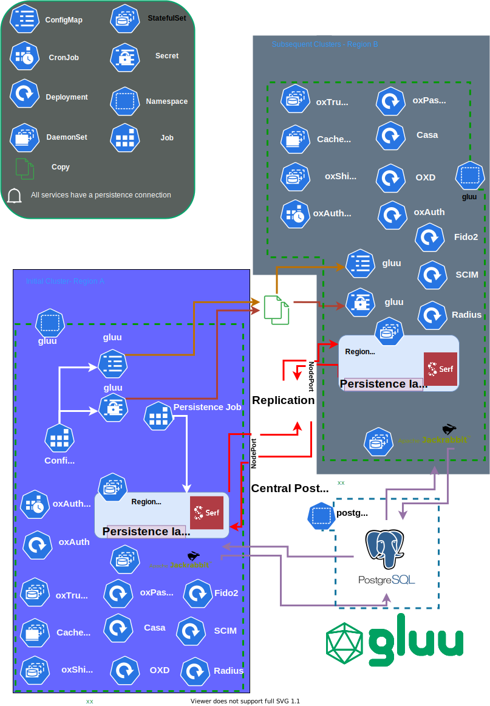

# ALPHA-How to setup multi kubernetes clusters with Gluu Server cloud native edition and LDAP as a persistence

## Overview

This will walk you through a multi cluster setup of Gluu using LDAP as the backend persistence.



## Installation

### Set up the cluster

#### Resources

Setup two kubernetes cluster. We will be using two microk8s clusters sized at t2.xlarge with one node each as an example.
 
#### Requirements

-  You must make sure that the nodeports in the prompts that will appear are open for ldap to communicate.

!!!note
    This is an alpha feature only offered with helm installation of Gluu >4.2.
        
!!!note
    The current setup hinders the scale of the same StatefulSet of ldap on the same node. 

#### On the first cluster run:

1.  Download [`pygluu-kubernetes.pyz`](https://github.com/GluuFederation/cloud-native-edition/releases). This package can be built [manually](https://github.com/GluuFederation/cloud-native-edition/blob/4.2/README.md#build-pygluu-kubernetespyz-manually).

1.  Run :

    ```bash
    ./pygluu-kubernetes.pyz helm-install
    ```

1.  Keep an eye out for the following prompts: 

    ```bash
    ALPHA-FEATURE-Are you setting up a multi kubernetes cluster [N] [y/N]: Y
    ALPHA-FEATURE-Please enter LDAP serf port (NodePort) [30946]: 30946
    ALPHA-FEATURE-Please enter Serf advertise address [demoexample.gluu.org:30946]: firstldap.gluu.org:30946
    ALPHA-FEATURE-Please enter LDAP advertise admin port (NodePort) [30444]: 30444
    ALPHA-FEATURE-Please enter LDAP advertise LDAPS port (NodePort) [30636]: 30636
    ALPHA-FEATURE-Please enter LDAP advertise replication port (NodePort) [30989]: 30989
    ALPHA-FEATURE-Is this not the first kubernetes cluster [N] [y/N]: N
    ALPHA-FEATURE-Please enter LDAP advertise serf peers as an array [['firstldap.gluu.org:30946', 'secondldap.gluu.org:31946']]: ['firstldap.gluu.org:30946', 'secondldap.gluu.org:31946']
    ```
    
    All the above NodePorts must be reachable by the second cluster. Please note also that the Serf advertise address must be resolvable by both clusters. In the event that this is a test environment you may map the addresses via `hostAliases` key inside ldap StatefulSets in both cluster after deployment as in the example below:
   
    ```yaml
      hostAliases:
      - hostnames:
        - firstldap.gluu.org
        ip: 11.11.11.11
      - hostnames:
        - secondldap.gluu.org
        ip: 12.12.12.12
      restartPolicy: Always
      schedulerName: default-scheduler
      securityContext: {}
      terminationGracePeriodSeconds: 30
      volumes:
      - name: serfkey
        secret:
          secretName: gluu-serf-key
      - configMap:
          name: gluu-serf-peers
        name: serfpeers
    ```

1.  Wait for all pods to be ina ready state.

1.  Prepare `gluu` Secret for second cluster
    
    ```bash
    kubectl get  secret gluu -n gluu -o yaml > gluu-secret.yaml
    ```

1.  Prepare `gluu` ConfigMap for second cluster

    ```bash
    kubectl get cm gluu -n gluu -o yaml > gluu-cm.yaml
    ```
    
#### On the second cluster:

1.  Download [`pygluu-kubernetes.pyz`](https://github.com/GluuFederation/cloud-native-edition/releases). This package can be built [manually](https://github.com/GluuFederation/cloud-native-edition/blob/4.2/README.md#build-pygluu-kubernetespyz-manually).

1.  Move the following from the first cluster:
    - `settings.json`
    - `gluu-secret.yaml`
    -  `gluu-cm.yaml`

1.  Place `settings.json` adjacent to `pygluu-kubernetes.pyz`.

1.  Create the namespace for gluu. It must match the one created in the first cluster

    ```bash
    kubectl create ns gluu
    ```
   
1.  Create both `gluu-secret.yaml` and `gluu-cm.yaml`

    ```bash
    kubectl create -f gluu-secret.yaml
    kubectl create -f gluu-cm.yaml
    ```
    
1.  Open `settings.json` at the second cluster and edit the following lines to match your setup:

    ```json
      "GLUU_LDAP_MULTI_CLUSTER": "Y",
      "GLUU_LDAP_SERF_PORT": "31946",
      "GLUU_LDAP_ADVERTISE_ADDRESS": "secondldap.gluu.org:31946",
      "GLUU_LDAP_ADVERTISE_ADMIN_PORT": "31444",
      "GLUU_LDAP_ADVERTISE_LDAPS_PORT": "31636",
      "GLUU_LDAP_ADVERTISE_REPLICATION_PORT": "31989",
      "GLUU_LDAP_SECONDARY_CLUSTER": "Y"
    ```
    
    Notice we added a `1` to all the NodePorts and changed the advertise address to suite the second opendj.

1.  Run :

    ```bash
    ./pygluu-kubernetes.pyz helm-install
    ```
   
1.  Tail the logs and wait for replication to occur. Services should start turning on soon after replication finishes.

#### Test replication

You may run `dsreplication` command to check the replication status using the a command as in the example below:

    ```bash
    kubectl exec -ti gluu-opendj-0 -n gluu -- /opt/opendj/bin/dsreplication status -X
    
    
    >>>> Specify OpenDJ LDAP connection parameters
    
    Directory server hostname or IP address [gluu-opendj-0]: secondldap.gluu.org
    
    Directory server administration port number [31444]:
    
    Global Administrator User ID [admin]:
    
    Password for user 'admin':
    Suffix DN : Server                    : Entries : Replication enabled : DS ID : RS ID : RS Port (1) : M.C. (2) : A.O.M.C. (3) : Security (4)
    ----------:---------------------------:---------:---------------------:-------:-------:-------------:----------:--------------:-------------
    o=gluu    : firstldap.gluu.org:30444  : 192     : true                : 22979 : 3088  : 30989       : 0        :              : true
    o=gluu    : secondldap.gluu.org:31444 : 192     : true                : 3278  : 28492 : 31989       : 0        :              : true
    o=metric  : firstldap.gluu.org:30444  : 7       : true                : 26809 : 3088  : 30989       : 0        :              : true
    o=metric  : secondldap.gluu.org:31444 : 7       : true                : 1216  : 28492 : 31989       : 0        :              : true
    o=site    : firstldap.gluu.org:30444  : 2       : true                : 18467 : 3088  : 30989       : 0        :              : true
    o=site    : secondldap.gluu.org:31444 : 2       : true                : 25521 : 28492 : 31989       : 0        :              : true
    
    ```   

#### Example `settings.json` used in the first cluster.

```json
{
  "ACCEPT_GLUU_LICENSE": "Y",
  "GLUU_VERSION": "4.2",
  "TEST_ENVIRONMENT": "",
  "GLUU_UPGRADE_TARGET_VERSION": "",
  "GLUU_HELM_RELEASE_NAME": "gluu",
  "NGINX_INGRESS_RELEASE_NAME": "ningress",
  "NGINX_INGRESS_NAMESPACE": "ingress-nginx",
  "INSTALL_GLUU_GATEWAY": "N",
  "POSTGRES_NAMESPACE": "",
  "KONG_NAMESPACE": "",
  "GLUU_GATEWAY_UI_NAMESPACE": "",
  "KONG_PG_USER": "",
  "KONG_PG_PASSWORD": "",
  "GLUU_GATEWAY_UI_PG_USER": "",
  "GLUU_GATEWAY_UI_PG_PASSWORD": "",
  "KONG_DATABASE": "",
  "GLUU_GATEWAY_UI_DATABASE": "",
  "POSTGRES_REPLICAS": "",
  "POSTGRES_URL": "",
  "KONG_HELM_RELEASE_NAME": "",
  "GLUU_GATEWAY_UI_HELM_RELEASE_NAME": "",
  "USE_ISTIO": "N",
  "USE_ISTIO_INGRESS": "",
  "ISTIO_SYSTEM_NAMESPACE": "",
  "NODES_IPS": [
    "172.31.22.223"
  ],
  "NODES_ZONES": [],
  "NODES_NAMES": [],
  "NODE_SSH_KEY": "",
  "HOST_EXT_IP": "172.31.22.223",
  "VERIFY_EXT_IP": "",
  "AWS_LB_TYPE": "",
  "USE_ARN": "",
  "VPC_CIDR": "",
  "ARN_AWS_IAM": "",
  "LB_ADD": "",
  "REDIS_URL": "",
  "REDIS_TYPE": "",
  "REDIS_PW": "",
  "REDIS_USE_SSL": "false",
  "REDIS_SSL_TRUSTSTORE": "",
  "REDIS_SENTINEL_GROUP": "",
  "REDIS_MASTER_NODES": "",
  "REDIS_NODES_PER_MASTER": "",
  "REDIS_NAMESPACE": "",
  "INSTALL_REDIS": "",
  "INSTALL_JACKRABBIT": "Y",
  "JACKRABBIT_STORAGE_SIZE": "4Gi",
  "JACKRABBIT_URL": "http://jackrabbit:8080",
  "JACKRABBIT_ADMIN_ID": "admin",
  "JACKRABBIT_ADMIN_PASSWORD": ":bC-g@<_|Db{+@*|<Su1p|{o",
  "JACKRABBIT_CLUSTER": "N",
  "JACKRABBIT_PG_USER": "",
  "JACKRABBIT_PG_PASSWORD": "",
  "JACKRABBIT_DATABASE": "",
  "DEPLOYMENT_ARCH": "microk8s",
  "PERSISTENCE_BACKEND": "ldap",
  "INSTALL_COUCHBASE": "",
  "COUCHBASE_NAMESPACE": "",
  "COUCHBASE_VOLUME_TYPE": "",
  "COUCHBASE_CLUSTER_NAME": "",
  "COUCHBASE_URL": "",
  "COUCHBASE_USER": "",
  "COUCHBASE_BUCKET_PREFIX": "",
  "COUCHBASE_SUPERUSER": "",
  "COUCHBASE_PASSWORD": "",
  "COUCHBASE_SUPERUSER_PASSWORD": "",
  "COUCHBASE_CRT": "",
  "COUCHBASE_CN": "",
  "COUCHBASE_INDEX_NUM_REPLICA": "",
  "COUCHBASE_SUBJECT_ALT_NAME": "",
  "COUCHBASE_CLUSTER_FILE_OVERRIDE": "",
  "COUCHBASE_USE_LOW_RESOURCES": "",
  "COUCHBASE_DATA_NODES": "",
  "COUCHBASE_QUERY_NODES": "",
  "COUCHBASE_INDEX_NODES": "",
  "COUCHBASE_SEARCH_EVENTING_ANALYTICS_NODES": "",
  "COUCHBASE_GENERAL_STORAGE": "",
  "COUCHBASE_DATA_STORAGE": "",
  "COUCHBASE_INDEX_STORAGE": "",
  "COUCHBASE_QUERY_STORAGE": "",
  "COUCHBASE_ANALYTICS_STORAGE": "",
  "COUCHBASE_INCR_BACKUP_SCHEDULE": "",
  "COUCHBASE_FULL_BACKUP_SCHEDULE": "",
  "COUCHBASE_BACKUP_RETENTION_TIME": "",
  "COUCHBASE_BACKUP_STORAGE_SIZE": "",
  "LDAP_BACKUP_SCHEDULE": "",
  "NUMBER_OF_EXPECTED_USERS": "",
  "EXPECTED_TRANSACTIONS_PER_SEC": "",
  "USING_CODE_FLOW": "",
  "USING_SCIM_FLOW": "",
  "USING_RESOURCE_OWNER_PASSWORD_CRED_GRANT_FLOW": "",
  "DEPLOY_MULTI_CLUSTER": "",
  "HYBRID_LDAP_HELD_DATA": "",
  "LDAP_JACKRABBIT_VOLUME": "",
  "APP_VOLUME_TYPE": 1,
  "LDAP_STATIC_VOLUME_ID": "",
  "LDAP_STATIC_DISK_URI": "",
  "GLUU_CACHE_TYPE": "NATIVE_PERSISTENCE",
  "GLUU_NAMESPACE": "gluu",
  "GLUU_FQDN": "demoexample.gluu.org",
  "COUNTRY_CODE": "US",
  "STATE": "TX",
  "EMAIL": "support@gluu.org",
  "CITY": "Austin",
  "ORG_NAME": "Gluu",
  "GMAIL_ACCOUNT": "",
  "GOOGLE_NODE_HOME_DIR": "",
  "IS_GLUU_FQDN_REGISTERED": "N",
  "LDAP_PW": "Test65Me$",
  "ADMIN_PW": "Test1234#",
  "OXD_APPLICATION_KEYSTORE_CN": "",
  "OXD_ADMIN_KEYSTORE_CN": "",
  "LDAP_STORAGE_SIZE": "4Gi",
  "OXAUTH_REPLICAS": 1,
  "OXTRUST_REPLICAS": 1,
  "LDAP_REPLICAS": 1,
  "OXSHIBBOLETH_REPLICAS": "",
  "OXPASSPORT_REPLICAS": "",
  "OXD_SERVER_REPLICAS": "",
  "CASA_REPLICAS": "",
  "RADIUS_REPLICAS": "",
  "FIDO2_REPLICAS": "",
  "SCIM_REPLICAS": "",
  "ENABLE_OXTRUST_API": "N",
  "ENABLE_OXTRUST_TEST_MODE": "N",
  "ENABLE_CACHE_REFRESH": "N",
  "ENABLE_OXD": "N",
  "ENABLE_FIDO2": "N",
  "ENABLE_SCIM": "N",
  "ENABLE_RADIUS": "N",
  "ENABLE_OXPASSPORT": "N",
  "ENABLE_OXSHIBBOLETH": "N",
  "ENABLE_CASA": "N",
  "ENABLE_OXAUTH_KEY_ROTATE": "N",
  "ENABLE_OXTRUST_API_BOOLEAN": "true",
  "ENABLE_OXTRUST_TEST_MODE_BOOLEAN": "false",
  "ENABLE_RADIUS_BOOLEAN": "false",
  "ENABLE_OXPASSPORT_BOOLEAN": "false",
  "ENABLE_CASA_BOOLEAN": "false",
  "ENABLE_SAML_BOOLEAN": "false",
  "ENABLED_SERVICES_LIST": [
    "ldap",
    "update-lb-ip",
    "oxauth",
    "persistence",
    "jackrabbit",
    "oxtrust",
    "config"
  ],
  "OXAUTH_KEYS_LIFE": "",
  "EDIT_IMAGE_NAMES_TAGS": "N",
  "CASA_IMAGE_NAME": "gluufederation/casa",
  "CASA_IMAGE_TAG": "4.2.3_02",
  "CONFIG_IMAGE_NAME": "gluufederation/config-init",
  "CONFIG_IMAGE_TAG": "4.2.3_03",
  "CACHE_REFRESH_ROTATE_IMAGE_NAME": "gluufederation/cr-rotate",
  "CACHE_REFRESH_ROTATE_IMAGE_TAG": "4.2.3_03",
  "CERT_MANAGER_IMAGE_NAME": "gluufederation/certmanager",
  "CERT_MANAGER_IMAGE_TAG": "4.2.3_07",
  "LDAP_IMAGE_NAME": "gluufederation/opendj",
  "LDAP_IMAGE_TAG": "4.2.3_02",
  "JACKRABBIT_IMAGE_NAME": "gluufederation/jackrabbit",
  "JACKRABBIT_IMAGE_TAG": "4.2.3_02",
  "OXAUTH_IMAGE_NAME": "gluufederation/oxauth",
  "OXAUTH_IMAGE_TAG": "4.2.3_06",
  "FIDO2_IMAGE_NAME": "gluufederation/fido2",
  "FIDO2_IMAGE_TAG": "4.2.3_02",
  "SCIM_IMAGE_NAME": "gluufederation/scim",
  "SCIM_IMAGE_TAG": "4.2.3_02",
  "OXD_IMAGE_NAME": "gluufederation/oxd-server",
  "OXD_IMAGE_TAG": "4.2.3_02",
  "OXPASSPORT_IMAGE_NAME": "gluufederation/oxpassport",
  "OXPASSPORT_IMAGE_TAG": "4.2.3_04",
  "OXSHIBBOLETH_IMAGE_NAME": "gluufederation/oxshibboleth",
  "OXSHIBBOLETH_IMAGE_TAG": "4.2.3_04",
  "OXTRUST_IMAGE_NAME": "gluufederation/oxtrust",
  "OXTRUST_IMAGE_TAG": "4.2.3_02",
  "PERSISTENCE_IMAGE_NAME": "gluufederation/persistence",
  "PERSISTENCE_IMAGE_TAG": "4.2.3_03",
  "RADIUS_IMAGE_NAME": "gluufederation/radius",
  "RADIUS_IMAGE_TAG": "4.2.3_02",
  "GLUU_GATEWAY_IMAGE_NAME": "gluufederation/gluu-gateway",
  "GLUU_GATEWAY_IMAGE_TAG": "4.2.2_01",
  "GLUU_GATEWAY_UI_IMAGE_NAME": "gluufederation/gluu-gateway-ui",
  "GLUU_GATEWAY_UI_IMAGE_TAG": "4.2.2_01",
  "UPGRADE_IMAGE_NAME": "gluufederation/upgrade",
  "UPGRADE_IMAGE_TAG": "4.2.3_03",
  "CONFIRM_PARAMS": "Y",
  "GLUU_LDAP_MULTI_CLUSTER": "Y",
  "GLUU_LDAP_SERF_PORT": "30946",
  "GLUU_LDAP_ADVERTISE_ADDRESS": "firstldap.gluu.org:30946",
  "GLUU_LDAP_ADVERTISE_ADMIN_PORT": "30444",
  "GLUU_LDAP_ADVERTISE_LDAPS_PORT": "30636",
  "GLUU_LDAP_ADVERTISE_REPLICATION_PORT": "30989",
  "GLUU_LDAP_SECONDARY_CLUSTER": "N",
  "GLUU_LDAP_SERF_PEERS": "['firstldap.gluu.org:30946', 'secondldap.gluu.org:31946']"
}
``` 
  
#### Example `settings.json` used in the second cluster.

```json
{
  "ACCEPT_GLUU_LICENSE": "Y",
  "GLUU_VERSION": "4.2",
  "TEST_ENVIRONMENT": "",
  "GLUU_UPGRADE_TARGET_VERSION": "",
  "GLUU_HELM_RELEASE_NAME": "gluu",
  "NGINX_INGRESS_RELEASE_NAME": "ningress",
  "NGINX_INGRESS_NAMESPACE": "ingress-nginx",
  "INSTALL_GLUU_GATEWAY": "N",
  "POSTGRES_NAMESPACE": "",
  "KONG_NAMESPACE": "",
  "GLUU_GATEWAY_UI_NAMESPACE": "",
  "KONG_PG_USER": "",
  "KONG_PG_PASSWORD": "",
  "GLUU_GATEWAY_UI_PG_USER": "",
  "GLUU_GATEWAY_UI_PG_PASSWORD": "",
  "KONG_DATABASE": "",
  "GLUU_GATEWAY_UI_DATABASE": "",
  "POSTGRES_REPLICAS": "",
  "POSTGRES_URL": "",
  "KONG_HELM_RELEASE_NAME": "",
  "GLUU_GATEWAY_UI_HELM_RELEASE_NAME": "",
  "USE_ISTIO": "N",
  "USE_ISTIO_INGRESS": "",
  "ISTIO_SYSTEM_NAMESPACE": "",
  "NODES_IPS": [
    "172.31.22.223"
  ],
  "NODES_ZONES": [],
  "NODES_NAMES": [],
  "NODE_SSH_KEY": "",
  "HOST_EXT_IP": "172.31.22.223",
  "VERIFY_EXT_IP": "",
  "AWS_LB_TYPE": "",
  "USE_ARN": "",
  "VPC_CIDR": "",
  "ARN_AWS_IAM": "",
  "LB_ADD": "",
  "REDIS_URL": "",
  "REDIS_TYPE": "",
  "REDIS_PW": "",
  "REDIS_USE_SSL": "false",
  "REDIS_SSL_TRUSTSTORE": "",
  "REDIS_SENTINEL_GROUP": "",
  "REDIS_MASTER_NODES": "",
  "REDIS_NODES_PER_MASTER": "",
  "REDIS_NAMESPACE": "",
  "INSTALL_REDIS": "",
  "INSTALL_JACKRABBIT": "Y",
  "JACKRABBIT_STORAGE_SIZE": "4Gi",
  "JACKRABBIT_URL": "http://jackrabbit:8080",
  "JACKRABBIT_ADMIN_ID": "admin",
  "JACKRABBIT_ADMIN_PASSWORD": ":bC-g@<_|Db{+@*|<Su1p|{o",
  "JACKRABBIT_CLUSTER": "N",
  "JACKRABBIT_PG_USER": "",
  "JACKRABBIT_PG_PASSWORD": "",
  "JACKRABBIT_DATABASE": "",
  "DEPLOYMENT_ARCH": "microk8s",
  "PERSISTENCE_BACKEND": "ldap",
  "INSTALL_COUCHBASE": "",
  "COUCHBASE_NAMESPACE": "",
  "COUCHBASE_VOLUME_TYPE": "",
  "COUCHBASE_CLUSTER_NAME": "",
  "COUCHBASE_URL": "",
  "COUCHBASE_USER": "",
  "COUCHBASE_BUCKET_PREFIX": "",
  "COUCHBASE_SUPERUSER": "",
  "COUCHBASE_PASSWORD": "",
  "COUCHBASE_SUPERUSER_PASSWORD": "",
  "COUCHBASE_CRT": "",
  "COUCHBASE_CN": "",
  "COUCHBASE_INDEX_NUM_REPLICA": "",
  "COUCHBASE_SUBJECT_ALT_NAME": "",
  "COUCHBASE_CLUSTER_FILE_OVERRIDE": "",
  "COUCHBASE_USE_LOW_RESOURCES": "",
  "COUCHBASE_DATA_NODES": "",
  "COUCHBASE_QUERY_NODES": "",
  "COUCHBASE_INDEX_NODES": "",
  "COUCHBASE_SEARCH_EVENTING_ANALYTICS_NODES": "",
  "COUCHBASE_GENERAL_STORAGE": "",
  "COUCHBASE_DATA_STORAGE": "",
  "COUCHBASE_INDEX_STORAGE": "",
  "COUCHBASE_QUERY_STORAGE": "",
  "COUCHBASE_ANALYTICS_STORAGE": "",
  "COUCHBASE_INCR_BACKUP_SCHEDULE": "",
  "COUCHBASE_FULL_BACKUP_SCHEDULE": "",
  "COUCHBASE_BACKUP_RETENTION_TIME": "",
  "COUCHBASE_BACKUP_STORAGE_SIZE": "",
  "LDAP_BACKUP_SCHEDULE": "",
  "NUMBER_OF_EXPECTED_USERS": "",
  "EXPECTED_TRANSACTIONS_PER_SEC": "",
  "USING_CODE_FLOW": "",
  "USING_SCIM_FLOW": "",
  "USING_RESOURCE_OWNER_PASSWORD_CRED_GRANT_FLOW": "",
  "DEPLOY_MULTI_CLUSTER": "",
  "HYBRID_LDAP_HELD_DATA": "",
  "LDAP_JACKRABBIT_VOLUME": "",
  "APP_VOLUME_TYPE": 1,
  "LDAP_STATIC_VOLUME_ID": "",
  "LDAP_STATIC_DISK_URI": "",
  "GLUU_CACHE_TYPE": "NATIVE_PERSISTENCE",
  "GLUU_NAMESPACE": "gluu",
  "GLUU_FQDN": "demoexample.gluu.org",
  "COUNTRY_CODE": "US",
  "STATE": "TX",
  "EMAIL": "support@gluu.org",
  "CITY": "Austin",
  "ORG_NAME": "Gluu",
  "GMAIL_ACCOUNT": "",
  "GOOGLE_NODE_HOME_DIR": "",
  "IS_GLUU_FQDN_REGISTERED": "N",
  "LDAP_PW": "Test65Me$",
  "ADMIN_PW": "Test1234#",
  "OXD_APPLICATION_KEYSTORE_CN": "",
  "OXD_ADMIN_KEYSTORE_CN": "",
  "LDAP_STORAGE_SIZE": "4Gi",
  "OXAUTH_REPLICAS": 1,
  "OXTRUST_REPLICAS": 1,
  "LDAP_REPLICAS": 1,
  "OXSHIBBOLETH_REPLICAS": "",
  "OXPASSPORT_REPLICAS": "",
  "OXD_SERVER_REPLICAS": "",
  "CASA_REPLICAS": "",
  "RADIUS_REPLICAS": "",
  "FIDO2_REPLICAS": "",
  "SCIM_REPLICAS": "",
  "ENABLE_OXTRUST_API": "N",
  "ENABLE_OXTRUST_TEST_MODE": "N",
  "ENABLE_CACHE_REFRESH": "N",
  "ENABLE_OXD": "N",
  "ENABLE_FIDO2": "N",
  "ENABLE_SCIM": "N",
  "ENABLE_RADIUS": "N",
  "ENABLE_OXPASSPORT": "N",
  "ENABLE_OXSHIBBOLETH": "N",
  "ENABLE_CASA": "N",
  "ENABLE_OXAUTH_KEY_ROTATE": "N",
  "ENABLE_OXTRUST_API_BOOLEAN": "true",
  "ENABLE_OXTRUST_TEST_MODE_BOOLEAN": "false",
  "ENABLE_RADIUS_BOOLEAN": "false",
  "ENABLE_OXPASSPORT_BOOLEAN": "false",
  "ENABLE_CASA_BOOLEAN": "false",
  "ENABLE_SAML_BOOLEAN": "false",
  "ENABLED_SERVICES_LIST": [
    "persistence",
    "jackrabbit",
    "oxtrust",
    "update-lb-ip",
    "ldap",
    "oxauth",
    "config"
  ],
  "OXAUTH_KEYS_LIFE": "",
  "EDIT_IMAGE_NAMES_TAGS": "N",
  "CASA_IMAGE_NAME": "gluufederation/casa",
  "CASA_IMAGE_TAG": "4.2.3_02",
  "CONFIG_IMAGE_NAME": "gluufederation/config-init",
  "CONFIG_IMAGE_TAG": "4.2.3_03",
  "CACHE_REFRESH_ROTATE_IMAGE_NAME": "gluufederation/cr-rotate",
  "CACHE_REFRESH_ROTATE_IMAGE_TAG": "4.2.3_03",
  "CERT_MANAGER_IMAGE_NAME": "gluufederation/certmanager",
  "CERT_MANAGER_IMAGE_TAG": "4.2.3_07",
  "LDAP_IMAGE_NAME": "gluufederation/opendj",
  "LDAP_IMAGE_TAG": "4.2.3_02",
  "JACKRABBIT_IMAGE_NAME": "gluufederation/jackrabbit",
  "JACKRABBIT_IMAGE_TAG": "4.2.3_02",
  "OXAUTH_IMAGE_NAME": "gluufederation/oxauth",
  "OXAUTH_IMAGE_TAG": "4.2.3_06",
  "FIDO2_IMAGE_NAME": "gluufederation/fido2",
  "FIDO2_IMAGE_TAG": "4.2.3_02",
  "SCIM_IMAGE_NAME": "gluufederation/scim",
  "SCIM_IMAGE_TAG": "4.2.3_02",
  "OXD_IMAGE_NAME": "gluufederation/oxd-server",
  "OXD_IMAGE_TAG": "4.2.3_02",
  "OXPASSPORT_IMAGE_NAME": "gluufederation/oxpassport",
  "OXPASSPORT_IMAGE_TAG": "4.2.3_04",
  "OXSHIBBOLETH_IMAGE_NAME": "gluufederation/oxshibboleth",
  "OXSHIBBOLETH_IMAGE_TAG": "4.2.3_04",
  "OXTRUST_IMAGE_NAME": "gluufederation/oxtrust",
  "OXTRUST_IMAGE_TAG": "4.2.3_02",
  "PERSISTENCE_IMAGE_NAME": "gluufederation/persistence",
  "PERSISTENCE_IMAGE_TAG": "4.2.3_03",
  "RADIUS_IMAGE_NAME": "gluufederation/radius",
  "RADIUS_IMAGE_TAG": "4.2.3_02",
  "GLUU_GATEWAY_IMAGE_NAME": "gluufederation/gluu-gateway",
  "GLUU_GATEWAY_IMAGE_TAG": "4.2.2_01",
  "GLUU_GATEWAY_UI_IMAGE_NAME": "gluufederation/gluu-gateway-ui",
  "GLUU_GATEWAY_UI_IMAGE_TAG": "4.2.2_01",
  "UPGRADE_IMAGE_NAME": "gluufederation/upgrade",
  "UPGRADE_IMAGE_TAG": "4.2.3_02",
  "CONFIRM_PARAMS": "Y",
  "GLUU_LDAP_MULTI_CLUSTER": "Y",
  "GLUU_LDAP_SERF_PORT": "31946",
  "GLUU_LDAP_ADVERTISE_ADDRESS": "secondldap.gluu.org:31946",
  "GLUU_LDAP_ADVERTISE_ADMIN_PORT": "31444",
  "GLUU_LDAP_ADVERTISE_LDAPS_PORT": "31636",
  "GLUU_LDAP_ADVERTISE_REPLICATION_PORT": "31989",
  "GLUU_LDAP_SECONDARY_CLUSTER": "Y",
  "GLUU_LDAP_SERF_PEERS": "['firstldap.gluu.org:30946', 'secondldap.gluu.org:31946']"
}
```

#### Example `values.yaml` that was generated and used in the first cluster.

```yaml
global:
  istio:
    ingress: false
    enabled: false
    namespace: istio-system
  alb:
    ingress: false
  cloud:
    testEnviroment: true
  upgrade:
    enabled: false
  provisioner: microk8s.io/hostpath
  pool: default
  fsType: ext4
  gcePdStorageType: pd-standard
  azureStorageAccountType: Standard_LRS
  azureStorageKind: Managed
  reclaimPolicy: Retain
  lbIp: "172.31.22.223"
  domain: demoexample.gluu.org
  isDomainRegistered: "false"
  gluuPersistenceType: ldap
  gluuJackrabbitCluster: "false"
  oxauth:
    enabled: true
  fido2:
    enabled: false
  scim:
    enabled: false
  config:
    enabled: true
  jackrabbit:
    enabled: true
  persistence:
    enabled: true
  oxtrust:
    enabled: true
  opendj:
    enabled: true
  oxshibboleth:
    enabled: false
  oxd-server:
    enabled: false
  nginx-ingress:
    enabled: true
  oxauth-key-rotation:
    enabled: false
  cr-rotate:
    enabled: false
config:
  orgName: Gluu
  email: support@gluu.org
  adminPass: Test1234#
  ldapPass: Test65Me$
  redisPass: P@assw0rd
  countryCode: US
  state: TX
  city: Austin
  configmap:
    gluuOxdApplicationCertCn: oxd-server
    gluuOxdAdminCertCn: oxd-server
    gluuCouchbaseCrt: LS0tLS1CRUdJTiBDRVJUSUZJQ0FURS0tLS0tCk1JSURlakNDQW1LZ0F3SUJBZ0lKQUwyem5UWlREUHFNTUEwR0NTcUdTSWIzRFFFQkN3VUFNQzB4S3pBcEJnTlYKQkFNTUlpb3VZMkpuYkhWMUxtUmxabUYxYkhRdWMzWmpMbU5zZFhOMFpYSXViRzlqWVd3d0hoY05NakF3TWpBMQpNRGt4T1RVeFdoY05NekF3TWpBeU1Ea3hPVFV4V2pBdE1Tc3dLUVlEVlFRRERDSXFMbU5pWjJ4MWRTNWtaV1poCmRXeDBMbk4yWXk1amJIVnpkR1Z5TG14dlkyRnNNSUlCSWpBTkJna3Foa2lHOXcwQkFRRUZBQU9DQVE4QU1JSUIKQ2dLQ0FRRUFycmQ5T3lvSnRsVzhnNW5nWlJtL2FKWjJ2eUtubGU3dVFIUEw4Q2RJa1RNdjB0eHZhR1B5UkNQQgo3RE00RTFkLzhMaU5takdZZk41QjZjWjlRUmNCaG1VNmFyUDRKZUZ3c0x0cTFGT3MxaDlmWGo3d3NzcTYrYmlkCjV6Umw3UEE0YmdvOXVkUVRzU1UrWDJUUVRDc0dxVVVPWExrZ3NCMjI0RDNsdkFCbmZOeHcvYnFQa2ZCQTFxVzYKVXpxellMdHN6WE5GY0dQMFhtU3c4WjJuaFhhUGlva2pPT2dyMkMrbVFZK0htQ2xGUWRpd2g2ZjBYR0V0STMrKwoyMStTejdXRkF6RlFBVUp2MHIvZnk4TDRXZzh1YysvalgwTGQrc2NoQTlNQjh3YmJORUp2ZjNMOGZ5QjZ0cTd2CjF4b0FnL0g0S1dJaHdqSEN0dFVnWU1oU0xWV3UrUUlEQVFBQm80R2NNSUdaTUIwR0ExVWREZ1FXQkJTWmQxWU0KVGNIRVZjSENNUmp6ejczZitEVmxxREJkQmdOVkhTTUVWakJVZ0JTWmQxWU1UY0hFVmNIQ01Sanp6NzNmK0RWbApxS0V4cEM4d0xURXJNQ2tHQTFVRUF3d2lLaTVqWW1kc2RYVXVaR1ZtWVhWc2RDNXpkbU11WTJ4MWMzUmxjaTVzCmIyTmhiSUlKQUwyem5UWlREUHFNTUF3R0ExVWRFd1FGTUFNQkFmOHdDd1lEVlIwUEJBUURBZ0VHTUEwR0NTcUcKU0liM0RRRUJDd1VBQTRJQkFRQk9meTVWSHlKZCtWUTBXaUQ1aSs2cmhidGNpSmtFN0YwWVVVZnJ6UFN2YWVFWQp2NElVWStWOC9UNnE4Mk9vVWU1eCtvS2dzbFBsL01nZEg2SW9CRnVtaUFqek14RTdUYUhHcXJ5dk13Qk5IKzB5CnhadG9mSnFXQzhGeUlwTVFHTEs0RVBGd3VHRlJnazZMRGR2ZEN5NVdxWW1MQWdBZVh5VWNaNnlHYkdMTjRPUDUKZTFiaEFiLzRXWXRxRHVydFJrWjNEejlZcis4VWNCVTRLT005OHBZN05aaXFmKzlCZVkvOEhZaVQ2Q0RRWWgyTgoyK0VWRFBHcFE4UkVsRThhN1ZLL29MemlOaXFyRjllNDV1OU1KdjM1ZktmNUJjK2FKdWduTGcwaUZUYmNaT1prCkpuYkUvUENIUDZFWmxLaEFiZUdnendtS1dDbTZTL3g0TklRK2JtMmoKLS0tLS1FTkQgQ0VSVElGSUNBVEUtLS0tLQo=
    gluuCouchbasePass: P@ssw0rd
    gluuCouchbaseSuperUserPass: P@ssw0rd
    gluuCouchbaseSuperUser: admin
    gluuCouchbaseUrl: cbgluu.default.svc.cluster.local
    gluuCouchbaseBucketPrefix: gluu
    gluuCouchbaseUser: gluu
    gluuCouchbaseIndexNumReplica: 0
    gluuCouchbasePassFile: /etc/gluu/conf/couchbase_password
    gluuCouchbaseSuperUserPassFile: /etc/gluu/conf/couchbase_superuser_password
    gluuCouchbaseCertFile: /etc/certs/couchbase.crt
    gluuPersistenceLdapMapping: ''
    gluuCacheType: NATIVE_PERSISTENCE
    gluuSyncShibManifests: false
    gluuSyncCasaManifests: false
    gluuMaxRamPercent: "75.0"
    configAdapterName: kubernetes
    containerMetadataName: kubernetes
    configSecretAdapter: kubernetes
    gluuRedisUrl: redis:6379
    gluuRedisUseSsl: "false"
    gluuRedisType: STANDALONE
    gluuRedisSslTruststore: ""
    gluuRedisSentinelGroup: ""
    gluuOxtrustBackend: oxtrust:8080
    gluuOxauthBackend: oxauth:8080
    gluuOxdServerUrl: oxd-server:8443
    gluuOxdBindIpAddresses: "*"
    gluuLdapUrl: opendj:1636
    gluuJackrabbitPostgresUser: jackrabbit
    gluuJackrabbitPostgresPasswordFile: /etc/gluu/conf/postgres_password
    gluuJackrabbitPostgresDatabaseName: jackrabbit
    gluuJackrabbitPostgresHost: postgres.postgres.svc.cluster.local
    gluuJackrabbitPostgresPort: 5432
    gluuJackrabbitAdminId: admin
    gluuJackrabbitAdminPassFile: /etc/gluu/conf/jackrabbit_admin_password
    gluuJackrabbitSyncInterval: 300
    gluuJackrabbitUrl: http://jackrabbit:8080
    gluuJackrabbitAdminIdFile: /etc/gluu/conf/jackrabbit_admin_id
    gluuDocumentStoreType: JCA
    lbAddr: ""
    ldapServiceName: opendj
    gluuOxtrustApiEnabled: true
    gluuOxtrustApiTestMode: false
    gluuPassportEnabled: false
    gluuCasaEnabled: false
    gluuRadiusEnabled: false
    gluuSamlEnabled: false
    gluuPersistenceType: ldap
  image:
    repository: gluufederation/config-init
    tag: 4.2.3_03
  resources: {}
nginx-ingress:
  ingress:
    enabled: true
    path: /
    hosts:
    - demoexample.gluu.org
    tls:
    - secretName: tls-certificate # DON'T change
      hosts:
      - demoexample.gluu.org
jackrabbit:
  service:
    jackRabbitServiceName: jackrabbit
  replicas: 1
  secrets:
    gluuJackrabbitAdminPass: :bC-g@<_|Db{+@*|<Su1p|{o
    gluuJackrabbitPostgresPass: ''
  storage:
    size: 5Gi
  image:
    repository: gluufederation/jackrabbit
    tag: 4.2.3_02
    pullPolicy: Always
  resources:
    limits:
      cpu: 1500m
      memory: 1000Mi
    requests:
      cpu: 1500m
      memory: 1000Mi
opendj:
  multiCluster:
    enabled: true
    serfAdvertiseAddr: "firstldap.gluu.org:30946"
    serfKey: RD0IJkRvP0TyWeKmHsFkeSZBQGUSCYabwUH48aRhPz8=
    serfPeers: "['firstldap.gluu.org:30946', 'secondldap.gluu.org:31946']"
  service:
    ldapServiceName: opendj
  replicas: 1
  persistence:
    size: 4Gi
  image:
    repository: gluufederation/opendj
    tag: 4.2.3_02
    pullPolicy: Always
  resources:
    limits:
      cpu: 1500m
      memory: 2000Mi
    requests:
      cpu: 1500m
      memory: 2000Mi
  ports:
    tcp-ldaps:
      port: 1636
      targetPort: 1636
      protocol: TCP
      nodePort: 30636
    tcp-ldap:
      port: 1389
      targetPort: 1389
      protocol: TCP
      nodePort: ""
    tcp-repl:
      port: 30989
      targetPort: 30989
      protocol: TCP
      nodePort: 30989
    tcp-admin:
      port: 30444
      targetPort: 30444
      protocol: TCP
      nodePort: 30444
    tcp-serf:
      port: 7946
      targetPort: 7946
      protocol: TCP
      nodePort: 30946
    udp-serf:
      port: 7946
      targetPort: 7946
      protocol: UDP
      nodePort: 30946
  gluuRedisEnabled: false
persistence:
  image:
    repository: gluufederation/persistence
    tag: 4.2.3_03
    pullPolicy: Always
  resources: {}
oxauth:
  service:
    oxAuthServiceName: oxauth
  replicas: 1
  image:
    repository: gluufederation/oxauth
    tag: 4.2.3_06
    pullPolicy: Always
  resources:
    limits:
      cpu: 2500m
      memory: 2500Mi
    requests:
      cpu: 2500m
      memory: 2500Mi
oxtrust:
  service:
    oxTrustServiceName: oxtrust
  replicas: 1
  image:
    repository: gluufederation/oxtrust
    tag: 4.2.3_02
    pullPolicy: Always
  resources:
    limits:
      cpu: 1000m
      memory: 1000Mi
    requests:
      cpu: 1000m
      memory: 1000Mi
fido2:
  service:
    fido2ServiceName: fido2
  replicas: 1
  image:
    repository: gluufederation/fido2
    tag: 4.2.3_02
    pullPolicy: Always
  resources:
    limits:
      cpu: 500m
      memory: 500Mi
    requests:
      cpu: 500m
      memory: 500Mi
scim:
  service:
    scimServiceName: scim
  replicas: 1
  image:
    repository: gluufederation/scim
    tag: 4.2.3_02
    pullPolicy: Always
  resources:
    limits:
      cpu: 1000m
      memory: 1000Mi
    requests:
      cpu: 1000m
      memory: 1000Mi
oxd-server:
  service:
    oxdServerServiceName: oxd-server
  replicas: 1
  image:
    repository: gluufederation/oxd-server
    tag: 4.2.3_02
    pullPolicy: Always
  resources:
    limits:
      cpu: 1000m
      memory: 400Mi
    requests:
      cpu: 1000m
      memory: 400Mi
casa:
  service:
    casaServiceName: casa
  replicas: ''
  image:
    repository: gluufederation/casa
    tag: 4.2.3_02
    pullPolicy: Always
  resources:
    requests:
      memory: "500Mi"
      cpu: "500m"
    limits:
      memory: "500Mi"
      cpu: "500m"
oxpassport:
  service:
    oxPassportServiceName: oxpassport
  replicas: ''
  image:
    repository: gluufederation/oxpassport
    tag: 4.2.3_04
    pullPolicy: Always
  resources: {}
oxshibboleth:
  service:
    oxShibbolethServiceName: oxshibboleth
  replicas: ''
  image:
    repository: gluufederation/oxshibboleth
    tag: 4.2.3_04
    pullPolicy: Always
  resources:
    limits:
      cpu: 1000m
      memory: 1000Mi
    requests:
      cpu: 1000m
      memory: 1000Mi
radius:
  service:
    radiusServiceName: radius
  replicas: ''
  image:
    repository: gluufederation/radius
    tag: 4.2.3_02
    pullPolicy: Always
  resources:
    limits:
      cpu: 700m
      memory: 700Mi
    requests:
      cpu: 700m
      memory: 700Mi
cr-rotate:
  service:
    crRotateServiceName: cr-rotate
  image:
    repository: gluufederation/cr-rotate
    tag: 4.2.3_03
    pullPolicy: Always
  resources:
    limits:
      cpu: 200m
      memory: 200Mi
    requests:
      cpu: 200m
      memory: 200Mi
oxauth-key-rotation:
  keysLife: 48
  image:
    repository: gluufederation/certmanager
    tag: 4.2.3_07
    pullPolicy: Always
  resources:
    limits:
      cpu: 300m
      memory: 300Mi
    requests:
      cpu: 300m
      memory: 300Mi
``` 
 
#### Example `values.yaml` that was generated and used in the second cluster.

```yaml
{
  "ACCEPT_GLUU_LICENSE": "Y",
  "GLUU_VERSION": "4.2",
  "TEST_ENVIRONMENT": "",
  "GLUU_UPGRADE_TARGET_VERSION": "",
  "GLUU_HELM_RELEASE_NAME": "gluu",
  "NGINX_INGRESS_RELEASE_NAME": "ningress",
  "NGINX_INGRESS_NAMESPACE": "ingress-nginx",
  "INSTALL_GLUU_GATEWAY": "N",
  "POSTGRES_NAMESPACE": "",
  "KONG_NAMESPACE": "",
  "GLUU_GATEWAY_UI_NAMESPACE": "",
  "KONG_PG_USER": "",
  "KONG_PG_PASSWORD": "",
  "GLUU_GATEWAY_UI_PG_USER": "",
  "GLUU_GATEWAY_UI_PG_PASSWORD": "",
  "KONG_DATABASE": "",
  "GLUU_GATEWAY_UI_DATABASE": "",
  "POSTGRES_REPLICAS": "",
  "POSTGRES_URL": "",
  "KONG_HELM_RELEASE_NAME": "",
  "GLUU_GATEWAY_UI_HELM_RELEASE_NAME": "",
  "USE_ISTIO": "N",
  "USE_ISTIO_INGRESS": "",
  "ISTIO_SYSTEM_NAMESPACE": "",
  "NODES_IPS": [
    "172.31.22.223"
  ],
  "NODES_ZONES": [],
  "NODES_NAMES": [],
  "NODE_SSH_KEY": "",
  "HOST_EXT_IP": "172.31.22.223",
  "VERIFY_EXT_IP": "",
  "AWS_LB_TYPE": "",
  "USE_ARN": "",
  "VPC_CIDR": "",
  "ARN_AWS_IAM": "",
  "LB_ADD": "",
  "REDIS_URL": "",
  "REDIS_TYPE": "",
  "REDIS_PW": "",
  "REDIS_USE_SSL": "false",
  "REDIS_SSL_TRUSTSTORE": "",
  "REDIS_SENTINEL_GROUP": "",
  "REDIS_MASTER_NODES": "",
  "REDIS_NODES_PER_MASTER": "",
  "REDIS_NAMESPACE": "",
  "INSTALL_REDIS": "",
  "INSTALL_JACKRABBIT": "Y",
  "JACKRABBIT_STORAGE_SIZE": "4Gi",
  "JACKRABBIT_URL": "http://jackrabbit:8080",
  "JACKRABBIT_ADMIN_ID": "admin",
  "JACKRABBIT_ADMIN_PASSWORD": ":bC-g@<_|Db{+@*|<Su1p|{o",
  "JACKRABBIT_CLUSTER": "N",
  "JACKRABBIT_PG_USER": "",
  "JACKRABBIT_PG_PASSWORD": "",
  "JACKRABBIT_DATABASE": "",
  "DEPLOYMENT_ARCH": "microk8s",
  "PERSISTENCE_BACKEND": "ldap",
  "INSTALL_COUCHBASE": "",
  "COUCHBASE_NAMESPACE": "",
  "COUCHBASE_VOLUME_TYPE": "",
  "COUCHBASE_CLUSTER_NAME": "",
  "COUCHBASE_URL": "",
  "COUCHBASE_USER": "",
  "COUCHBASE_BUCKET_PREFIX": "",
  "COUCHBASE_SUPERUSER": "",
  "COUCHBASE_PASSWORD": "",
  "COUCHBASE_SUPERUSER_PASSWORD": "",
  "COUCHBASE_CRT": "",
  "COUCHBASE_CN": "",
  "COUCHBASE_INDEX_NUM_REPLICA": "",
  "COUCHBASE_SUBJECT_ALT_NAME": "",
  "COUCHBASE_CLUSTER_FILE_OVERRIDE": "",
  "COUCHBASE_USE_LOW_RESOURCES": "",
  "COUCHBASE_DATA_NODES": "",
  "COUCHBASE_QUERY_NODES": "",
  "COUCHBASE_INDEX_NODES": "",
  "COUCHBASE_SEARCH_EVENTING_ANALYTICS_NODES": "",
  "COUCHBASE_GENERAL_STORAGE": "",
  "COUCHBASE_DATA_STORAGE": "",
  "COUCHBASE_INDEX_STORAGE": "",
  "COUCHBASE_QUERY_STORAGE": "",
  "COUCHBASE_ANALYTICS_STORAGE": "",
  "COUCHBASE_INCR_BACKUP_SCHEDULE": "",
  "COUCHBASE_FULL_BACKUP_SCHEDULE": "",
  "COUCHBASE_BACKUP_RETENTION_TIME": "",
  "COUCHBASE_BACKUP_STORAGE_SIZE": "",
  "LDAP_BACKUP_SCHEDULE": "",
  "NUMBER_OF_EXPECTED_USERS": "",
  "EXPECTED_TRANSACTIONS_PER_SEC": "",
  "USING_CODE_FLOW": "",
  "USING_SCIM_FLOW": "",
  "USING_RESOURCE_OWNER_PASSWORD_CRED_GRANT_FLOW": "",
  "DEPLOY_MULTI_CLUSTER": "",
  "HYBRID_LDAP_HELD_DATA": "",
  "LDAP_JACKRABBIT_VOLUME": "",
  "APP_VOLUME_TYPE": 1,
  "LDAP_STATIC_VOLUME_ID": "",
  "LDAP_STATIC_DISK_URI": "",
  "GLUU_CACHE_TYPE": "NATIVE_PERSISTENCE",
  "GLUU_NAMESPACE": "gluu",
  "GLUU_FQDN": "demoexample.gluu.org",
  "COUNTRY_CODE": "US",
  "STATE": "TX",
  "EMAIL": "support@gluu.org",
  "CITY": "Austin",
  "ORG_NAME": "Gluu",
  "GMAIL_ACCOUNT": "",
  "GOOGLE_NODE_HOME_DIR": "",
  "IS_GLUU_FQDN_REGISTERED": "N",
  "LDAP_PW": "Test65Me$",
  "ADMIN_PW": "Test1234#",
  "OXD_APPLICATION_KEYSTORE_CN": "",
  "OXD_ADMIN_KEYSTORE_CN": "",
  "LDAP_STORAGE_SIZE": "4Gi",
  "OXAUTH_REPLICAS": 1,
  "OXTRUST_REPLICAS": 1,
  "LDAP_REPLICAS": 1,
  "OXSHIBBOLETH_REPLICAS": "",
  "OXPASSPORT_REPLICAS": "",
  "OXD_SERVER_REPLICAS": "",
  "CASA_REPLICAS": "",
  "RADIUS_REPLICAS": "",
  "FIDO2_REPLICAS": "",
  "SCIM_REPLICAS": "",
  "ENABLE_OXTRUST_API": "N",
  "ENABLE_OXTRUST_TEST_MODE": "N",
  "ENABLE_CACHE_REFRESH": "N",
  "ENABLE_OXD": "N",
  "ENABLE_FIDO2": "N",
  "ENABLE_SCIM": "N",
  "ENABLE_RADIUS": "N",
  "ENABLE_OXPASSPORT": "N",
  "ENABLE_OXSHIBBOLETH": "N",
  "ENABLE_CASA": "N",
  "ENABLE_OXAUTH_KEY_ROTATE": "N",
  "ENABLE_OXTRUST_API_BOOLEAN": "true",
  "ENABLE_OXTRUST_TEST_MODE_BOOLEAN": "false",
  "ENABLE_RADIUS_BOOLEAN": "false",
  "ENABLE_OXPASSPORT_BOOLEAN": "false",
  "ENABLE_CASA_BOOLEAN": "false",
  "ENABLE_SAML_BOOLEAN": "false",
  "ENABLED_SERVICES_LIST": [
    "persistence",
    "jackrabbit",
    "oxtrust",
    "update-lb-ip",
    "ldap",
    "oxauth",
    "config"
  ],
  "OXAUTH_KEYS_LIFE": "",
  "EDIT_IMAGE_NAMES_TAGS": "N",
  "CASA_IMAGE_NAME": "gluufederation/casa",
  "CASA_IMAGE_TAG": "4.2.3_02",
  "CONFIG_IMAGE_NAME": "gluufederation/config-init",
  "CONFIG_IMAGE_TAG": "4.2.3_03",
  "CACHE_REFRESH_ROTATE_IMAGE_NAME": "gluufederation/cr-rotate",
  "CACHE_REFRESH_ROTATE_IMAGE_TAG": "4.2.3_03",
  "CERT_MANAGER_IMAGE_NAME": "gluufederation/certmanager",
  "CERT_MANAGER_IMAGE_TAG": "4.2.3_07",
  "LDAP_IMAGE_NAME": "gluufederation/opendj",
  "LDAP_IMAGE_TAG": "4.2.3_02",
  "JACKRABBIT_IMAGE_NAME": "gluufederation/jackrabbit",
  "JACKRABBIT_IMAGE_TAG": "4.2.3_02",
  "OXAUTH_IMAGE_NAME": "gluufederation/oxauth",
  "OXAUTH_IMAGE_TAG": "4.2.3_06",
  "FIDO2_IMAGE_NAME": "gluufederation/fido2",
  "FIDO2_IMAGE_TAG": "4.2.3_02",
  "SCIM_IMAGE_NAME": "gluufederation/scim",
  "SCIM_IMAGE_TAG": "4.2.3_02",
  "OXD_IMAGE_NAME": "gluufederation/oxd-server",
  "OXD_IMAGE_TAG": "4.2.3_02",
  "OXPASSPORT_IMAGE_NAME": "gluufederation/oxpassport",
  "OXPASSPORT_IMAGE_TAG": "4.2.3_04",
  "OXSHIBBOLETH_IMAGE_NAME": "gluufederation/oxshibboleth",
  "OXSHIBBOLETH_IMAGE_TAG": "4.2.3_04",
  "OXTRUST_IMAGE_NAME": "gluufederation/oxtrust",
  "OXTRUST_IMAGE_TAG": "4.2.3_02",
  "PERSISTENCE_IMAGE_NAME": "gluufederation/persistence",
  "PERSISTENCE_IMAGE_TAG": "4.2.3_03",
  "RADIUS_IMAGE_NAME": "gluufederation/radius",
  "RADIUS_IMAGE_TAG": "4.2.3_02",
  "GLUU_GATEWAY_IMAGE_NAME": "gluufederation/gluu-gateway",
  "GLUU_GATEWAY_IMAGE_TAG": "4.2.2_01",
  "GLUU_GATEWAY_UI_IMAGE_NAME": "gluufederation/gluu-gateway-ui",
  "GLUU_GATEWAY_UI_IMAGE_TAG": "4.2.2_01",
  "UPGRADE_IMAGE_NAME": "gluufederation/upgrade",
  "UPGRADE_IMAGE_TAG": "4.2.3_02",
  "CONFIRM_PARAMS": "Y",
  "GLUU_LDAP_MULTI_CLUSTER": "Y",
  "GLUU_LDAP_SERF_PORT": "31946",
  "GLUU_LDAP_ADVERTISE_ADDRESS": "secondldap.gluu.org:31946",
  "GLUU_LDAP_ADVERTISE_ADMIN_PORT": "31444",
  "GLUU_LDAP_ADVERTISE_LDAPS_PORT": "31636",
  "GLUU_LDAP_ADVERTISE_REPLICATION_PORT": "31989",
  "GLUU_LDAP_SECONDARY_CLUSTER": "Y",
  "GLUU_LDAP_SERF_PEERS": "['firstldap.gluu.org:30946', 'secondldap.gluu.org:31946']"
}root@ip-172-31-28-64:/cloud-native-edition/test# ^C
root@ip-172-31-28-64:/cloud-native-edition/test# cat helm/gluu/values.yaml
global:
  istio:
    ingress: false
    enabled: false
    namespace: istio-system
  alb:
    ingress: false
  cloud:
    testEnviroment: true
  upgrade:
    enabled: false
  provisioner: microk8s.io/hostpath
  pool: default
  fsType: ext4
  gcePdStorageType: pd-standard
  azureStorageAccountType: Standard_LRS
  azureStorageKind: Managed
  reclaimPolicy: Retain
  lbIp: "172.31.22.223"
  domain: demoexample.gluu.org
  isDomainRegistered: "false"
  gluuPersistenceType: ldap
  gluuJackrabbitCluster: "false"
  oxauth:
    enabled: true
  fido2:
    enabled: false
  scim:
    enabled: false
  config:
    enabled: true
  jackrabbit:
    enabled: true
  persistence:
    enabled: false
  oxtrust:
    enabled: true
  opendj:
    enabled: true
  oxshibboleth:
    enabled: false
  oxd-server:
    enabled: false
  nginx-ingress:
    enabled: true
  oxauth-key-rotation:
    enabled: false
  cr-rotate:
    enabled: false
config:
  orgName: Gluu
  email: support@gluu.org
  adminPass: Test1234#
  ldapPass: Test65Me$
  redisPass: P@assw0rd
  countryCode: US
  state: TX
  city: Austin
  configmap:
    gluuOxdApplicationCertCn: oxd-server
    gluuOxdAdminCertCn: oxd-server
    gluuCouchbaseCrt: LS0tLS1CRUdJTiBDRVJUSUZJQ0FURS0tLS0tCk1JSURlakNDQW1LZ0F3SUJBZ0lKQUwyem5UWlREUHFNTUEwR0NTcUdTSWIzRFFFQkN3VUFNQzB4S3pBcEJnTlYKQkFNTUlpb3VZMkpuYkhWMUxtUmxabUYxYkhRdWMzWmpMbU5zZFhOMFpYSXViRzlqWVd3d0hoY05NakF3TWpBMQpNRGt4T1RVeFdoY05NekF3TWpBeU1Ea3hPVFV4V2pBdE1Tc3dLUVlEVlFRRERDSXFMbU5pWjJ4MWRTNWtaV1poCmRXeDBMbk4yWXk1amJIVnpkR1Z5TG14dlkyRnNNSUlCSWpBTkJna3Foa2lHOXcwQkFRRUZBQU9DQVE4QU1JSUIKQ2dLQ0FRRUFycmQ5T3lvSnRsVzhnNW5nWlJtL2FKWjJ2eUtubGU3dVFIUEw4Q2RJa1RNdjB0eHZhR1B5UkNQQgo3RE00RTFkLzhMaU5takdZZk41QjZjWjlRUmNCaG1VNmFyUDRKZUZ3c0x0cTFGT3MxaDlmWGo3d3NzcTYrYmlkCjV6Umw3UEE0YmdvOXVkUVRzU1UrWDJUUVRDc0dxVVVPWExrZ3NCMjI0RDNsdkFCbmZOeHcvYnFQa2ZCQTFxVzYKVXpxellMdHN6WE5GY0dQMFhtU3c4WjJuaFhhUGlva2pPT2dyMkMrbVFZK0htQ2xGUWRpd2g2ZjBYR0V0STMrKwoyMStTejdXRkF6RlFBVUp2MHIvZnk4TDRXZzh1YysvalgwTGQrc2NoQTlNQjh3YmJORUp2ZjNMOGZ5QjZ0cTd2CjF4b0FnL0g0S1dJaHdqSEN0dFVnWU1oU0xWV3UrUUlEQVFBQm80R2NNSUdaTUIwR0ExVWREZ1FXQkJTWmQxWU0KVGNIRVZjSENNUmp6ejczZitEVmxxREJkQmdOVkhTTUVWakJVZ0JTWmQxWU1UY0hFVmNIQ01Sanp6NzNmK0RWbApxS0V4cEM4d0xURXJNQ2tHQTFVRUF3d2lLaTVqWW1kc2RYVXVaR1ZtWVhWc2RDNXpkbU11WTJ4MWMzUmxjaTVzCmIyTmhiSUlKQUwyem5UWlREUHFNTUF3R0ExVWRFd1FGTUFNQkFmOHdDd1lEVlIwUEJBUURBZ0VHTUEwR0NTcUcKU0liM0RRRUJDd1VBQTRJQkFRQk9meTVWSHlKZCtWUTBXaUQ1aSs2cmhidGNpSmtFN0YwWVVVZnJ6UFN2YWVFWQp2NElVWStWOC9UNnE4Mk9vVWU1eCtvS2dzbFBsL01nZEg2SW9CRnVtaUFqek14RTdUYUhHcXJ5dk13Qk5IKzB5CnhadG9mSnFXQzhGeUlwTVFHTEs0RVBGd3VHRlJnazZMRGR2ZEN5NVdxWW1MQWdBZVh5VWNaNnlHYkdMTjRPUDUKZTFiaEFiLzRXWXRxRHVydFJrWjNEejlZcis4VWNCVTRLT005OHBZN05aaXFmKzlCZVkvOEhZaVQ2Q0RRWWgyTgoyK0VWRFBHcFE4UkVsRThhN1ZLL29MemlOaXFyRjllNDV1OU1KdjM1ZktmNUJjK2FKdWduTGcwaUZUYmNaT1prCkpuYkUvUENIUDZFWmxLaEFiZUdnendtS1dDbTZTL3g0TklRK2JtMmoKLS0tLS1FTkQgQ0VSVElGSUNBVEUtLS0tLQo=
    gluuCouchbasePass: P@ssw0rd
    gluuCouchbaseSuperUserPass: P@ssw0rd
    gluuCouchbaseSuperUser: admin
    gluuCouchbaseUrl: cbgluu.default.svc.cluster.local
    gluuCouchbaseBucketPrefix: gluu
    gluuCouchbaseUser: gluu
    gluuCouchbaseIndexNumReplica: 0
    gluuCouchbasePassFile: /etc/gluu/conf/couchbase_password
    gluuCouchbaseSuperUserPassFile: /etc/gluu/conf/couchbase_superuser_password
    gluuCouchbaseCertFile: /etc/certs/couchbase.crt
    gluuPersistenceLdapMapping: ''
    gluuCacheType: NATIVE_PERSISTENCE
    gluuSyncShibManifests: false
    gluuSyncCasaManifests: false
    gluuMaxRamPercent: "75.0"
    configAdapterName: kubernetes
    containerMetadataName: kubernetes
    configSecretAdapter: kubernetes
    gluuRedisUrl: redis:6379
    gluuRedisUseSsl: "false"
    gluuRedisType: STANDALONE
    gluuRedisSslTruststore: ""
    gluuRedisSentinelGroup: ""
    gluuOxtrustBackend: oxtrust:8080
    gluuOxauthBackend: oxauth:8080
    gluuOxdServerUrl: oxd-server:8443
    gluuOxdBindIpAddresses: "*"
    gluuLdapUrl: opendj:1636
    gluuJackrabbitPostgresUser: jackrabbit
    gluuJackrabbitPostgresPasswordFile: /etc/gluu/conf/postgres_password
    gluuJackrabbitPostgresDatabaseName: jackrabbit
    gluuJackrabbitPostgresHost: postgres.postgres.svc.cluster.local
    gluuJackrabbitPostgresPort: 5432
    gluuJackrabbitAdminId: admin
    gluuJackrabbitAdminPassFile: /etc/gluu/conf/jackrabbit_admin_password
    gluuJackrabbitSyncInterval: 300
    gluuJackrabbitUrl: http://jackrabbit:8080
    gluuJackrabbitAdminIdFile: /etc/gluu/conf/jackrabbit_admin_id
    gluuDocumentStoreType: JCA
    lbAddr: ""
    ldapServiceName: opendj
    gluuOxtrustApiEnabled: true
    gluuOxtrustApiTestMode: false
    gluuPassportEnabled: false
    gluuCasaEnabled: false
    gluuRadiusEnabled: false
    gluuSamlEnabled: false
    gluuPersistenceType: ldap
  image:
    repository: gluufederation/config-init
    tag: 4.2.3_03
  resources: {}
nginx-ingress:
  ingress:
    enabled: true
    path: /
    hosts:
    - demoexample.gluu.org
    tls:
    - secretName: tls-certificate # DON'T change
      hosts:
      - demoexample.gluu.org
jackrabbit:
  service:
    jackRabbitServiceName: jackrabbit
  replicas: 1
  secrets:
    gluuJackrabbitAdminPass: :bC-g@<_|Db{+@*|<Su1p|{o
    gluuJackrabbitPostgresPass: ''
  storage:
    size: 5Gi
  image:
    repository: gluufederation/jackrabbit
    tag: 4.2.3_02
    pullPolicy: Always
  resources:
    limits:
      cpu: 1500m
      memory: 1000Mi
    requests:
      cpu: 1500m
      memory: 1000Mi
opendj:
  multiCluster:
    enabled: true
    serfAdvertiseAddr: "secondldap.gluu.org:31946"
    serfKey: BRjGalWj0NJRHQoR/7v3jL8gzua0IQLtAocFcPfWIt8=
    serfPeers: "['firstldap.gluu.org:30946', 'secondldap.gluu.org:31946']"
  service:
    ldapServiceName: opendj
  replicas: 1
  persistence:
    size: 4Gi
  image:
    repository: gluufederation/opendj
    tag: 4.2.3_02
    pullPolicy: Always
  resources:
    limits:
      cpu: 1500m
      memory: 2000Mi
    requests:
      cpu: 1500m
      memory: 2000Mi
  ports:
    tcp-ldaps:
      port: 1636
      targetPort: 1636
      protocol: TCP
      nodePort: 31636
    tcp-ldap:
      port: 1389
      targetPort: 1389
      protocol: TCP
      nodePort: ""
    tcp-repl:
      port: 31989
      targetPort: 31989
      protocol: TCP
      nodePort: 31989
    tcp-admin:
      port: 31444
      targetPort: 31444
      protocol: TCP
      nodePort: 31444
    tcp-serf:
      port: 7946
      targetPort: 7946
      protocol: TCP
      nodePort: 31946
    udp-serf:
      port: 7946
      targetPort: 7946
      protocol: UDP
      nodePort: 31946
  gluuRedisEnabled: false
persistence:
  image:
    repository: gluufederation/persistence
    tag: 4.2.3_03
    pullPolicy: Always
  resources: {}
oxauth:
  service:
    oxAuthServiceName: oxauth
  replicas: 1
  image:
    repository: gluufederation/oxauth
    tag: 4.2.3_06
    pullPolicy: Always
  resources:
    limits:
      cpu: 2500m
      memory: 2500Mi
    requests:
      cpu: 2500m
      memory: 2500Mi
oxtrust:
  service:
    oxTrustServiceName: oxtrust
  replicas: 1
  image:
    repository: gluufederation/oxtrust
    tag: 4.2.3_02
    pullPolicy: Always
  resources:
    limits:
      cpu: 1000m
      memory: 1000Mi
    requests:
      cpu: 1000m
      memory: 1000Mi
fido2:
  service:
    fido2ServiceName: fido2
  replicas: 1
  image:
    repository: gluufederation/fido2
    tag: 4.2.3_02
    pullPolicy: Always
  resources:
    limits:
      cpu: 500m
      memory: 500Mi
    requests:
      cpu: 500m
      memory: 500Mi
scim:
  service:
    scimServiceName: scim
  replicas: 1
  image:
    repository: gluufederation/scim
    tag: 4.2.3_02
    pullPolicy: Always
  resources:
    limits:
      cpu: 1000m
      memory: 1000Mi
    requests:
      cpu: 1000m
      memory: 1000Mi
oxd-server:
  service:
    oxdServerServiceName: oxd-server
  replicas: 1
  image:
    repository: gluufederation/oxd-server
    tag: 4.2.3_02
    pullPolicy: Always
  resources:
    limits:
      cpu: 1000m
      memory: 400Mi
    requests:
      cpu: 1000m
      memory: 400Mi
casa:
  service:
    casaServiceName: casa
  replicas: ''
  image:
    repository: gluufederation/casa
    tag: 4.2.3_02
    pullPolicy: Always
  resources:
    requests:
      memory: "500Mi"
      cpu: "500m"
    limits:
      memory: "500Mi"
      cpu: "500m"
oxpassport:
  service:
    oxPassportServiceName: oxpassport
  replicas: ''
  image:
    repository: gluufederation/oxpassport
    tag: 4.2.3_04
    pullPolicy: Always
  resources: {}
oxshibboleth:
  service:
    oxShibbolethServiceName: oxshibboleth
  replicas: ''
  image:
    repository: gluufederation/oxshibboleth
    tag: 4.2.3_04
    pullPolicy: Always
  resources:
    limits:
      cpu: 1000m
      memory: 1000Mi
    requests:
      cpu: 1000m
      memory: 1000Mi
radius:
  service:
    radiusServiceName: radius
  replicas: ''
  image:
    repository: gluufederation/radius
    tag: 4.2.3_02
    pullPolicy: Always
  resources:
    limits:
      cpu: 700m
      memory: 700Mi
    requests:
      cpu: 700m
      memory: 700Mi
cr-rotate:
  service:
    crRotateServiceName: cr-rotate
  image:
    repository: gluufederation/cr-rotate
    tag: 4.2.3_03
    pullPolicy: Always
  resources:
    limits:
      cpu: 200m
      memory: 200Mi
    requests:
      cpu: 200m
      memory: 200Mi
oxauth-key-rotation:
  keysLife: 48
  image:
    repository: gluufederation/certmanager
    tag: 4.2.3_07
    pullPolicy: Always
  resources:
    limits:
      cpu: 300m
      memory: 300Mi
    requests:
      cpu: 300m
      memory: 300Mi
```      
